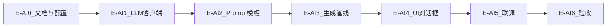

# arrow_jaw AI 辅助生成开发步骤拆解（P8）

> **版本**：v1.0  
> **日期**：2026-06-15  
> **关联文档**：[arrow_jaw_AI辅助生成需求文档.md](arrow_jaw_AI辅助生成需求文档.md) · [arrow_jaw_关卡编辑器开发需求文档.md](arrow_jaw_关卡编辑器开发需求文档.md) · [arrow_jaw_游戏功能图谱.md](arrow_jaw_游戏功能图谱.md) · [arrow_jaw_AI关卡编辑指南.md](arrow_jaw_AI关卡编辑指南.md)

本文档将 P8「AI 辅助生成」拆解为 **E-AI0 → E-AI6**。代码根目录 `code/editor`，校验复用 `code/shared`。

**预估总工时**：约 4–5 人日

---

## 0. 模块依赖



---

## E-AI0 — 文档与配置骨架

**目标**：需求与开发文档就绪；配置模板可拷贝  
**预估**：0.5 天

### 交付

| 文件 | 内容 |
|------|------|
| `docs/arrow_jaw_AI辅助生成需求文档.md` | 功能/UI/流程/AC |
| `docs/arrow_jaw_AI辅助生成开发步骤拆解.md` | 本文档 |
| `docs/arrow_jaw_关卡编辑器开发需求文档.md` | §1.4 调整 + P8 链接 |
| `code/editor/ai-config.example.json` | 示例配置 |
| `.gitignore` | 增加 `code/editor/ai-config.local.json` |

### DoD

- [x] 需求文档含三阶段流程、命名规则 `{prefix}-{seq}.uncheck.json`
- [ ] example 配置可拷贝为 local 并填入密钥
- [ ] 主编辑器文档 P8 链接可跳转

---

## E-AI1 — LLM 客户端与上下文加载

**目标**：可配置地调用 OpenAI 兼容 API；加载 AI 文档上下文  
**预估**：1 天

### 改动

| 文件 | 内容 |
|------|------|
| `code/editor/src/ai/types.ts` | `AiConfig`、`GenerationForm`、`PipelineProgress` 等类型 |
| `code/editor/src/ai/config.ts` | `loadAiConfig()`：fetch `/ai-config.local.json`，失败读 example 或报错 |
| `code/editor/src/ai/llm-client.ts` | `chatCompletion(messages, { signal })` → 解析 `choices[0].message.content` |
| `code/editor/src/ai/context.ts` | Vite `?raw` 导入 `docs/arrow_jaw_游戏功能图谱.md`、`docs/arrow_jaw_AI关卡编辑指南.md`；导出 `getAiContextBundle()` |
| `code/editor/vite.config.ts` | 可选：`server.proxy['/api/llm']` → `baseUrl`；public 提供 config |
| `code/editor/public/ai-config.local.json` | 本地开发用（gitignore，开发者自建） |

### 配置加载策略

1. 运行时 `fetch('/ai-config.local.json')`  
2. 404 → 提示复制 `ai-config.example.json`  
3. 校验 `baseUrl`、`apiKey`、`model` 非空  

### 测试

| 文件 | 内容 |
|------|------|
| `code/editor/src/ai/llm-client.test.ts` | mock `fetch`，验证 URL/header/body 与响应解析 |
| `code/editor/src/ai/config.test.ts` | 校验逻辑 |

### DoD

- [ ] mock 测试通过  
- [ ] 真实 config 下可 ping 通 chat/completions（手工）  
- [ ] context bundle 长度 > 0，含图谱与指南关键字  

---

## E-AI2 — Prompt 模板与响应解析

**目标**：三阶段 prompt 可维护；稳健提取 JSON  
**预估**：0.5 天

### 改动

| 文件 | 内容 |
|------|------|
| `code/editor/src/ai/prompts/optimize-prompt.ts` | `buildOptimizeMessages(form, contextBundle, schemaSummary)` |
| `code/editor/src/ai/prompts/generate-level.ts` | `buildGenerateMessages(optimizedPrompt, form, index, total)` |
| `code/editor/src/ai/prompts/fix-level.ts` | `buildFixMessages(levelJson, issues, contextSummary)` |
| `code/editor/src/ai/prompts/schema-summary.ts` | LevelData 精简 schema 字符串 |
| `code/editor/src/ai/parse-response.ts` | `extractJsonFromLlm(text)`：code fence → 全文 parse |
| `code/editor/src/ai/parse-response.test.ts` | fence / 纯 JSON / 非法文本用例 |

### Phase 1 期望响应

```json
{ "optimized_prompt": "...", "design_notes": "..." }
```

### Phase 2 / 3 期望响应

单个 `LevelData` JSON 对象。

### DoD

- [ ] parse-response 测试覆盖 fence 与裸 JSON  
- [ ] optimize 输出缺字段时 pipeline 报错友好  

---

## E-AI3 — 生成管线与文件 I/O

**目标**：编排 Phase1→2→3；校验/fix 循环；目录读写  
**预估**：1 天

### 改动

| 文件 | 内容 |
|------|------|
| `code/editor/src/ai/generation-pipeline.ts` | `runGenerationPipeline(form, dirHandle, config, callbacks)` |
| `code/editor/src/ai/level-io.ts` | `writeUncheckFile`、`renameToChecked`、`deleteUncheck`、`allocateSeq` |
| `code/editor/src/ai/validate-level.ts` | 封装 `assertLoadableLevelData` + `validateLevelData` + `hasBlockingErrors` |

### 管线伪代码

```typescript
async function runGenerationPipeline(...) {
  onProgress({ phase: 1 });
  const opt = await phase1Optimize(...);

  for (let i = 1; i <= form.count; i++) {
    if (signal.aborted) break;
    onProgress({ phase: 2, index: i });
    const seq = allocateSeq(dir, prefix, i);
    const raw = await phase2Generate(opt, i, form.count);
    await writeUncheckFile(dir, `${prefix}-${seq}.uncheck.json`, raw);

    onProgress({ phase: 3, index: i });
    let fixAttempts = 0;
    while (true) {
      const result = validateFileContent(raw);
      if (!result.blocking) {
        await renameToChecked(dir, seq);
        passed++;
        break;
      }
      if (fixAttempts >= 2) {
        await deleteUncheck(dir, seq);
        failed.push({ seq, issues: result.issues });
        break;
      }
      raw = await phase3Fix(raw, result.issues);
      await writeUncheckFile(...);
      fixAttempts++;
    }
  }
  return { requested, passed, failed };
}
```

### 序号冲突

`allocateSeq(prefix, intendedIndex)`：若 `{prefix}-{pad(intendedIndex)}.json` 或 `.uncheck.json` 存在，递增直到空闲。

### 测试

| 文件 | 内容 |
|------|------|
| `code/editor/src/ai/generation-pipeline.test.ts` | mock llm-client + 内存目录对象；验证 fix 最多 2 次 |
| `code/editor/src/ai/validate-level.test.ts` | 9001 通过、故意缺 width 失败 |

### DoD

- [ ] 单测不调用真实 API  
- [ ] 9001 fixture 校验为 pass  
- [ ] fix 循环第 3 次不再调用 LLM  

---

## E-AI4 — UI 对话框

**目标**：菜单入口 + 完整表单 + 进度 + 汇总  
**预估**：1 天

### 改动

| 文件 | 内容 |
|------|------|
| `code/editor/src/ui/ai-generate-dialog.ts` | `showAiGenerateDialog(app)`：表单、目录选择、进度、汇总 |
| `code/editor/src/app.ts` | `buildMenu()` 增加「AI 辅助生成」；`private showAiGenerateDialog()` |
| `code/editor/src/style.css` | `.ai-gen-form`、`.kind-checkboxes`、`.ai-progress`、`.ai-summary` |

### UI 结构

```
.modal.ai-generate
  h2 AI 辅助生成
  .ai-gen-form（字段 §3.1）
  .kind-checkboxes（K1 disabled checked）
  .dir-row（路径 + 选择目录）
  .ai-progress（hidden → 生成中显示）
  .actions（取消 | 生成）
```

### 目录选择

```typescript
const dir = await window.showDirectoryPicker({ mode: 'readwrite' });
```

### DoD

- [ ] AC-AI02、AC-AI03 UI 满足  
- [ ] 生成中按钮状态正确  
- [ ] 完成后汇总弹窗显示 N/X/Y  

---

## E-AI5 — 联调与错误处理

**目标**：真实 API 端到端；异常文案友好  
**预估**：0.5 天

### 场景

| 场景 | 预期 UX |
|------|---------|
| 401 / 403 | 「API 密钥无效，请检查 ai-config.local.json」 |
| 429 | 「请求过于频繁，请稍后重试」 |
| 网络超时 | 「请求超时（timeoutMs），请检查网络或调大超时」 |
| JSON 解析失败 | Phase 1 重试提示；Phase 2 进入 fix 或失败 |
| 用户取消 | 静默停止，不 crash |

### 可选日志

写入输出目录 `{prefix}-generation.log`：

```
2026-06-15T10:00:00 Phase1 OK design_notes=...
2026-06-15T10:01:00 seq=001 PASS
2026-06-15T10:02:00 seq=002 FAIL V04,V-NEW-07 after 2 fixes
```

### DoD

- [ ] 至少 1 次真实 API 生成通过校验的关卡  
- [ ] 错误场景不抛未捕获异常  

---

## E-AI6 — 验收与收尾

**目标**：AC 全覆盖；文档 DoD 勾选  
**预估**：0.5 天

### 验收清单

| ID | 验证方式 |
|----|----------|
| AC-AI01 | 删除 local config → 提示 |
| AC-AI02 | UI 目视 + 单测 |
| AC-AI03 | 未选目录点击生成 |
| AC-AI04 | 生成 1 关 → 打开编辑器 |
| AC-AI05 | mock LLM 返回非法 JSON |
| AC-AI06 | count=3 |
| AC-AI07 | 生成中取消 |
| AC-AI08 | `createDocumentFromJson` 加载通过关 |

### 文档更新

- [ ] 本文件各 E-AI DoD 勾选  
- [ ] 需求文档状态改为「已实现」或「部分实现」  
- [ ] 主编辑器 README / 需求 § 补充「首次配置 ai-config.local.json」三步说明  

### 首次配置说明（写入主文档或 editor README）

1. 复制 `code/editor/ai-config.example.json` → `ai-config.local.json`  
2. 填入 `baseUrl`、`apiKey`、`model`  
3. 若 CORS 失败，配置 `vite.config.ts` proxy 并将 baseUrl 改为 `/api/llm`  

---

## 附录 A：建议目录结构

```
code/editor/
  ai-config.example.json
  ai-config.local.json          # gitignore
  public/
    ai-config.local.json        # 可选：运行时 fetch（或 vite 静态）
  src/
    ai/
      types.ts
      config.ts
      llm-client.ts
      context.ts
      parse-response.ts
      validate-level.ts
      generation-pipeline.ts
      level-io.ts
      prompts/
        optimize-prompt.ts
        generate-level.ts
        fix-level.ts
        schema-summary.ts
    ui/
      ai-generate-dialog.ts
```

---

## 附录 B：与 P7 文档关系

| 阶段 | 文档 | 用途 |
|------|------|------|
| P7 | 游戏功能图谱、AI 关卡编辑指南 | LLM 上下文 + 设计规范 |
| P8 | 本文档 + AI辅助生成需求 | 编辑器功能实现 |

---

*文档结束*
