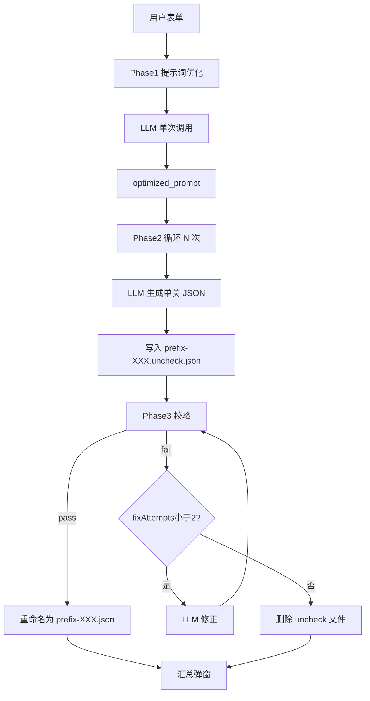

# arrow_jaw AI 辅助生成需求文档（P8）

> **版本**：v1.0  
> **日期**：2026-06-15  
> **状态**：待开发  
> **关联文档**：[arrow_jaw_关卡编辑器开发需求文档.md](arrow_jaw_关卡编辑器开发需求文档.md) · [arrow_jaw_AI辅助生成开发步骤拆解.md](arrow_jaw_AI辅助生成开发步骤拆解.md) · [arrow_jaw_游戏功能图谱.md](arrow_jaw_游戏功能图谱.md) · [arrow_jaw_AI关卡编辑指南.md](arrow_jaw_AI关卡编辑指南.md)

---

## 1. 概述

### 1.1 功能名称

**AI 辅助生成** — 在 Arrow Jam 关卡编辑器（`code/editor`）中，通过 OpenAI 兼容大模型 API，按用户约束批量生成关卡 JSON 文件。

### 1.2 目标

- 降低关卡从零搭建成本：用户输入棋盘参数、机制组合与创意关键词，由 AI 产出符合 schema 的关卡数据  
- 生成结果经 **shared 校验器**自动校验，失败时自动修正（最多 2 轮）  
- 合法关卡落盘到用户指定本地目录，文件名规范、可区分「未校验 / 已通过」状态  

### 1.3 入口

菜单栏新增 **「AI 辅助生成」**，与「新建」「打开」「保存」等并列（`EditorApp.buildMenu()`）。

### 1.4 不在本期范围

| 项 | 说明 |
|----|------|
| 自动写入 `manifest.json` | 生成文件需人工审核后再入库 |
| 自动打开编辑器标签页 | 可选后续增强：生成完成后询问是否打开 |
| 服务端密钥托管 | 本期浏览器本地配置；生产环境需代理或后端 |
| 可玩性自动求解 | 校验通过 ≠ 关卡可解/好玩；须人工试玩 |
| 流式输出 / 多模型对比 | 后续迭代 |

### 1.5 依赖资产

| 资产 | 路径 | 用途 |
|------|------|------|
| 游戏功能图谱 | [arrow_jaw_游戏功能图谱.md](arrow_jaw_游戏功能图谱.md) | LLM 规则上下文 |
| AI 关卡编辑指南 | [arrow_jaw_AI关卡编辑指南.md](arrow_jaw_AI关卡编辑指南.md) | 设计规范与 JSON 输出约束 |
| 关卡结构说明 | [Arrow 关卡结构说明.md](Arrow%20关卡结构说明.md) | JSON 字段语义补充 |
| 校验器 | `code/shared/src/validator.ts` | 生成后校验与修正依据 |
| 解析器 | `code/shared/src/parser.ts` | `assertLoadableLevelData` |

---

## 2. 大模型配置

### 2.1 协议

采用 **OpenAI 兼容 Chat Completions API**：

```
POST {baseUrl}/chat/completions
Authorization: Bearer {apiKey}
Content-Type: application/json

{
  "model": "{model}",
  "temperature": 0.7,
  "max_tokens": 8192,
  "messages": [ ... ]
}
```

兼容 OpenAI、Azure OpenAI、Ollama（`/v1`）、国内多数中转服务等。

### 2.2 配置文件

| 文件 | 说明 |
|------|------|
| `code/editor/ai-config.example.json` | 仓库示例（无真实密钥） |
| `code/editor/ai-config.local.json` | 本地实际配置，**须加入 `.gitignore`** |

示例结构：

```json
{
  "baseUrl": "https://api.openai.com/v1",
  "apiKey": "sk-your-key-here",
  "model": "gpt-4o",
  "temperature": 0.7,
  "maxTokens": 8192,
  "timeoutMs": 120000
}
```

| 字段 | 必填 | 说明 |
|------|------|------|
| `baseUrl` | 是 | API 根路径，不含 `/chat/completions` |
| `apiKey` | 是 | Bearer Token |
| `model` | 是 | 模型名称 |
| `temperature` | 否 | 默认 0.7；修正阶段建议 ≤0.5 |
| `maxTokens` | 否 | 默认 8192 |
| `timeoutMs` | 否 | 单次请求超时，默认 120000 |

### 2.3 加载时机

- 编辑器启动或打开「AI 辅助生成」对话框时加载 `ai-config.local.json`  
- 文件不存在或 `apiKey` 为空：禁用「生成」按钮并提示复制 example 配置  

### 2.4 安全与 CORS

**安全**：密钥存于本地 JSON，浏览器运行时可见；仅限本地编辑器工具链，禁止提交到 Git。

**CORS**：若 `baseUrl` 不支持浏览器跨域，开发环境须在 `vite.config.ts` 配置 `server.proxy`（见开发步骤 E-AI1）。

---

## 3. 生成对话框 UI

复用 `#modal-root`（`index.html`）与 `.modal` 样式（`style.css`），参考 `showNewDialog()` 实现模式。

### 3.1 表单字段

| 字段 | 控件 | 默认值 | 校验规则 |
|------|------|--------|----------|
| 名称前缀 | `input[type=text]` | 空 | 必填；正则 `^[a-zA-Z0-9_-]+$`；用于文件名 |
| 宽度 | `input[type=number]` | 20 | 20–255 |
| 高度 | `input[type=number]` | 32 | 20–255 |
| 时限（秒） | `input[type=number]` | **150** | ≥1 |
| 难度 | `select` | **Normal (1)** | 1=Normal，2=Hard，3=Superhuman |
| 关卡类型 | `select` | **普通 (2)** | 1=主线，2=普通（对应 `levelKind`） |
| 生成个数 | `input[type=number]` | **1** | 1–20（常量 `AI_GEN_MAX_COUNT` 可配置） |
| 包含物件 | 多选 `checkbox` | **K1 默认勾选** | 见 §3.2 |
| 生成关键词 | `textarea` | 空 | 可选；用户创意描述 |
| 输出目录 | 只读文本 + 按钮 | 空 | 开始生成前必选 |

### 3.2 物件多选列表

| kind | 标签 | 默认 | 可取消 |
|------|------|------|--------|
| 1 | K1 折线箭 | 勾选 | **否**（固定包含） |
| 2 | K2 翻转箭 | 未勾选 | 是 |
| 3 | K3 管道 | 未勾选 | 是 |
| 4 | K4 反射角 | 未勾选 | 是 |
| 5 | K5 定时炸弹 | 未勾选 | 是 |
| 6 | K6 幕布 | 未勾选 | 是 |
| 7 | K7 移动墙 | 未勾选 | 是 |
| 8 | K8 捆绑箭 | 未勾选 | 是 |
| 11 | K11 钥匙箭 | 未勾选 | 是 |
| 12 | K12 子区域 | 未勾选 | 是 |
| 13 | K13 冻结箭 | 未勾选 | 是 |

**禁止**：kind 9、kind 10（未实现）。

选中 kind 列表将作为 `allowed_kinds` 传入 LLM；K1 始终存在于该列表。

### 3.3 输出目录选择

- 使用 `window.showDirectoryPicker()`（File System Access API）  
- 用户授权后保留 `FileSystemDirectoryHandle` 至生成结束  
- 不支持 FSA 的浏览器：显示阻塞提示「请使用 Chrome / Edge，本功能需目录写入权限」，不提供降级（批量写文件强依赖 FSA）  

### 3.4 按钮与状态

| 按钮 | 行为 |
|------|------|
| 取消 | 关闭对话框；若正在生成则 Abort 请求 |
| 生成 | 校验表单 → 执行三阶段流程 |

生成中：

- 「生成」禁用，「取消」可用（触发 AbortController）  
- 显示进度区：当前 Phase、序号、状态文案（见 §5）  

---

## 4. 三阶段生成流程



### 4.1 Phase 1 — 提示词优化（1 次 LLM 调用）

**目的**：将用户简短关键词扩展为结构化、可执行的关卡生成指令。

**输入（打包为 messages）**：

| 部分 | 内容 |
|------|------|
| System | 角色：Arrow Jam 关卡设计专家；输出须为 JSON |
| 静态上下文 | 《游戏功能图谱》全文、《AI 关卡编辑指南》全文 |
| Schema 摘要 | `LevelData` 顶层字段与 `itemModels` 要求 |
| 用户参数 | width、height、durationInSec、difficulty、levelKind、allowed_kinds、用户关键词 |

**要求模型输出 JSON**（非 markdown 包裹亦可，解析器需兼容）：

```json
{
  "optimized_prompt": "（供 Phase 2 使用的详细生成指令，含依赖链、机制用法、难度目标）",
  "design_notes": "（简短设计思路，可选，写入日志）"
}
```

**失败处理**：JSON 解析失败 → 提示用户重试；不进入 Phase 2。

### 4.2 Phase 2 — 批量生成（N 次 LLM 调用）

对每个 `index` ∈ [1, N] 独立调用 LLM（推荐，降低超长响应风险）。

**每次输入**：

- `optimized_prompt`（Phase 1 产出）  
- `index` / `total`（如「第 2 关，共 5 关」）  
- 棋盘与 meta 约束（宽高、时限、难度、levelKind）  
- `allowed_kinds`  
- 要求：**仅输出一个完整关卡 JSON 对象**，含 `width`、`height`、`name`、`durationInSec`、`difficulty`、`itemModels`  

**`name` 字段建议**：`{前缀} #{三位序号}` 或与文件名一致。

**落盘**（写入用户选定目录）：

| 阶段 | 文件名 |
|------|--------|
| 刚生成 | `{prefix}-{三位序号}.uncheck.json` |
| 校验通过 | `{prefix}-{三位序号}.json` |

示例：`puzzle-001.uncheck.json` → `puzzle-001.json`

**序号规则**：

- 从 `001` 起递增到 `N`  
- 若 `{prefix}-{seq}.json` 或 `.uncheck.json` 已存在，**跳过该序号**继续递增（避免覆盖）  

**JSON 提取**：

1. 优先从 ` ```json ... ``` ` 代码块提取  
2. 否则对全文 `JSON.parse`  
3. 失败则该关进入 Phase 3 修正（视为校验前错误）或记失败  

### 4.3 Phase 3 — 校验与修正

对每个 `.uncheck.json` 执行：

```
1. JSON.parse
2. assertLoadableLevelData(raw)
3. issues = validateLevelData(data)
4. if !hasBlockingErrors(issues):
     重命名：去掉文件名中的 .uncheck → 通过
   else if fixAttempts < 2:
     调用 LLM 修正（见 §4.4）
     fixAttempts++
     goto 3
   else:
     删除 .uncheck.json
     记录失败原因
```

**修正输入**：

- 当前关卡 JSON（字符串）  
- `issues` 列表：`{ id, severity, message, instanceId? }`  
- 《游戏功能图谱》§12 校验码说明（或内嵌摘要）  
- 要求：输出修正后的**完整关卡 JSON**  

**修正 temperature**：建议使用配置值的 50% 或固定 0.3。

**丢弃策略**：2 次修正仍失败 → **删除** `{prefix}-{seq}.uncheck.json`（不保留 failed 副本，失败详情写入汇总与可选日志）。

### 4.4 完成汇总弹窗

```
AI 辅助生成完成

请求生成：N
校验通过：X
失败丢弃：Y

[确认]
```

- `Y > 0` 时提供可展开区域：列出失败序号及最后 validator 摘要（前 3 条 error）  
- 可选：写入输出目录 `{prefix}-generation.log`（时间戳、参数、每关状态）  

---

## 5. 进度与取消

### 5.1 进度展示

| 阶段 | 文案示例 |
|------|----------|
| Phase 1 | 「正在优化提示词…」 |
| Phase 2 | 「正在生成第 2/5 关…」 |
| Phase 3 | 「正在校验第 2/5 关…」 / 「正在修正第 2/5 关（第 1 次）…」 |

### 5.2 取消

- 用户点击「取消」→ `AbortController.abort()`  
- 已写入的 `.uncheck.json` / 已通过 `.json` **保留**  
- 关闭进度 UI，不显示汇总弹窗（或显示「已取消」简要提示）  

---

## 6. 与编辑器集成

### 6.1 生成后操作（本期）

- 汇总弹窗「确认」关闭即可  
- 用户通过「打开」手动加载生成目录中的 JSON  

### 6.2 后续增强（非本期）

- 「打开已通过的第 1 关」按钮  
- 一键追加到 `manifest.json` devTests  

---

## 7. 验收标准

| ID | 验收条件 |
|----|----------|
| AC-AI01 | 无 `ai-config.local.json` 或 apiKey 为空时，提示配置说明，不发起 LLM 请求 |
| AC-AI02 | K1 多选始终勾选且 disabled |
| AC-AI03 | 未选择输出目录时，「生成」不可用或点击提示 |
| AC-AI04 | 成功 1 关时，目录存在 `{prefix}-001.json`，`validateLevelData` 无 error |
| AC-AI05 | 非法 JSON 经最多 2 次修正仍失败时，文件被删除，失败数 +1 |
| AC-AI06 | N=3 时最多 3 个请求，序号 001–003（跳过已占用槽位） |
| AC-AI07 | 生成中显示 Phase/序号；取消后不抛未捕获异常 |
| AC-AI08 | 生成 JSON 可被编辑器「打开」正常加载（`createDocumentFromJson` 无阻塞错误） |

---

## 8. 风险与对策

| 风险 | 影响 | 对策 |
|------|------|------|
| CORS 拦截 | 无法调用 API | Vite proxy；或使用支持 CORS 的网关 |
| 密钥泄露 | 安全风险 | gitignore + 文档警示；勿部署到公网 |
| LLM 幻觉字段 | 校验失败 | fix 循环；Prompt 强调 schema |
| 校验通过但不可玩 | 体验差 | 文档与 UI 提示「请试玩验证」 |
| 大关卡 token 超限 | 生成截断 | 限制棋盘尺寸提示；调大 maxTokens |
| FSA 不可用 | 无法批量写盘 | 明确浏览器要求 |

---

## 9. 非功能需求

| 项 | 要求 |
|----|------|
| 性能 | 单关生成 + 校验 + 最多 2 修正，P95 < 3min（依赖模型） |
| 可测试性 | LLM 客户端、JSON 解析、校验管线可单测（mock fetch） |
| 日志 | 开发期 console；可选 `{prefix}-generation.log` |
| 国际化 | 本期中文 UI |

---

## 附录 A：LevelData Schema 摘要（供 Prompt 嵌入）

```json
{
  "width": "number, required",
  "height": "number, required",
  "name": "string",
  "durationInSec": "number, default 120",
  "difficulty": "1|2|3",
  "levelKind": "optional number",
  "itemModels": [
    {
      "kind": "1-8,11-13",
      "instanceId": "unique positive int",
      "layer": "see feature map",
      "occupiedPositions": "[[x,y],...]",
      "... kind-specific fields ..."
    }
  ]
}
```

详见 [arrow_jaw_游戏功能图谱.md §3–§5](arrow_jaw_游戏功能图谱.md)。

---

## 附录 B：校验码速查（修正 Prompt 用）

| 代码 | 严重程度 | 含义 |
|------|----------|------|
| V01 | error | 缺 width/height/itemModels |
| V02 | error | instanceId 重复 |
| V03 | error | 坐标越界 |
| V04 | error | 折线不连续 |
| V05 | error | 矩形区域不完整 |
| V06 | error | 子区域非法 kind |
| V-NEW-07 | error | 移动墙路径/子区域违规 |
| V-EDIT-01 | error | 同箭多附件 |

完整列表见 [游戏功能图谱 §12](arrow_jaw_游戏功能图谱.md#12-校验规则索引validator.ts)。

---

*文档结束*
