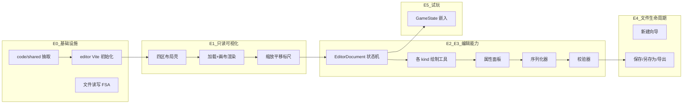

# arrow_jaw 关卡编辑器开发步骤拆解

> **版本**：v0.1  
> **日期**：2026-06-15  
> **关联文档**：[arrow_jaw_关卡编辑器开发需求文档.md](arrow_jaw_关卡编辑器开发需求文档.md) · [Arrow Jam 关卡编辑器需求.md](Arrow%20Jam%20关卡编辑器需求.md)

本文档将 arrow_jaw 关卡编辑器开发拆解为可执行的工程步骤，按 **E0 → E6** 分期推进。每步包含目标、产出物、依赖与完成定义（DoD）。代码根目录为 **`code/editor`**，共享层为 **`code/shared`**。

---

## 0. 模块依赖总览



---

## 1. E0 — 工程与共享层

> **目标**：搭建 editor 工程骨架，抽取 client 与 editor 共享代码  
> **预估**：2 天

### Step E0.1 — 创建 `code/shared/`

**目标**：将类型与解析器抽取为独立包，预留校验器/序列化器接口。

**操作**：
```bash
mkdir -p code/shared/src
cd code/shared && npm init -y
```

**文件**：

| 文件 | 内容 |
|------|------|
| `code/shared/package.json` | 包名 `@arrowjaw/shared`，导出 types/parser/validator/serializer |
| `code/shared/src/types.ts` | 从 `client/src/core/types.ts` 迁移 `LevelData`、`RawItem`、`Vec2`、`Direction`、枚举工具 |
| `code/shared/src/parser.ts` | 从 `client/src/core/level/parser.ts` 迁移 `parseLevelData` |
| `code/shared/src/validator.ts` | `validateLevelData(data): ValidationIssue[]`（先实现 V01~V03） |
| `code/shared/src/serializer.ts` | `serializeLevelData(doc): string`（占位，E2 完善） |
| `code/shared/src/index.ts` | 统一导出 |

**client 迁移**：
- `code/client/src/core/types.ts` 改为 `export * from '@arrowjaw/shared'`
- `code/client/src/core/level/parser.ts` 改为 re-export 或薄包装
- `code/client/vite.config.ts` 添加 alias：`@arrowjaw/shared` → `../shared/src`

**测试**：`code/shared/src/parser.test.ts`
- 加载 `level-30.json`，断言箭头数与 zone 数

**DoD**：
- [ ] `cd code/client && npm test` 全量通过（无回归）
- [ ] shared 包可独立 `npm test`

**依赖**：无  
**预估**：1 天

---

### Step E0.2 — 创建 `code/editor/` Vite 工程

**目标**：可启动的编辑器空壳，四区布局就绪。

**操作**：
```bash
cd code/editor
npm create vite@latest . -- --template vanilla-ts
npm install
npm install -D vitest
```

**产出目录**：
```
code/editor/
├── index.html
├── package.json
├── vite.config.ts          # alias: @arrowjaw/shared, @arrowjaw/client-render
├── src/
│   ├── main.ts
│   ├── app.ts
│   ├── style.css
│   ├── ui/
│   │   ├── layout.ts       # 四区 DOM 骨架
│   │   ├── menu-bar.ts
│   │   ├── toolbar.ts
│   │   ├── props-panel.ts
│   │   ├── status-bar.ts
│   │   └── tab-bar.ts      # 多标签占位
│   └── canvas/
│       └── editor-canvas.ts  # Canvas 容器占位
└── tsconfig.json
```

**`index.html` 布局**：菜单栏 + 左侧工具栏 + 中央 canvas 容器 + 右侧属性面板 + 底部状态栏 + 标签页栏。

**DoD**：
- [ ] `npm run dev` 可启动，四区布局可见
- [ ] `npm test` 可运行（空测试通过）

**依赖**：E0.1  
**预估**：0.5 天

---

### Step E0.3 — 文件 I/O 模块

**文件**：`code/editor/src/io/file-service.ts`

**功能**：

```typescript
interface FileService {
  supportsFSA(): boolean;
  openFile(): Promise<{ name: string; content: string; handle?: FileSystemFileHandle }>;
  openFiles(): Promise<...[]>;           // 多选
  openFromDrop(files: FileList): Promise<...[]>;
  saveFile(handle: FileSystemFileHandle, content: string): Promise<void>;
  saveAs(content: string, suggestedName: string): Promise<{ handle?: FileSystemFileHandle }>;
  exportDownload(content: string, filename: string): void;
}
```

**行为**：
- 检测 `window.showOpenFilePicker` 可用性
- FSA 不可用时降级：`<input type="file">` 打开 + `exportDownload` 保存
- 解析 `LevelData` JSON，必填字段缺失时 throw 带文案的错误

**测试**：`file-service.test.ts`
- mock FSA 不可用场景，断言降级路径
- 合法/非法 JSON 解析

**DoD**：
- [ ] 可选择 `code/client/public/levels/level-30.json` 并 `JSON.parse` 成功
- [ ] 缺字段 JSON 抛出可读错误
- [ ] FSA 降级路径有单元测试

**依赖**：E0.2  
**预估**：0.5 天

---

### E0 里程碑小结

| 步骤 | 产出 | 预估 |
|------|------|------|
| E0.1 | shared 包 + client 迁移 | 1 天 |
| E0.2 | editor 工程骨架 | 0.5 天 |
| E0.3 | 文件 I/O | 0.5 天 |
| **合计** | **可打开 JSON** | **2 天** |

---

## 2. E1 — 只读可视化

> **目标**：加载关卡并在画布上完整渲染，支持视图控制  
> **验收关卡**：L30, L45, L61  
> **预估**：2 天

### Step E1.1 — 加载与 EditorDocument 构建

**文件**：
- `code/editor/src/document/editor-document.ts`
- `code/editor/src/document/instance-id-allocator.ts`

**功能**：
- 打开文件 → 构建 `EditorDocument`
- `collectAllItems(itemModels)` 递归收集全部物件（含 kind 12 嵌套）
- instanceId 冲突检测：`findDuplicateIds()` → 自动重分配并记录变更
- 必填字段校验（V01）：width/height/itemModels

```typescript
function createDocumentFromJson(
  name: string,
  data: LevelData,
  handle?: FileSystemFileHandle
): EditorDocument;
```

**测试**：
- 加载 L30，断言顶层 + 嵌套物件总数
- 构造重复 instanceId 的 JSON，断言重分配后唯一

**DoD**：
- [ ] L30/L45/L61 均可加载为 EditorDocument
- [ ] 冲突 instanceId 自动修复并提示

**依赖**：E0.3  
**预估**：0.5 天

---

### Step E1.2 — 画布渲染

**文件**：
- `code/editor/src/canvas/editor-canvas.ts`
- `code/editor/src/canvas/board-view.ts`

**功能**：
- Vite alias `@arrowjaw/client-render` → `../client/src/render`
- 将 `EditorDocument` → `parseLevelData` → `BoardRenderer.drawBoard()`
- 编辑器叠加层：
  - 选中高亮（黄色描边，E2 前可跳过）
  - hover 格高亮 + tooltip `[x, y]`
- 网格线（浅灰细线）
- x/y 坐标标尺

**DoD**：
- [ ] L30 渲染与游戏 Demo 视觉一致（箭头颜色、区域框、捆绑条带）
- [ ] L45 管道与角块正确显示
- [ ] L61 幕布血量与钥匙标记正确

**依赖**：E1.1  
**预估**：1 天

---

### Step E1.3 — 视图控制

**文件**：`code/editor/src/canvas/viewport.ts`

**功能**：
- 滚轮缩放（10%~800%，以光标为中心）
- 空格 + 拖拽平移
- 「视图 → 重置视图」：100% 居中
- 状态栏：光标格坐标、缩放百分比、文件名

**DoD**：
- [ ] 缩放/平移流畅
- [ ] 状态栏实时更新坐标与缩放比
- [ ] 缩放 < 10% 时网格线隐藏

**依赖**：E1.2  
**预估**：0.5 天

---

### E1 里程碑小结

| 步骤 | 产出 | 预估 |
|------|------|------|
| E1.1 | EditorDocument 加载 | 0.5 天 |
| E1.2 | 画布渲染 | 1 天 |
| E1.3 | 视图控制 | 0.5 天 |
| **合计** | **只读可视化** | **2 天** |

---

## 3. E2 — 基础编辑

> **目标**：kind 1/4 编辑、关卡参数、序列化、撤销重做  
> **预估**：3 天

### Step E2.1 — 编辑状态与选择

**文件**：
- `code/editor/src/document/editor-store.ts`
- `code/editor/src/document/history.ts`
- `code/editor/src/ui/props-panel.ts`（关卡信息面板）

**功能**：
- 单击选中物件 → `selectedInstanceIds` 更新 → 属性面板切换
- Delete 删除选中物件
- 无选中时显示关卡信息面板（width/height/name 等）
- 修改 width/height 前确认对话框
- `instanceId` 自动递增分配器
- 撤销/重做栈（命令模式：`AddItem`、`RemoveItem`、`MoveItem`、`UpdateMeta`）

**DoD**：
- [ ] 可选中/取消选中物件，属性面板联动
- [ ] Delete 删除后 undo 可恢复
- [ ] 关卡信息修改后 dirty 标记更新

**依赖**：E1.3  
**预估**：1 天

---

### Step E2.2 — Kind 1 折线箭工具

**文件**：`code/editor/src/tools/arrow-tool.ts`

**功能**：
- 工具栏选中 Kind 1 → 画布点击添加折点 → 双击/回车结束绘制
- 绘制中虚线预览
- 末格 = 头部；绘制结束后根据末段自动建议 direction
- 属性面板：direction 下拉、colorId 色块选择
- 选中后拖拽整体平移 occupiedPositions
- 实时校验：不自交（V12）、头部方向（V11）、连续性（V04）

**测试**：`arrow-tool.test.ts`
- 构造 L 形折线，断言 occupiedPositions 与 direction

**DoD**：
- [ ] 可绘制 3 条不同颜色/方向的折线箭
- [ ] 拖拽平移后坐标正确更新
- [ ] 自交时绘制结束提示错误

**依赖**：E2.1  
**预估**：1 天

---

### Step E2.3 — Kind 4 角块工具

**文件**：`code/editor/src/tools/corner-tool.ts`

**功能**：
- 单格点击放置
- 属性面板：direction1/direction2 四方向按钮组
- 选择时实时校验垂直（V09 警告）与后方约束（V10 阻塞）
- 非法态红色闪烁

**DoD**：
- [ ] 可放置角块并配置 direction1/direction2
- [ ] 不垂直时警告，指向后方时阻塞并闪烁

**依赖**：E2.1  
**预估**：0.5 天

---

### Step E2.4 — 序列化器 v1

**文件**：`code/shared/src/serializer.ts`

**功能**：
- `serializeLevelData(doc: EditorDocument): string`
- 输出格式：2 空格缩进、UTF-8、稳定字段顺序
- kind 特有字段按结构说明顺序输出
- kind 12 递归序列化 `items[]`

**测试**：`serializer.test.ts`
- 往返：`parseLevelData(id, JSON.parse(serialize(doc)))` 物件数量与坐标一致
- L25 打开 → 序列化 → 解析，箭头数 = 62

**DoD**：
- [ ] 新建关卡画 3 条 kind 1 + 1 个 kind 4，导出 JSON 可被游戏 `parseLevelData` 解析
- [ ] L25 往返测试通过

**依赖**：E2.2, E2.3  
**预估**：0.5 天

---

### E2 里程碑小结

| 步骤 | 产出 | 预估 |
|------|------|------|
| E2.1 | 选择/删除/undo/关卡面板 | 1 天 |
| E2.2 | Kind 1 工具 | 1 天 |
| E2.3 | Kind 4 工具 | 0.5 天 |
| E2.4 | 序列化器 | 0.5 天 |
| **合计** | **基础编辑 MVP** | **3 天** |

---

## 4. E3 — 复杂物件与嵌套

> **目标**：kind 3/6/8/11/12 全部可编辑，完整校验器  
> **验收关卡**：L30, L45, L61  
> **预估**：4 天

### Step E3.1 — Kind 3 管道工具

**文件**：`code/editor/src/tools/pipe-tool.ts`

**功能**：
- 折线绘制（同 kind 1 交互）
- 属性面板：
  - health 数值输入
  - passes 端点列表：每端 position（从 occupiedPositions 选择）+ directions 多选
  - healthViewPathIndex 下拉（occupiedPositions 索引）
- 绘制结束后自动在首尾格生成默认 passes

**测试**：参考 L45/L48 passes 配置

**DoD**：
- [ ] L45 管道可加载、编辑 health 与 passes
- [ ] passes position 不在 occupiedPositions 内时校验阻塞

**预估**：1 天

---

### Step E3.2 — Kind 6 幕布 + Kind 11 钥匙

**文件**：
- `code/editor/src/tools/curtain-tool.ts`
- `code/editor/src/tools/key-tool.ts`

**功能**：
- 幕布：拖拽框选矩形 → 生成 occupiedPositions 网格
- 属性：health、order；layer 锁定为 8
- 钥匙：单格点击放置；layer 锁定为 3
- 属性面板显示绑定 kind 1 箭坐标（同格查找）

**DoD**：
- [ ] L61 幕布可编辑 health/order
- [ ] 钥匙放置后显示绑定箭坐标
- [ ] 非矩形幕布区域校验阻塞

**预估**：1 天

---

### Step E3.3 — Kind 12 子区域

**文件**：
- `code/editor/src/tools/zone-tool.ts`
- `code/editor/src/document/edit-context.ts`

**功能**：
- 拖拽框选矩形创建 kind 12
- 双击 zone → `editContext.zoneInstanceId` 切换为子层
- 面包屑导航：「顶层 > Zone #117 > 」
- 子层仅允许添加 kind 1/4/8（工具栏灰掉其他 kind）
- 子项坐标始终为全局棋盘坐标
- 子层绘制时 zone 外区域半透明遮罩

**DoD**：
- [ ] L30 可双击进入 zone，编辑内部箭头
- [ ] 面包屑返回顶层正常
- [ ] 子层添加 kind 3 被阻止

**预估**：1 天

---

### Step E3.4 — Kind 8 捆绑

**文件**：`code/editor/src/tools/bundle-tool.ts`

**功能**：
- 先选中 kind 1 箭 → 菜单/工具栏「捆绑」→ 框选 2~4 格
- 框选格须与箭身格子对齐
- 生成 kind 8 物件，layer = 3

**DoD**：
- [ ] L30 可新增/删除 bundle 条带
- [ ] 少于 2 格或多于 4 格校验阻塞

**预估**：0.5 天

---

### Step E3.5 — 完整校验器

**文件**：`code/shared/src/validator.ts`（扩展）

**功能**：实现需求文档 §5 全部 V01~V16 规则。

**文件**：`code/editor/src/ui/validation-panel.ts`

**功能**：
- 编辑操作后 debounce 运行校验
- 问题列表：等级图标 + 描述 + 定位（点击跳转物件）
- 保存按钮联动：有阻塞级错误时 disabled

**测试**：`validator.test.ts`
- 各 V 规则正负用例
- L30/L45/L61 加载后零阻塞错误

**DoD**：
- [ ] 16 条校验规则均有单元测试
- [ ] L30 修改 bundle 后校验通过
- [ ] 故意制造冲突后保存按钮禁用

**依赖**：E3.1~E3.4  
**预估**：0.5 天

---

### E3 里程碑小结

| 步骤 | 产出 | 预估 |
|------|------|------|
| E3.1 | Kind 3 管道 | 1 天 |
| E3.2 | Kind 6/11 | 1 天 |
| E3.3 | Kind 12 嵌套 | 1 天 |
| E3.4 | Kind 8 捆绑 | 0.5 天 |
| E3.5 | 完整校验器 | 0.5 天 |
| **合计** | **全物件编辑** | **4 天** |

---

## 5. E4 — 文件生命周期

> **目标**：新建/保存/多标签/快捷键完整闭环  
> **预估**：1.5 天

### Step E4.1 — 新建向导

**文件**：`code/editor/src/ui/new-level-dialog.ts`

**功能**：弹窗表单（width/height/name/duration/difficulty/levelKind）→ 创建空 EditorDocument。

**DoD**：
- [ ] Ctrl+N 弹出向导，确认后打开新标签页

**预估**：0.25 天

---

### Step E4.2 — 保存 / 另存为 / 导出

**文件**：`code/editor/src/document/save-controller.ts`

**功能**：
- Ctrl+S：有 FSA handle → 校验通过 → 写入；无 handle → 另存为
- Ctrl+Shift+S：`showSaveFilePicker`，强制 `arrowJam-main-level-{N}.json` 正则校验
- 导出：任意文件名 download
- 保存成功后 `dirty = false`，状态栏更新

**DoD**：
- [ ] 完整走通「新建 → 编辑 → FSA 保存 → 重新打开」
- [ ] 校验未通过时保存被阻止

**预估**：0.5 天

---

### Step E4.3 — 多标签页与拖拽

**文件**：
- `code/editor/src/ui/tab-bar.ts`
- `code/editor/src/document/tab-manager.ts`

**功能**：
- 每关卡独立标签页，各自 EditorDocument + dirty 状态
- 拖拽 JSON 到窗口 → 新标签打开
- 批量文件选择 → 多标签
- 关闭未保存标签 → 确认对话框

**DoD**：
- [ ] 同时打开 L30 + L45，切换标签互不影响
- [ ] 拖拽 2 个 JSON 文件打开 2 个标签

**预估**：0.5 天

---

### Step E4.4 — 复制/粘贴与快捷键

**文件**：`code/editor/src/document/clipboard.ts`

**功能**：
- Ctrl+C：复制选中物件（深拷贝，重分配新 instanceId）
- Ctrl+V：粘贴到光标格或偏移 (1,1)
- 全局快捷键表（见需求文档 §4.7）

**DoD**：
- [ ] 复制粘贴后 instanceId 不冲突
- [ ] 全部快捷键可用

**预估**：0.25 天

---

### E4 里程碑小结

| 步骤 | 产出 | 预估 |
|------|------|------|
| E4.1 | 新建向导 | 0.25 天 |
| E4.2 | 保存流程 | 0.5 天 |
| E4.3 | 多标签/拖拽 | 0.5 天 |
| E4.4 | 剪贴板/快捷键 | 0.25 天 |
| **合计** | **文件生命周期** | **1.5 天** |

---

## 6. E5 — 试玩预览

> **目标**：编辑器内嵌入游戏引擎试玩  
> **验收关卡**：L29  
> **预估**：1.5 天

### Step E5.1 — 试玩模式

**文件**：
- `code/editor/src/preview/play-mode.ts`
- `code/editor/src/preview/play-controls.ts`

**功能**：
- 「工具 → 试玩预览」切换模式
- 编辑工具栏/属性面板禁用
- 当前 doc → serialize → parseLevelData → new GameState(level)
- 复用 client `BoardRenderer` + 发射动画循环
- 播放控件：开始 / 暂停 / 重置
- Esc 退出，恢复编辑态与视口

**约束**：
- 存在阻塞级校验错误时入口禁用

**DoD**：
- [ ] 编辑器内试玩 L29 可发射并获胜
- [ ] 编辑改动后试玩反映最新数据
- [ ] Esc 退出恢复编辑态

**依赖**：E3.5, E2.4  
**预估**：1.5 天

---

## 7. E6 — 打磨与验收

> **目标**：体验完善、文档补齐、全量验收  
> **预估**：1 天

### Step E6.1 — 体验打磨

- 非法态红色闪烁动画
- 「高级视图」显示全部 instanceId（只读）
- 帮助菜单：kind 说明弹窗、快捷键列表
- FSA 不可用时首次打开显示降级提示

**预估**：0.5 天

---

### Step E6.2 — 文档与 README

- 根目录 `README.md` 补充编辑器启动说明：
  ```bash
  cd code/editor && npm install && npm run dev
  ```
- 注明 Chrome/Edge 推荐（FSA 完整支持）

**预估**：0.25 天

---

### Step E6.3 — 全量验收

**操作**：
1. 往返测试：L25, L30, L45, L48, L61 打开 → 无修改保存 → 重新解析语义等价
2. 编辑测试：新建 20×32 关卡，放置 kind 1/4/12，校验通过并试玩
3. `cd code/shared && npm test`
4. `cd code/editor && npm test`
5. `cd code/client && npm test`（回归）

**DoD**（对应需求文档 §7）：
- [ ] 5 个往返测试关卡通过
- [ ] 新建关卡流程通过
- [ ] client 全量测试无回归
- [ ] 无控制台错误

**预估**：0.25 天

---

### E6 里程碑小结

| 步骤 | 产出 | 预估 |
|------|------|------|
| E6.1 | 体验打磨 | 0.5 天 |
| E6.2 | README | 0.25 天 |
| E6.3 | 全量验收 | 0.25 天 |
| **合计** | **可交付版本** | **1 天** |

---

## 8. 测试策略

### 8.1 单元测试（Vitest）

| 模块 | 测试文件 | 重点 |
|------|----------|------|
| shared/parser | `code/shared/src/parser.test.ts` | JSON 解析、嵌套 zone |
| shared/serializer | `code/shared/src/serializer.test.ts` | 往返等价 |
| shared/validator | `code/shared/src/validator.test.ts` | V01~V16 正负用例 |
| editor/file-service | `code/editor/src/io/file-service.test.ts` | FSA 降级 |
| editor/history | `code/editor/src/document/history.test.ts` | undo/redo |
| editor/arrow-tool | `code/editor/src/tools/arrow-tool.test.ts` | 折线约束 |
| editor/instance-id | `code/editor/src/document/instance-id-allocator.test.ts` | 冲突重分配 |

### 8.2 集成 / 手工测试

- 每阶段 DoD 所列关卡视觉对比游戏 Demo
- 往返测试：打开 → 保存 → 重新打开
- 试玩验收：L29 通关录屏

### 8.3 回归清单

| 阶段 | 必测关卡 | 测试重点 |
|------|----------|----------|
| E1 | 30, 45, 61 | 只读渲染 |
| E2 | 25 | kind 1/4 编辑 + 往返 |
| E3 | 30, 45, 61 | 全 kind 编辑 + 校验 |
| E4 | 新建关卡 | 保存/多标签 |
| E5 | 29 | 试玩通关 |
| E6 | 25, 30, 45, 48, 61 | 全量往返 |

---

## 9. 里程碑时间表（粗估）

| 里程碑 | 内容 | 累计工时 |
|--------|------|----------|
| M0 (E0) | 工程 + shared 抽取 | 2 天 |
| M1 (E1) | 只读可视化 | 4 天 |
| M2 (E2) | 基础编辑 MVP | 7 天 |
| M3 (E3) | 全物件 + 校验 | 11 天 |
| M4 (E4) | 文件生命周期 | 12.5 天 |
| M5 (E5) | 试玩预览 | 14 天 |
| M6 (E6) | 打磨验收 | 15 天 |

> 以上为单人全职开发的粗估，实际可能因 UI 细节、FSA 兼容性调试而浮动 ±30%。  
> **可先行交付的子里程碑**：E0+E1+E2 ≈ 7 天 → 「能看能画基础关卡并导出 JSON」。

---

## 10. 建议开发顺序速查

```
Week 1:  E0.1–E0.3, E1.1–E1.3     （工程 + 只读可视化）
Week 2:  E2.1–E2.4                （kind 1/4 编辑 + 序列化）
Week 3:  E3.1–E3.5                （全 kind 编辑 + 校验器）
Week 4:  E4.1–E4.4, E5.1         （文件闭环 + 试玩）
Week 5:  E6.1–E6.3                （打磨 + 全量验收）
```

---

## 11. 目录结构预览（完成后）

```
arrowjaw/
├── code/
│   ├── shared/                    # E0.1
│   │   └── src/
│   │       ├── types.ts
│   │       ├── parser.ts
│   │       ├── validator.ts
│   │       └── serializer.ts
│   ├── client/                    # 游戏 Demo（import 改指向 shared）
│   └── editor/                    # E0.2 起
│       └── src/
│           ├── app.ts
│           ├── document/          # EditorDocument / store / history
│           ├── tools/             # 各 kind 绘制工具
│           ├── ui/                # 面板/菜单/标签/对话框
│           ├── io/                # FSA 文件服务
│           ├── canvas/            # 画布 + viewport
│           └── preview/           # E5 试玩模式
└── docs/
    ├── arrow_jaw_关卡编辑器开发需求文档.md
    └── arrow_jaw_关卡编辑器开发步骤拆解.md
```

---

*文档结束*
