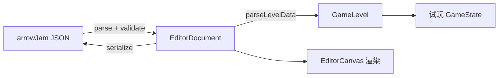

# arrow_jaw 关卡编辑器开发需求文档

> **版本**：v0.1  
> **日期**：2026-06-15  
> **状态**：待开发  
> **关联文档**：[Arrow Jam 关卡编辑器需求.md](Arrow%20Jam%20关卡编辑器需求.md) · [Arrow 关卡结构说明.md](Arrow%20关卡结构说明.md) · [arrow_jaw_开发需求文档.md](arrow_jaw_开发需求文档.md) · [arrow_jaw_关卡编辑器开发步骤拆解.md](arrow_jaw_关卡编辑器开发步骤拆解.md)

---

## 1. 项目概述

### 1.1 项目名称

**arrow_jaw Level Editor** — Arrow Jam 关卡可视化编辑器（仓库子项目 `code/editor`）。

### 1.2 项目背景

Arrow Jam 关卡数据采用 JSON 文件（`arrowJam-main-level-{N}.json`）存储。手工编辑存在效率低、可视化差、易出错、学习成本高等问题。游戏 Demo（`code/client`）已实现全部 7 种物件的解析、渲染与玩法逻辑，为编辑器提供了可复用的核心资产。

### 1.3 项目目标

在浏览器中实现关卡数据的「所见即所得」编辑，覆盖完整生命周期：

- **可视化**：所有物件在棋盘网格上以图形化方式呈现
- **结构化编辑**：通过属性面板配置参数，无需直接书写 JSON
- **文件管理**：新建 / 打开 / 保存 / 另存为 / 导出
- **数据校验**：保存前自动校验，阻塞级错误禁止写入
- **试玩预览**：内置试玩模式，验证关卡可玩性

### 1.4 不在本期范围

- Electron / Tauri 桌面应用包装
- JSON diff / 版本对比 UI
- 多人协作、云端存储、账号系统
- 自动关卡生成 / AI 辅助设计
- 音效与复杂粒子特效

### 1.5 技术选型

| 项 | 选择 | 理由 |
|----|------|------|
| 语言 | TypeScript | 与游戏 Demo 一致 |
| 构建 | Vite | 与游戏 Demo 一致 |
| 渲染 | Canvas（主） | 复用 `code/client/src/render/` |
| 工程位置 | `code/editor/` 独立应用 | 与游戏 Demo 解耦，可独立部署 |
| 共享代码 | `code/shared/` | types / parser / validator / serializer 避免双向拷贝 |
| 文件 I/O | File System Access API + 降级 | Chrome/Edge 覆盖保存；其他浏览器下载/上传 |
| UI | 纯 DOM + CSS | 与 client 一致，属性面板用表单 DOM |
| 测试 | Vitest | 校验器、序列化器、往返测试 |

---

## 2. 术语与数据契约

### 2.1 术语约定

| 术语 | 含义 |
|------|------|
| 棋盘 | 由 width × height 网格组成的关卡画布 |
| 物件 | 关卡中可交互的元素（箭、管道、角块等） |
| 坐标 | (x, y)，x 为列（向右增大），y 为行（向下增大） |
| 占用格 | occupiedPositions，物件占据的网格点集合 |
| 容器物件 | kind: 12 区域，可嵌套子物件 |

完整 kind 映射、坐标语义、嵌套规则见 [Arrow 关卡结构说明.md](Arrow%20关卡结构说明.md)。

### 2.2 kind 与 layer 速查

| kind | 配置名称 | layer | 编辑器工具 |
|------|----------|-------|-----------|
| 1 | 折线箭 | 2 | 折线绘制 |
| 3 | 管道 | 2 | 折线绘制 + passes 端点编辑 |
| 4 | 反射角块 | 2 | 单格放置 |
| 6 | 幕布 | 8（固定） | 矩形框选 |
| 8 | 捆绑箭 | 3（固定） | 捆绑命令 + 框选 |
| 11 | 钥匙箭 | 3（固定） | 单格放置 |
| 12 | 子区域容器 | 1（固定） | 矩形框选 + 双击进入子层 |

### 2.3 direction 枚举

| 值 | 方向 | 向量 (dx, dy) |
|----|------|---------------|
| 1 | 下 | (0, +1) |
| 2 | 上 | (0, -1) |
| 3 | 右 | (+1, 0) |
| 4 | 左 | (-1, 0) |

### 2.4 colorId 色表

与游戏 Demo 渲染一致（引用 `gen_level_board.py`）：

| colorId | 颜色 | 色值 |
|---------|------|------|
| 3 | 红 | `#ff6b6b` |
| 4 | 紫 | `#e599f7` |
| 6 | 绿 | `#51cf66` |
| 7 | 蓝 | `#4dabf7` |
| 1, 2, 8 | 未定义 | `#adb5bd`（回退灰） |

### 2.5 JSON 文件命名

| 场景 | 命名规范 |
|------|----------|
| 编辑器导出 / 另存为 | `arrowJam-main-level-{N}.json`（强制） |
| 游戏 Demo 运行时 | `level-{N}.json`（由 `copy-levels.mjs` 转换） |

编辑器打开时**同时兼容**两种命名；导出默认使用原始规范。

### 2.6 顶层 JSON 结构

```json
{
  "width": 20,
  "height": 32,
  "name": "",
  "durationInSec": 150,
  "difficulty": 2,
  "levelKind": 1,
  "itemModels": [ ... ]
}
```

| 字段 | 类型 | 约束 |
|------|------|------|
| width | int | 20 ≤ width ≤ 255 |
| height | int | 20 ≤ height ≤ 255 |
| name | string | 可空 |
| durationInSec | int | ≥ 1 |
| difficulty | enum | 1=Normal / 2=Hard / 3=Superhuman |
| levelKind | int | 可选，主线/普通 |
| itemModels | RawItem[] | 顶层物件数组 |

### 2.7 编辑器文档模型 vs 运行时模型

游戏 Demo 使用扁平化的 `GameLevel`（便于玩法逻辑）；编辑器使用保留树形结构的 `EditorDocument`：

```typescript
interface EditorDocument {
  meta: {
    width: number;
    height: number;
    name: string;
    durationInSec: number;
    difficulty: number;
    levelKind?: number;
  };
  itemModels: RawItem[];           // 保留 JSON 树形结构（kind 12 含 items[]）
  source: {
    name: string;                    // 文件名
    handle?: FileSystemFileHandle;  // FSA 文件句柄（可选）
  };
  dirty: boolean;
  selectedInstanceIds: number[];
  editContext: {
    zoneInstanceId: number | null;  // null=顶层；非 null=子区域编辑态
  };
}
```

**数据流**：



---

## 3. 核心功能需求

### 3.1 文件管理

#### 3.1.1 打开 / 读取关卡

**支持来源**：

- 本地文件选择（`<input type="file" accept=".json" multiple>`）
- 拖拽 JSON 文件至编辑器窗口
- File System Access API `showOpenFilePicker()`（Chrome/Edge）
- 批量打开同一目录下的多关卡（多标签页）

**解析规则**：

| 条件 | 行为 |
|------|------|
| 必填顶层字段缺失（width/height/itemModels） | 弹窗提示，阻止加载 |
| instanceId 冲突（含 kind 12 嵌套子项） | 提示并自动重分配 |
| JSON 语法错误 | 弹窗提示解析失败 |

**展示**：解析成功后，在画布中央渲染棋盘与全部物件。

#### 3.1.2 保存关卡

| 方式 | 行为 | 平台 |
|------|------|------|
| 保存（Ctrl+S） | 覆盖原文件 | FSA 有 handle 时直接写入；否则触发另存为 |
| 另存为（Ctrl+Shift+S） | 弹出文件选择，强制 `arrowJam-main-level-{N}.json` | FSA `showSaveFilePicker` |
| 导出 | 下载 JSON 到自定义路径 | 所有浏览器 `download` 降级 |

**写入格式**：JSON 美化（2 空格缩进、UTF-8、字段顺序稳定）。

**保存前**：必须通过 §5 数据校验（阻塞级错误禁用保存按钮）。

#### 3.1.3 新建关卡

弹出新建向导：

| 字段 | 默认值 | 约束 |
|------|--------|------|
| width | 20 | 20~255 |
| height | 32 | 20~255 |
| name | 空 | 可空 |
| durationInSec | 150 | ≥ 1 |
| difficulty | 1 | 1/2/3 |
| levelKind | 可选 | 下拉 |

创建后 `itemModels` 为空，`instanceId` 分配器从 1 起递增。

---

### 3.2 关卡基础参数编辑

无选中物件时，右侧显示「关卡信息」面板：

| 字段 | UI 控件 | 特殊行为 |
|------|---------|----------|
| width | 数字输入框（20~255） | 修改前确认：「调整棋盘尺寸可能裁切/留白现有物件，是否继续？」 |
| height | 数字输入框（20~255） | 同上 |
| name | 单行文本 | — |
| durationInSec | 数字输入框（≥1） | — |
| difficulty | 下拉（Normal/Hard/Superhuman） | — |
| levelKind | 下拉（主线/普通） | — |

缩小棋盘时，超出范围的物件坐标在保存校验时报阻塞错误；放大时留白无影响。

---

### 3.3 物件编辑

#### 3.3.1 通用编辑能力

| 操作 | 交互 |
|------|------|
| 新增物件 | 左侧工具栏选择 kind → 画布点击/拖拽放置 |
| 选中物件 | 单击高亮（黄色描边），右侧属性面板显示字段 |
| 移动物件 | 拖拽整体平移，occupiedPositions 同步更新 |
| 删除物件 | Delete 键或右键菜单 |
| 复制/粘贴 | Ctrl+C / Ctrl+V |
| 撤销/重做 | Ctrl+Z / Ctrl+Y |
| instanceId | 自动分配，UI 默认隐藏；「高级视图」只读展示 |

#### 3.3.2 Kind 1 — 折线箭

**绘制**：点击拖动形成折线，末格为头部。

**可编辑字段**：direction（1~4）、colorId（3/4/6/7）、layer（默认 2）。

**约束**：

- 折线不可自交
- 末格必须与 direction 步进向量一致
- 相邻格必须正交相连（曼哈顿距离 = 1）

#### 3.3.3 Kind 3 — 管道

**绘制**：点击拖动生成折线/蛇身。

**可编辑字段**：health、passes（每端 `{position, directions[]}`）、healthViewPathIndex。

**约束**：

- passes 的 position 必须在 occupiedPositions 内
- directions 必须是允许的反射向量（如 `[1,0]`、`[0,-1]` 等）
- 相邻格首尾相接

#### 3.3.4 Kind 4 — 反射角块

**绘制**：单格放置。

**可编辑字段**：direction1、direction2（`[dx, dy]` 向量）。

**约束**：

- direction1 与 direction2 必须互相垂直（90° 折射）
- 不能指向角块「后方」（不能让箭反射回原路）

#### 3.3.5 Kind 6 — 幕布

**绘制**：拖拽框选矩形区域。

**可编辑字段**：health、order；layer 固定为 8，不可改。

**约束**：

- occupiedPositions 必须是连续完整矩形
- 不同幕布 order 唯一性建议（警告级）

#### 3.3.6 Kind 8 — 捆绑箭

**绘制**：先选中 kind 1 箭 → 执行「捆绑」命令 → 框选 2–4 格短条。

**可编辑字段**：无额外字段；layer 固定为 3。

**约束**：捆绑段须沿箭身格子排列。

#### 3.3.7 Kind 11 — 钥匙箭

**绘制**：单格放置；layer 固定为 3。

**绑定规则**：与占用格上的 kind 1 箭绑定（同格计数点）；属性面板显示绑定箭的坐标。

#### 3.3.8 Kind 12 — 区域容器

**绘制**：拖拽框选矩形。

**子项编辑**：双击进入子区域，面包屑导航；递归编辑 `items[]`。

**子项支持类型**：kind 1、4、8（坐标使用**全局棋盘坐标**，非局部坐标）。

**约束**：layer 固定为 1；子区域外框须为完整矩形。

---

### 3.4 可视化画布

#### 3.4.1 渲染规则

**坐标系**：x 向右、y 向下，原点在左上角。

**层级显示（从底到顶）**：

| layer | 物件 |
|-------|------|
| 1 | kind 12 区域背景 |
| 2 | kind 1 箭、kind 3 管道、kind 4 角块 |
| 3 | kind 8 捆绑、kind 11 钥匙 |
| 8 | kind 6 幕布 |

复用游戏 Demo 的 `BoardRenderer` 与各 drawer，保证视觉一致。

#### 3.4.2 编辑器叠加层

| 状态 | 视觉表现 |
|------|----------|
| colorId 3/4/6/7 | 红/紫/绿/蓝填充（与游戏一致） |
| 选中态 | 黄色描边 |
| 非法态 | 红色闪烁 |
| Hover 占用格 | 高亮 + tooltip 显示 `[x, y]` |
| 绘制中（折线/矩形） | 虚线预览 |

#### 3.4.3 辅助功能

| 功能 | 交互 |
|------|------|
| 网格线 | 默认显示；缩放 < 10% 时自动隐藏 |
| 坐标标尺 | 顶部 x 轴、左侧 y 轴 |
| 缩放 | 鼠标滚轮，10%~800% |
| 平移 | 按住空格 + 拖拽 |
| 重置视图 | 菜单 / 快捷键，100% 居中 |

---

### 3.5 试玩预览

**入口**：菜单栏「工具 → 试玩预览」。

**行为**：

- 进入后禁用所有编辑工具
- 将当前 `EditorDocument` 序列化 → `parseLevelData` → `GameState`
- 复用游戏 Demo 的 `BoardRenderer` 动画循环与输入处理
- 播放控件：开始 / 暂停 / 重置
- Esc 退出试玩，恢复编辑态

**约束**：存在阻塞级校验错误时，试玩入口禁用并提示先修复。

---

## 4. UI 界面设计

### 4.1 整体窗口布局

```
┌─────────────────────────────────────────────┐
│  菜单栏 / 工具栏                              │
├──────────┬──────────────────────┬───────────┤
│          │                      │           │
│  物件    │    画布主区域         │  属性面板  │
│  工具栏  │  (棋盘网格+物件渲染)  │           │
│          │                      │           │
├──────────┴──────────────────────┴───────────┤
│  标签页栏（多关卡时）                          │
├─────────────────────────────────────────────┤
│  状态栏（坐标、缩放比例、保存状态、提示信息）    │
└─────────────────────────────────────────────┘
```

### 4.2 菜单栏

| 菜单 | 项 | 功能 |
|------|-----|------|
| 文件 | 新建 / 打开 / 保存 / 另存为 / 导出 / 关闭标签 | §3.1 |
| 编辑 | 撤销 / 重做 / 复制 / 粘贴 / 删除 | §3.3.1 |
| 视图 | 缩放 +/- / 重置视图 / 显示网格 / 高级视图 | §3.4 |
| 工具 | 试玩预览 / 捆绑（kind 8） | §3.5 / §3.3.6 |
| 帮助 | 类型说明 / 快捷键列表 | — |

### 4.3 左侧物件工具栏

按 kind 分类，hover 显示名称与简要说明：

- Kind 1：折线箭
- Kind 3：管道
- Kind 4：反射角块
- Kind 6：幕布（矩形工具）
- Kind 8：捆绑箭（需先选中 Kind 1）
- Kind 11：钥匙箭
- Kind 12：区域容器

### 4.4 右侧属性面板

| 上下文 | 显示内容 |
|--------|----------|
| 无选中 | 关卡信息面板（§3.2） |
| 选中 kind 1 | direction、colorId、layer |
| 选中 kind 3 | health、passes 端点编辑器、healthViewPathIndex |
| 选中 kind 4 | direction1、direction2 方向选择器 |
| 选中 kind 6 | health、order |
| 选中 kind 8 | 附加段信息（继承关联箭） |
| 选中 kind 11 | 绑定箭坐标 |
| 选中 kind 12 | 子项树形列表 + 「进入子层」按钮 |
| 高级视图 | 只读 instanceId 列表 |

### 4.5 对话框

| 触发 | 内容 | 等级 |
|------|------|------|
| 打开文件失败 | 必填字段缺失 / JSON 解析错误 | 阻塞 |
| instanceId 冲突 | 自动重分配说明 | 信息 |
| 修改 width/height | 裁切/留白确认 | 警告 |
| 保存 | 校验问题清单 | 阻塞/警告 |
| 角块 direction 不垂直 | 配置提示 | 警告 |
| 角块指向后方 | 配置错误 | 阻塞 |
| 另存为 | 强制 `arrowJam-main-level-{N}.json` | 强制 |
| 关闭未保存标签 | 是否保存 | 警告 |
| FSA 不可用 | 降级为下载/上传说明 | 信息 |

### 4.6 状态栏

| 区域 | 内容 |
|------|------|
| 左 | 光标格坐标 `[x, y]` |
| 中 | 缩放百分比、当前选中物件 kind + instanceId |
| 右 | 保存状态（已保存 / 未保存 / 校验未通过） |

### 4.7 快捷键

| 快捷键 | 功能 |
|--------|------|
| Delete | 删除选中物件 |
| Ctrl+C / Ctrl+V | 复制 / 粘贴 |
| Ctrl+Z / Ctrl+Y | 撤销 / 重做 |
| Ctrl+S | 保存 |
| Ctrl+Shift+S | 另存为 |
| Ctrl+O | 打开 |
| Ctrl+N | 新建 |
| Space + 拖拽 | 平移画布 |
| 滚轮 | 缩放画布 |
| Esc | 退出试玩 / 取消当前绘制 / 退出子区域编辑 |

---

## 5. 数据校验

保存前执行全部校验。结果分为**阻塞**（禁止保存）与**警告**（允许保存但列表提示）。

| ID | 校验项 | 规则 | 等级 | 校验函数 |
|----|--------|------|------|----------|
| V01 | 顶层字段完整性 | width/height/itemModels 必须存在且类型正确 | 阻塞 | `assertTopLevelFields` |
| V02 | instanceId 唯一性 | 同关内（含 kind 12 嵌套）不重复 | 阻塞 | `assertUniqueInstanceIds` |
| V03 | 坐标范围 | 所有 occupiedPositions 在 [0, width) × [0, height) | 阻塞 | `assertPositionsInBounds` |
| V04 | 折线连续性 | kind 1/3 相邻格曼哈顿距离 = 1 | 阻塞 | `assertPolylineContinuous` |
| V05 | 矩形完整性 | kind 6/12 的 occupiedPositions 为完整矩形 | 阻塞 | `assertRectangularRegion` |
| V06 | kind 12 嵌套约束 | 子项只能为 kind 1/4/8 | 阻塞 | `assertZoneChildKinds` |
| V07 | passes 配置 | kind 3 的 passes.position 均在 occupiedPositions 内 | 阻塞 | `assertPipePasses` |
| V08 | 管道 passes 数量 | kind 3 至少 2 个 pass 端点 | 阻塞 | `assertPipePassCount` |
| V09 | 角块垂直约束 | kind 4 的 direction1 与 direction2 点积 = 0 | 警告 | `warnCornerPerpendicular` |
| V10 | 角块后方约束 | kind 4 配置不能让箭从后方穿入 | 阻塞 | `assertCornerNoBackface` |
| V11 | 箭头头部方向 | kind 1 末段步进与 direction 一致 | 阻塞 | `assertArrowHeadDirection` |
| V12 | 箭头不自交 | kind 1 occupiedPositions 无重复格 | 阻塞 | `assertNoSelfIntersection` |
| V13 | 幕布 order 唯一 | kind 6 的 order 值不重复 | 警告 | `warnCurtainOrderUnique` |
| V14 | 钥匙绑定 | kind 11 占用格须存在 kind 1 箭（同格或箭身段） | 警告 | `warnKeyBinding` |
| V15 | 捆绑格数 | kind 8 占用 2~4 格 | 阻塞 | `assertBundleLength` |
| V16 | 必填 kind 字段 | 各 kind 特有字段非空（direction/colorId/health 等） | 阻塞 | `assertKindRequiredFields` |

**UI 联动**：

- 存在阻塞级错误 → 保存按钮禁用，状态栏显示「校验未通过」，问题面板列出全部项
- 仅警告 → 保存按钮可用，保存时弹窗确认或问题面板展示

---

## 6. 与游戏 Demo 的代码复用

| 模块 | 源路径 | 编辑器用途 |
|------|--------|-----------|
| 类型定义 | `code/client/src/core/types.ts` → `code/shared/` | `LevelData`、`RawItem`、枚举 |
| 解析器 | `code/client/src/core/level/parser.ts` → `code/shared/` | 打开关卡、试玩前转换 |
| 校验器 | **新建** `code/shared/src/validator.ts` | 保存前校验 |
| 序列化器 | **新建** `code/shared/src/serializer.ts` | 导出 JSON |
| 棋盘渲染 | `code/client/src/render/board-renderer.ts` | 画布可视化 |
| 各 drawer | `code/client/src/render/*-drawer.ts` | 物件绘制 |
| 布局常量 | `code/client/src/render/colors.ts` | CELL/GAP/配色 |
| 玩法引擎 | `code/client/src/core/game/game-state.ts` | 试玩预览 |

**共享策略**：抽取 `code/shared/`，client 与 editor 均通过 workspace alias `@arrowjaw/shared` 导入；渲染层通过 Vite alias `@arrowjaw/client-render` 引用 client 模块（避免重复拷贝 drawer 代码）。

---

## 7. 验收标准

### 7.1 E1 验收（只读可视化）

- [ ] 打开 `level-30.json`、`level-45.json`、`level-61.json` 渲染与游戏 Demo 视觉一致
- [ ] 网格、标尺、缩放、平移可用
- [ ] 状态栏显示文件名与坐标

### 7.2 E2 验收（基础编辑）

- [ ] 从零新建 20×32 关卡，绘制 3 条 kind 1 + 1 个 kind 4
- [ ] 导出 JSON 可被游戏 `parseLevelData` 解析
- [ ] 撤销/重做、删除、移动正常

### 7.3 E3 验收（全物件编辑）

- [ ] L30（zone + bundle）可加载、编辑 bundle 后校验通过
- [ ] L45（pipe）可编辑 passes 与 health
- [ ] L61（curtain + key）可编辑 order/health
- [ ] kind 12 双击进入子层，面包屑返回顶层

### 7.4 E4 验收（文件生命周期）

- [ ] 完整走通「新建 → 编辑 → FSA 保存 → 重新打开」
- [ ] 另存为强制 `arrowJam-main-level-{N}.json`
- [ ] 多标签页切换，未保存关闭提示
- [ ] 拖拽批量打开

### 7.5 E5 验收（试玩预览）

- [ ] 编辑器内试玩 L29 可正常发射并获胜
- [ ] 编辑改动后试玩反映最新数据
- [ ] Esc 退出恢复编辑态

### 7.6 往返测试

对以下关卡执行「打开 → 无修改保存 → 重新解析」语义等价测试：

| 关卡 | 测试重点 |
|------|----------|
| L25 | kind 4 角块 |
| L30 | kind 12 嵌套 + kind 8 捆绑 |
| L45 | kind 3 管道 |
| L48 | L 形管道 |
| L61 | kind 6 幕布 + kind 11 钥匙 |

字段顺序可不同，但物件数量、坐标、参数须一致。

---

## 8. 风险与未决问题

| ID | 问题 | 影响 | 缓解措施 |
|----|------|------|----------|
| RISK-E01 | File System Access API 在 Firefox/Safari 支持有限 | E4 保存 | 降级为下载 + 上传；状态栏提示 |
| RISK-E02 | kind 8 捆绑组跨箭头 direction 不一致 | E3 编辑 | 参考游戏 `bundle.ts` 规则；警告提示 |
| RISK-E03 | kind 11 与 kind 1 无显式 linkId | E3 属性面板 | 按同格坐标推断绑定关系 |
| RISK-E04 | 大棋盘（L29: 27×36）编辑器性能 | E1 渲染 | 复用 Canvas 分层；缩放时降低标尺精度 |
| RISK-E05 | shared 包抽取导致 client 回归 | E0 迁移 | client 改 import 后跑全量 Vitest |
| RISK-E06 | 序列化字段顺序与原版不完全一致 | E4 往返 | 往返测试以语义等价为准，非字节级 diff |

---

## 附录 A：参考资产

| 资产 | 路径 | 用途 |
|------|------|------|
| 编辑器需求原文 | `docs/Arrow Jam 关卡编辑器需求.md` | 功能/UI 原始描述 |
| 关卡结构说明 | `docs/Arrow 关卡结构说明.md` | JSON 字段语义 |
| 示例关卡 | `code/client/public/levels/level-*.json` | 开发/验收用例 |
| 游戏 Demo 代码 | `code/client/src/` | 解析/渲染/玩法复用 |
| 可视化脚本 | `docs/crackdata/关卡提取/gen_level_board.py` | 渲染参数、配色 |

---

*文档结束*
