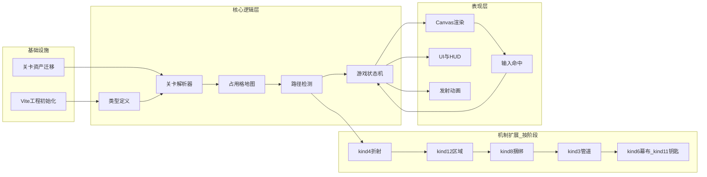

# arrow_jaw 开发步骤拆解

> **版本**：v0.1  
> **日期**：2026-06-10  
> **关联文档**：[arrow_jaw_开发需求文档.md](arrow_jaw_开发需求文档.md)

本文档将 arrow_jaw Demo 开发拆解为可执行的工程步骤，按 **P0 → P4** 分期推进。每步包含目标、产出物、依赖与完成定义（DoD）。代码根目录在项目根目录下的 **code\client**

---

## 0. 模块依赖总览



---

## 1. 工程初始化（所有阶段前置）

### Step 0.1 — 创建 Vite + TypeScript 项目

**目标**：搭建可运行的空项目骨架。

**操作**：
```bash
npm create vite@latest . -- --template vanilla-ts
npm install
npm install -D vitest
```

**产出目录**：
```
arrow_jaw/
├── index.html
├── package.json
├── tsconfig.json
├── vite.config.ts
├── public/
│   └── levels/          # 关卡 JSON（Step 0.2 填充）
├── src/
│   ├── main.ts
│   ├── core/
│   ├── render/
│   └── ui/
└── docs/
```

**DoD**：
- [ ] `npm run dev` 可启动
- [ ] TypeScript 编译无错误
- [ ] `npm test` 可运行（空测试通过）

**预估**：0.5 天

---

### Step 0.2 — 关卡资产迁移

**目标**：将 JSON 关卡拷贝到 `public/levels/` 并统一命名。

**操作**：
- 编写 `scripts/copy-levels.mjs`（或 npm script）
- 源：`docs/crackdata/关卡提取/0605-arrowJam-main-level-{N}-seed-1.json`
- 目标：`public/levels/level-{N}.json`
- 生成 `public/levels/manifest.json`（关卡列表 25–64）

**manifest.json 示例**：
```json
{
  "levels": [
    { "id": 29, "file": "level-29.json", "name": "Level 29", "difficulty": 3 }
  ]
}
```

**DoD**：
- [ ] 40 个 JSON 全部拷贝
- [ ] manifest 可被 `fetch` 加载
- [ ] 拷贝脚本可重复执行

**预估**：0.5 天

---

## 2. P0 — MVP 可玩 Demo

> **目标**：kind 1 基础箭头 + 路径判定 + 倒计时 + 胜负 UI  
> **验收关卡**：L29, L32, L64  
> **可玩关卡池**：11 关纯 kind 1

### Step P0.1 — 核心类型定义

**文件**：`src/core/types.ts`

**内容**：
```typescript
// 方向、坐标、BaseItem、ArrowItem、LevelData、GameLevel 等
type Vec2 = [number, number];
type Direction = 1 | 2 | 3 | 4;
const DIR_VEC: Record<Direction, Vec2> = { 1:[0,1], 2:[0,-1], 3:[1,0], 4:[-1,0] };
```

**DoD**：
- [ ] 覆盖需求文档 6.2 节所有字段类型
- [ ] 导出 direction 向量工具函数

**依赖**：Step 0.1  
**预估**：0.5 天

---

### Step P0.2 — 关卡解析器

**文件**：`src/core/level/parser.ts`, `src/core/level/loader.ts`

**功能**：
- `loadLevel(id: number): Promise<GameLevel>`
- 解析 itemModels，提取 kind 1 箭头
- 校验 width/height/instanceId 唯一性
- 忽略非 kind 1 物件（P0 阶段）

**测试**：`src/core/level/parser.test.ts`
- 加载 L29 JSON，断言箭头数量 = 120
- 加载 L64 JSON，断言 width=28, height=27

**DoD**：
- [ ] 11 个纯 kind 1 关卡均可解析
- [ ] 单元测试通过

**依赖**：P0.1, Step 0.2  
**预估**：1 天

---

### Step P0.3 — 占用格地图

**文件**：`src/core/board/cell-map.ts`

**功能**：
- `CellMap` 类：`set(x, y, item)`, `get(x, y)`, `remove(item)`
- 从 GameLevel 初始化
- 箭头移除后更新地图

**测试**：
- 两箭头相邻，检测共享边界格
- 移除箭头后格释放

**DoD**：
- [ ] O(1) 格查询
- [ ] 单元测试通过

**依赖**：P0.2  
**预估**：0.5 天

---

### Step P0.4 — 路径畅通检测

**文件**：`src/core/board/path-check.ts`

**功能**：
```typescript
function canLaunch(arrow: ArrowItem, cellMap: CellMap, board: BoardSize): boolean
function raycast(from: Vec2, dir: Direction, cellMap, board): RaycastResult
```

**P0 规则**：射线遇到其他 kind 1 箭头格 → 阻挡；到达边界 → 畅通。

**测试**（手动构造小棋盘）：
- 单箭头朝空旷方向 → true
- 箭头前有另一条箭 → false
- 头部贴边朝外 → true

**DoD**：
- [ ] 测试覆盖 4 个方向
- [ ] L29 中随机抽 5 条箭头与 HTML 参考图人工比对

**依赖**：P0.3  
**预估**：1 天

---

### Step P0.5 — 游戏状态机

**文件**：`src/core/game/game-state.ts`, `src/core/game/timer.ts`

**功能**：
- 状态：Loading | Playing | Animating | Won | Lost
- `launchArrow(instanceId)` → 状态转换
- 倒计时 `tick(dt)`
- `remainingArrows` 计数
- 误操作计数（P0 可选，建议预留字段）

**DoD**：
- [ ] 状态流转符合需求文档 5.6 状态图
- [ ] 清空箭头 → Won
- [ ] 时间归零 → Lost
- [ ] 单元测试覆盖状态转换

**依赖**：P0.4  
**预估**：1 天

---

### Step P0.6 — Canvas 棋盘渲染

**文件**：`src/render/board-renderer.ts`, `src/render/arrow-drawer.ts`, `src/render/colors.ts`

**功能**：
- 绘制网格（CELL=34, GAP=3）
- 绘制折线箭（身圆 R_BODY=5.5, 头圆 R_HEAD=7, 方向三角）
- colorId 着色
- 大棋盘滚动容器（`overflow: auto`）

**参考**：`gen_level_board.py` 的 CELL/GAP/配色参数

**DoD**：
- [ ] L29 渲染结果与 `0605-arrowJam-main-level-29-board.html` 视觉一致
- [ ] 缩放/滚动可用

**依赖**：P0.2  
**预估**：1.5 天

---

### Step P0.7 — 输入命中检测

**文件**：`src/render/input-handler.ts`

**功能**：
- Canvas 坐标 → 格子坐标
- 点击命中箭头（优先最上层、距头部最近）
- 调用 `gameState.launchArrow(id)` 或触发抖动反馈

**DoD**：
- [ ] 点击箭身/头部均可选中
- [ ] 动画期间忽略输入

**依赖**：P0.5, P0.6  
**预估**：0.5 天

---

### Step P0.8 — 发射动画

**文件**：`src/render/launch-animation.ts`

**功能**：
- 箭头刚体平移出棋盘（requestAnimationFrame）
- 动画结束回调 → 更新 CellMap、检查胜负
- 不可发射时头部抖动 200ms

**DoD**：
- [ ] 动画流畅（60fps）
- [ ] 动画结束后状态正确

**依赖**：P0.7  
**预估**：1 天

---

### Step P0.9 — UI / HUD

**文件**：`src/ui/hud.ts`, `src/ui/level-select.ts`, `src/ui/modals.ts`, `index.html`

**功能**：
- 关卡选择（列表 25–64，P0 标记纯 kind 1 关卡为「可玩」）
- 顶部 HUD：关卡名、倒计时、剩余箭头数
- 胜利/失败弹窗：重玩、下一关、选关

**DoD**：
- [ ] 可从选关进入 L29 并完成通关
- [ ] 倒计时显示正确
- [ ] 失败/胜利弹窗正常

**依赖**：P0.8  
**预估**：1 天

---

### Step P0.10 — P0 集成与验收

**操作**：
1. 端到端测试 L29, L32, L64
2. 验证路径判定：故意点击被挡箭头，确认无法发射
3. 验证计时失败场景
4. 修复集成问题

**DoD**（对应需求文档 9.1）：
- [ ] 3 个验收关卡通关
- [ ] 11 个纯 kind 1 关卡可加载可玩
- [ ] 无控制台错误

**依赖**：P0.9  
**预估**：1 天

---

### P0 里程碑小结

| 步骤 | 产出 | 预估 |
|------|------|------|
| 0.1–0.2 | 工程 + 资产 | 1 天 |
| P0.1–P0.5 | 逻辑层 | 4 天 |
| P0.6–P0.9 | 渲染 + UI | 4 天 |
| P0.10 | 集成验收 | 1 天 |
| **合计** | **MVP 可玩** | **~10 天** |

---

## 3. P1 — 反射角块 + 子区域

> **新增机制**：kind 4, kind 12  
> **验收关卡**：L25, L26, L28  
> **新增可玩**：+10 关（含 kind 4/kind 12 的关卡）

### Step P1.1 — kind 4 折射逻辑

**文件**：`src/core/mechanics/corner.ts`

**功能**：
- 扩展 `path-check.ts`：发射前模拟射线，遇角块折射
- `getReflectedDirection(incident, corner): Direction`
- 角块背面阻挡射线

**测试**：
- L25 底边角块：向下箭经折射变向右/左
- 被角块背面挡住的箭不可发射

**DoD**：
- [ ] L25 关键角块行为与预期一致
- [ ] 单元测试覆盖 4 种角块配置

**依赖**：P0 完成  
**预估**：2 天

---

### Step P1.2 — kind 4 渲染

**文件**：`src/render/corner-drawer.ts`

**功能**：橙色角块 `#fd7e14`，可选方向指示线

**DoD**：L25 棋盘显示角块

**预估**：0.5 天

---

### Step P1.3 — kind 12 区域逻辑

**文件**：`src/core/mechanics/zone.ts`

**功能**：
- 解析 kind 12 容器及 items[]
- 区域可见性：仅当无外层未清区域遮挡时可操作
- 区域完成判定：区域内箭头清空
- 区域内外箭头共享 CellMap

**测试**：
- L26：区域内 10 条箭 + 顶层 22 条箭均可操作
- 区域内外箭头互相阻挡

**DoD**：
- [ ] L26, L27 通关
- [ ] 区域框渲染（紫色虚线）

**预估**：2 天

---

### Step P1.4 — kind 12 渲染

**文件**：`src/render/zone-drawer.ts`

**功能**：紫色虚线框 `#7c6fef`，半透明填充

**DoD**：与 `gen_level_board.py` 区域框风格一致

**预估**：0.5 天

---

### Step P1.5 — P1 集成与回归

**操作**：
- 验收 L25, L26, L28
- 回归 P0 的 11 关

**DoD**（需求文档 9.2）：
- [ ] 3 个验收关卡通关
- [ ] P0 关卡回归通过

**预估**：1 天

**P1 合计**：~6 天

---

## 4. P2 — 捆绑箭

> **新增机制**：kind 8  
> **验收关卡**：L33, L36, L51

### Step P2.1 — 捆绑组推导

**文件**：`src/core/mechanics/bundle.ts`

**功能**：
- 从 kind 8 的 `occupiedPositions` 反查覆盖的箭头 instanceId
- 合并为 `BundleGroup`（共享 kind 8 条带的箭头）
- 整组可发射判定：组内所有箭头路径均畅通（或按假设：同 direction 整组移动）
- 发射时整组同步移除

**测试**：
- L33：2 条 kind 8 各绑定 1 箭
- L36：6 条 kind 8

**DoD**：
- [ ] L33, L36, L51 通关
- [ ] 捆绑箭视觉标记

**预估**：2.5 天

---

### Step P2.2 — P2 回归

回归 P0 + P1 全部已可玩关卡。

**DoD**：无回归失败

**预估**：0.5 天

**P2 合计**：~3 天

---

## 5. P3 — 管道

> **新增机制**：kind 3  
> **验收关卡**：L41, L45, L55

### Step P3.1 — 管道逻辑

**文件**：`src/core/mechanics/pipe.ts`

**功能**：
- 管道侧面格阻挡射线
- 端点 `passes` 方向限制
- 飞行中进入端点 A → 从端点 B 穿出（保持合法方向）
- `health` 递减，归零移除管道

**测试**：
- L41：3 条管道，水平穿通
- L45：管道 + 角块混合

**DoD**：
- [ ] 3 个验收关卡通关
- [ ] 管道渲染（身段 + 端点标记 + 血量）

**预估**：3 天

---

### Step P3.2 — P3 回归

**预估**：0.5 天

**P3 合计**：~3.5 天

---

## 6. P4 — 幕布 + 钥匙箭

> **新增机制**：kind 6, kind 11  
> **验收关卡**：L61, L62, L63  
> **完成后 40 关全部可玩**

### Step P4.1 — 幕布与钥匙逻辑

**文件**：`src/core/mechanics/curtain.ts`, `src/core/mechanics/key-arrow.ts`

**功能**：
- kind 6 覆盖格阻挡射线，隐藏区域内箭头
- kind 11 标记钥匙箭；该箭发射时 `curtain.health--`
- 多幕布 `order` 优先级
- health 归零 → 揭示区域内箭头

**测试**：
- L61：1 幕布 + 5 钥匙
- L63：2 幕布 + 12 钥匙 + 捆绑（最复杂）

**DoD**：
- [ ] 3 个验收关卡通关
- [ ] 幕布遮罩 + 钥匙图标渲染

**预估**：3 天

---

### Step P4.2 — P4 全量回归

**操作**：40 关逐关加载测试，确保无崩溃

**DoD**（需求文档 9.3）：
- [ ] 40 关均可加载
- [ ] 40 关均可通关（允许降低难度辅助测试，但机制须正确）

**预估**：1.5 天

**P4 合计**：~4.5 天

---

## 7. 测试策略

### 7.1 单元测试（Vitest）

| 模块 | 测试文件 | 重点 |
|------|----------|------|
| parser | `parser.test.ts` | JSON 解析、箭头计数 |
| path-check | `path-check.test.ts` | 射线、阻挡、边界 |
| corner | `corner.test.ts` | 折射方向 |
| zone | `zone.test.ts` | 区域可见性 |
| bundle | `bundle.test.ts` | 捆绑组推导 |
| pipe | `pipe.test.ts` | 管道穿越、health |
| curtain | `curtain.test.ts` | 幕布解锁顺序 |
| game-state | `game-state.test.ts` | 状态流转 |

### 7.2 集成测试

- 每阶段验收关卡手动通关录屏
- 自动化：加载 JSON → 解析无错 → 箭头数匹配

### 7.3 回归清单

每阶段完成后运行：

```
P0: L29, L32, L64
P1: + L25, L26, L28
P2: + L33, L36, L51
P3: + L41, L45, L55
P4: + L61, L62, L63
```

---

## 8. 里程碑时间表（粗估）

| 里程碑 | 内容 | 累计工时 |
|--------|------|----------|
| M0 | 工程初始化 + 资产迁移 | 1 天 |
| M1 (P0) | MVP 可玩，11 关 | 10 天 |
| M2 (P1) | 角块 + 子区域，+10 关 | 16 天 |
| M3 (P2) | 捆绑箭，+8 关 | 19 天 |
| M4 (P3) | 管道，+10 关 | 22.5 天 |
| M5 (P4) | 幕布钥匙，40 关全通 | 27 天 |

> 以上为单人全职开发的粗估，实际可能因机制澄清、调试而浮动 ±30%。

---

## 9. 建议开发顺序速查

```
Week 1:  Step 0.1–0.2, P0.1–P0.5  （工程 + 逻辑层）
Week 2:  P0.6–P0.10              （渲染 + UI + MVP 验收）
Week 3:  P1.1–P1.5               （角块 + 区域）
Week 4:  P2.1–P2.2, P3.1       （捆绑 + 管道）
Week 5:  P3.2, P4.1–P4.2       （管道回归 + 幕布 + 全量验收）
```

---

## 10. P1 增强项（MVP 后可选）

以下在需求文档中标记为 P1+，可在 P0 验收后并行开发：

| 功能 | 文件 | 预估 |
|------|------|------|
| 通关评价（6 档） | `src/ui/rating.ts` | 0.5 天 |
| 暂停按钮 | `src/core/game/timer.ts` | 0.5 天 |
| 触摸优化 | `src/render/input-handler.ts` | 0.5 天 |
| 音效占位 | `src/ui/sounds.ts` | 0.5 天 |

---

*文档结束*
