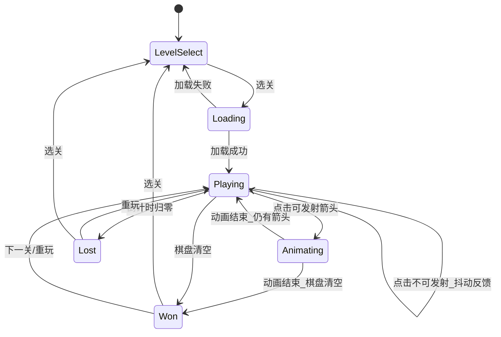

# arrow_jaw 开发需求文档

> **版本**：v0.1  
> **日期**：2026-06-10  
> **状态**：待开发  
> **关联文档**：[Arrow玩法规则详解.md](Arrow玩法规则详解.md) · [Arrow 关卡结构说明.md](Arrow%20关卡结构说明.md) · [arrow_jaw_开发步骤拆解.md](arrow_jaw_开发步骤拆解.md)

---

## 1. 项目概述

### 1.1 项目名称

**arrow_jaw** — Arrow Jam 类益智游戏的网页可玩 Demo。

### 1.2 项目目标

在浏览器中实现一款可玩的 Arrow Jam Demo：

- 加载现有关卡 JSON 配置，还原棋盘与物件布局
- 实现核心玩法：点击箭头 → 路径畅通则发射 → 清空棋盘获胜
- 按阶段逐步支持全部 7 种物件机制（kind 1/3/4/6/8/11/12）
- 提供倒计时、胜负判定、基础 HUD 与关卡选择

### 1.3 不在本期范围

- 账号系统、排行榜、内购
- 关卡编辑器
- 音效与复杂粒子特效
- 移动端原生 App
- 联网对战

### 1.4 技术选型

| 项 | 选择 |
|----|------|
| 语言 | TypeScript |
| 构建 | Vite |
| 渲染 | Canvas（主）+ 可选 SVG 调试层 |
| 架构 | 逻辑层（`core/`）与渲染层（`render/`）分离 |
| 测试 | Vitest（逻辑单元测试） |

---

## 2. 术语与 kind 映射

玩法文档与关卡配置使用不同术语，开发中统一以 **kind 编号** 为准：

| 玩法文档术语 | kind | 配置名称 | 说明 |
|-------------|------|----------|------|
| 基础折线箭头 | 1 | 折线箭 | 核心玩法物件 |
| 管道系统 | 3 | 管道 | 两端出入口，侧面阻挡 |
| 转向箭头 / 反射 | 4 | 反射角块 | 飞行中折射 90° |
| 帷幕 | 6 | 幕布 | 大块锁定区域 |
| 联动箭头 | 8 | 捆绑箭 | 叠在箭身上，联动发射 |
| 钥匙箭 | 11 | 钥匙箭 | 消除后减少幕布血量 |
| 多层区域 | 12 | 子区域容器 | 嵌套独立谜题区 |

### 2.1 direction 枚举

| 值 | 方向 | 向量 (dx, dy) |
|----|------|---------------|
| 1 | 下 | (0, +1) |
| 2 | 上 | (0, -1) |
| 3 | 右 | (+1, 0) |
| 4 | 左 | (-1, 0) |

### 2.2 colorId 色表

引用自 `gen_level_board.py`，Demo 渲染沿用：

| colorId | 颜色 | 色值 |
|---------|------|------|
| 3 | 红 | `#ff6b6b` |
| 4 | 紫 | `#e599f7` |
| 6 | 绿 | `#51cf66` |
| 7 | 蓝 | `#4dabf7` |
| 1, 2, 8 | 未定义 | `#adb5bd`（回退灰） |

### 2.3 layer 层级

| layer | 关联 kind | 角色 |
|-------|-----------|------|
| 1 | 12 | 子区域容器底 |
| 2 | 1, 3, 4 | 主玩法层 |
| 3 | 8, 11 | 叠在箭头之上 |
| 8 | 6 | 幕布目标层 |

---

## 3. 核心玩法规格

### 3.1 游戏目标

在 `durationInSec` 倒计时结束前，将棋盘上所有**可操作的箭头**全部发射出棋盘，清空棋盘即胜利。

### 3.2 基本操作

1. 玩家点击（或触摸）一条 kind 1 箭头
2. 系统判定该箭头当前是否**可发射**
3. 可发射 → 播放发射动画，箭头移出棋盘并从状态中移除
4. 不可发射 → 播放「被卡住」反馈（抖动/音效占位），计入误操作次数

### 3.3 路径畅通判定（P0 核心）

对一条 kind 1 箭头，从**头部格**（`occupiedPositions` 末格）出发，沿 `direction` 方向做射线检测：

```
当前格 = 头部格
循环：
  下一格 = 当前格 + direction 向量
  若下一格超出棋盘边界 → 可发射（路径畅通）
  若下一格被「阻挡物」占用 → 不可发射
  当前格 = 下一格
```

**P0 阻挡物定义**（仅 kind 1）：

- 其他仍在棋盘上的 kind 1 箭头的任意身段格或头部格

**随阶段扩展的阻挡物**：

| 阶段 | 新增阻挡物 |
|------|-----------|
| P1 | kind 4 角块（非可折射正面）、未清空 kind 12 区域边界格 |
| P2 | 被 kind 8 锁定的箭头视为绑定组，需整组可发射 |
| P3 | kind 3 管道侧面格 |
| P4 | kind 6 未消除幕布覆盖格 |

### 3.4 发射行为

**设计假设**（无原版源码，基于玩法文档与数据规律）：

1. 箭头被点击且路径畅通后，整条折线沿当前飞行方向**刚体平移**
2. 平移过程中格子逐格前进，直到完全离开棋盘边界后从状态移除
3. 发射动画时长约 200–400ms（可配置），动画期间禁止其他操作
4. 若飞行路径上存在 kind 4 角块（P1+），在碰到角块时改变飞行方向（见 4.4）

**注意**：发射前判定的是「初始方向直线路径」是否畅通；P1 后若存在角块折射，需额外做「折射后路径」预判定（玩法文档要求）。

### 3.5 胜负条件

| 结果 | 条件 |
|------|------|
| 胜利 | 倒计时 > 0 且棋盘上无剩余可操作箭头 |
| 失败 | 倒计时归零且仍有可操作箭头 |

**「可操作箭头」分期定义**：

| 阶段 | 计入胜利条件的箭头 |
|------|-------------------|
| P0 | 所有 kind 1 |
| P1 | kind 1 + kind 12 内已揭示的 kind 1 |
| P2 | 同上，捆绑组视为一个操作单位 |
| P3 | 同上 |
| P4 | 同上；幕布消除后揭示区域内箭头才计入 |

### 3.6 评价机制（P1+ 实现）

通关后根据剩余时间与误操作次数给出评价：

| 等级 | 触发条件（待调参） |
|------|-------------------|
| excellent | 剩余时间 > 80% 且无失误 |
| well done | 剩余时间 > 60% |
| amazing | 剩余时间 > 40% |
| magnificent | 剩余时间 > 20% |
| superb | 刚好通关 |
| terrific | 踩线通关 |

P0 仅显示「胜利 / 失败」，评价作为 P1 增强项。

---

## 4. 各 kind 行为规格

### 4.1 kind 1 — 折线箭

**配置字段**：`occupiedPositions`, `direction`, `colorId`, `instanceId`, `layer`

**行为**：

- 路径点顺序为尾 → 头，头部在最后一格
- `direction` 与末段步进向量一致（数据已 100% 验证）
- 点击可发射时整体移出棋盘
- 身段格阻挡其他箭头的路径射线

**交互**：点击箭身任意格均视为点击该箭头（以 `instanceId` 识别）。

**验收关卡**：L29, L32, L64

---

### 4.2 kind 4 — 反射角块

**配置字段**：`direction1`, `direction2`（`[dx, dy]` 向量）

**行为**：

- 占 1 格，不是箭，不可点击发射
- 箭飞行中头部进入角块格时，飞行方向改为 `direction1` 或 `direction2` 中与**入射方向垂直**且不是入射反方向的那个
- 角块**背面**（入射反方向一侧）阻挡路径射线
- 发射前需预判：初始方向 + 可能的折射后，整条飞出路径均畅通才可点击

**向量对照**（数据统计）：

| direction1 | direction2 | 典型位置 |
|------------|------------|----------|
| `[1, 0]` 右 | `[0, -1]` 上 | 底边/左侧 |
| `[-1, 0]` 左 | `[0, -1]` 上 | 底边/右侧 |
| `[1, 0]` 右 | `[0, 1]` 下 | 顶边/kind12 内 |
| `[-1, 0]` 左 | `[0, 1]` 下 | 顶边/kind12 内 |

**渲染**：橙色圆 `#fd7e14`，参考 `gen_level_board.py`。

**验收关卡**：L25, L28, L31

---

### 4.3 kind 12 — 子区域容器

**配置字段**：`occupiedPositions`（矩形区域）, `items[]`（子物件）

**行为**：

- 容器本身（layer 1）不阻挡、不可交互，仅定义逻辑边界
- `items[]` 内可含 kind 1、4、8，坐标为**全局棋盘坐标**
- 区域内箭头与区域外箭头**互相阻挡**（共享同一占用格地图）
- 当某 kind 12 区域内所有可操作箭头清空后，该区域视为「已完成」
- 若存在多个 kind 12 区域重叠（少见），按 `instanceId` 升序，外层区域优先；内层区域箭头在 outer 未清空前**不可操作、不可见**

**渲染**：紫色虚线框 `#7c6fef`，半透明填充。

**验收关卡**：L26, L27, L46

---

### 4.4 kind 8 — 捆绑箭

**配置字段**：仅 `occupiedPositions`（2–4 格）, `layer: 3`

**行为**：

- 每个格子落在某条 kind 1 箭头的身段上（数据验证 100%）
- 同一 kind 8 条带覆盖的格子，若属于同一条箭头 → 该箭头被「加粗/锁定」
- 若一条 kind 8 覆盖**多条箭头**的格子 → 这些箭头组成**捆绑组**
- 捆绑组内任一箭头被点击时，整组作为刚体一起发射（各箭头保持相对位置，各自沿自身 direction 移动——需实测原版；**默认假设**：整组沿被点击箭头的 direction 同步平移，组内箭头 direction 必须一致才可发射，不一致时不可发射）
- kind 8 条带在捆绑组发射后一并移除

**待验证假设**：捆绑组内箭头 direction 不一致时的行为（如 L63）。开发时先用 L33 验证同向捆绑。

**渲染**：在箭身上叠加深色粗线或锁链图标。

**验收关卡**：L33, L36, L51

---

### 4.5 kind 3 — 管道

**配置字段**：`health`, `passes[]`, `healthViewPathIndex`

**passes 元素**：`{ position: [x,y], directions: [[dx,dy], ...] }`

**行为**：

- `occupiedPositions` 折线为管道身段，**侧面格阻挡**路径射线
- `passes` 两个端点格为出入口，仅允许 `directions` 中列出的方向进出
- 箭飞行从端点 A 进入 → 瞬移/连续从端点 B 穿出，保持进入方向在 B 处允许的穿出方向
- 每有一条箭成功穿过管道，`health` 减 1；`health` 归零后管道消失，占用格释放
- 管道存在时，其侧面阻挡周围箭头

**渲染**：管道身段用区别于箭头的颜色（建议深灰 `#495057`），端点标记入口/出口图标，`health` 显示在 `healthViewPathIndex` 锚点。

**验收关卡**：L41, L45, L55

---

### 4.6 kind 6 — 幕布 + kind 11 — 钥匙箭

#### kind 6 幕布

**配置字段**：`health`, `order`, `layer: 8`

**行为**：

- 覆盖矩形区域内所有格，**阻挡**路径射线
- 区域内箭头在幕布消除前**不可见、不可操作**
- 每消除一把钥匙箭（kind 11），绑定幕布 `health` 减 1
- 多个幕布时，仅 `order` 值最小的未消除幕布接受钥匙计数
- `health` 归零 → 幕布消失，区域内箭头揭示并可操作

#### kind 11 钥匙箭

**配置字段**：单格 `occupiedPositions`, `layer: 3`

**行为**：

- 落在 kind 1 箭头的某一格上（数据验证 100%）
- 该箭头被发射消除时，触发钥匙计数 +1
- 钥匙箭视觉上叠加钥匙图标

**渲染**：幕布半透明遮罩 `#868e96`；钥匙为金色标记。

**验收关卡**：L61, L62, L63

---

## 5. 功能需求

### 5.1 关卡加载模块（FR-LOAD）

| ID | 需求 | 优先级 |
|----|------|--------|
| FR-LOAD-01 | 从 `public/levels/` 加载 JSON 关卡文件 | P0 |
| FR-LOAD-02 | 解析顶层字段：width, height, name, durationInSec, difficulty, levelKind | P0 |
| FR-LOAD-03 | 解析 itemModels，扁平化所有物件并保留 kind 12 嵌套树 | P0 |
| FR-LOAD-04 | 校验 instanceId 全关唯一 | P0 |
| FR-LOAD-05 | 提供关卡列表（25–64）供选择 | P0 |
| FR-LOAD-06 | 加载失败时显示错误信息 | P0 |

**文件名规范**：

- 源文件：`docs/crackdata/关卡提取/0605-arrowJam-main-level-{N}-seed-1.json`
- 运行时：`public/levels/level-{N}.json`（构建时拷贝并简化命名）
- 加载 API：`fetch('/levels/level-29.json')`

### 5.2 棋盘与渲染模块（FR-RENDER）

| ID | 需求 | 优先级 |
|----|------|--------|
| FR-RENDER-01 | Canvas 绘制网格（CELL=34, GAP=3，参考 gen_level_board.py） | P0 |
| FR-RENDER-02 | 绘制 kind 1 折线箭（折线 + 身圆 + 头圆 + 方向三角） | P0 |
| FR-RENDER-03 | 按 colorId 着色 | P0 |
| FR-RENDER-04 | 大棋盘（>20 格）支持滚动/缩放查看 | P0 |
| FR-RENDER-05 | 绘制 kind 4 角块 | P1 |
| FR-RENDER-06 | 绘制 kind 12 区域框 | P1 |
| FR-RENDER-07 | 绘制 kind 8 捆绑标记 | P2 |
| FR-RENDER-08 | 绘制 kind 3 管道 | P3 |
| FR-RENDER-09 | 绘制 kind 6 幕布 + kind 11 钥匙 | P4 |
| FR-RENDER-10 | 发射动画（刚体平移） | P0 |
| FR-RENDER-11 | 不可发射点击反馈（抖动） | P0 |

**渲染参数**（来自 `gen_level_board.py`）：

```
CELL = 34, GAP = 3, LINE_W = 6
R_BODY = 5.5, R_HEAD = 7, R_CORNER = 6
背景色 #1a1b26, 格子 #16161e, 格线 #2a2f45
```

### 5.3 输入模块（FR-INPUT）

| ID | 需求 | 优先级 |
|----|------|--------|
| FR-INPUT-01 | 鼠标点击检测命中箭头（从后往前，上层优先） | P0 |
| FR-INPUT-02 | 触摸事件支持（移动端浏览器） | P1 |
| FR-INPUT-03 | 发射动画期间禁用输入 | P0 |
| FR-INPUT-04 | 幕布未消除时点击无效区域无响应 | P4 |

### 5.4 游戏逻辑模块（FR-LOGIC）

| ID | 需求 | 优先级 |
|----|------|--------|
| FR-LOGIC-01 | 占用格地图（Cell → Item[]）维护 | P0 |
| FR-LOGIC-02 | 路径畅通射线检测 | P0 |
| FR-LOGIC-03 | 发射后更新占用格、移除箭头 | P0 |
| FR-LOGIC-04 | 胜利/失败判定 | P0 |
| FR-LOGIC-05 | 倒计时（每秒递减，可暂停——P1） | P0 |
| FR-LOGIC-06 | 误操作计数 | P1 |
| FR-LOGIC-07 | kind 4 折射路径预判定 | P1 |
| FR-LOGIC-08 | kind 12 区域可见性/可操作性 | P1 |
| FR-LOGIC-09 | kind 8 捆绑组管理 | P2 |
| FR-LOGIC-10 | kind 3 管道穿越与 health | P3 |
| FR-LOGIC-11 | kind 6/11 幕布解锁 | P4 |

### 5.5 UI / HUD 模块（FR-UI）

| ID | 需求 | 优先级 |
|----|------|--------|
| FR-UI-01 | 顶部：关卡名、倒计时、难度 | P0 |
| FR-UI-02 | 关卡选择界面（列表或下拉） | P0 |
| FR-UI-03 | 胜利弹窗（剩余时间、重玩、下一关） | P0 |
| FR-UI-04 | 失败弹窗（重玩、选关） | P0 |
| FR-UI-05 | 通关评价展示 | P1 |
| FR-UI-06 | 暂停按钮 | P1 |

### 5.6 游戏状态机



---

## 6. 数据规范

### 6.1 关卡 JSON 顶层结构

```json
{
  "width": 20,
  "height": 32,
  "name": "",
  "durationInSec": 150,
  "difficulty": 2,
  "levelKind": 1,
  "itemModels": []
}
```

| 字段 | 类型 | 必填 | 说明 |
|------|------|------|------|
| width | int | 是 | 列数 0…width-1 |
| height | int | 是 | 行数 0…height-1 |
| name | string | 是 | 可为空 |
| durationInSec | int | 是 | 限时秒数 |
| difficulty | int | 是 | 1=Normal, 2=Hard, 3=Superhuman |
| levelKind | int | 否 | 1=主线 |
| itemModels | array | 是 | 顶层物件列表 |

### 6.2 物件通用字段

```typescript
interface BaseItem {
  kind: number;
  occupiedPositions: [number, number][];
  instanceId: number;
  layer: number;
}
```

### 6.3 解析流程

```
loadJSON(file)
  → validateRoot(data)
  → parseItemModels(data.itemModels)
      → for each item:
          if kind === 12: recurse item.items[]
          → push to flatItems[]
          → register in zoneTree
  → buildCellMap(flatItems)
  → buildMechanicHandlers(flatItems)
  → return GameLevel
```

### 6.4 难度配置

| difficulty | 名称 |
|------------|------|
| 1 | Normal |
| 2 | Hard |
| 3 | Superhuman |

---

## 7. 非功能需求

| ID | 需求 | 指标 |
|----|------|------|
| NFR-01 | 首屏加载 | < 2s（本地 dev） |
| NFR-02 | 点击响应 | 路径判定 < 16ms（60fps 预算） |
| NFR-03 | 浏览器 | Chrome 100+, Firefox 100+, Safari 16+, Edge 100+ |
| NFR-04 | 分辨率 | 最小 360px 宽，棋盘区域可滚动 |
| NFR-05 | 最大棋盘 | 30×36（L29/L59）流畅运行 |
| NFR-06 | 代码 | `core/` 层零 DOM 依赖，可单元测试 |

---

## 8. 分期交付范围

### 8.1 阶段总览

| 阶段 | 机制 | 新增可玩关卡 | 验收关卡 |
|------|------|-------------|----------|
| **P0 MVP** | kind 1 + 路径判定 + 计时 + 胜负 | 11 关纯箭头 | L29, L32, L64 |
| **P1** | kind 4 反射 + kind 12 子区域 | +10 关 | L25, L26, L28 |
| **P2** | kind 8 捆绑箭 | +8 关 | L33, L36, L51 |
| **P3** | kind 3 管道 | +10 关 | L41, L45, L55 |
| **P4** | kind 6 幕布 + kind 11 钥匙 | +3 关 | L61, L62, L63 |

完成 P4 后 40 关全部可玩。

### 8.2 纯 kind 1 关卡（P0 关卡池）

29, 32, 34, 37, 40, 44, 47, 50, 54, 58, 64

### 8.3 关卡 × kind 矩阵（全量 40 关）

| 关卡 | 棋盘 | 顶层物件 | 难度 | 时限 | kind 分布 |
|------|------|----------|------|------|-----------|
| 25 | 20×32 | 68 | 2 | 150s | 1×62, 4×6 |
| 26 | 16×15 | 33 | 1 | 120s | 1×42, 12×1 |
| 27 | 20×16 | 51 | 1 | 120s | 1×78, 12×1 |
| 28 | 21×21 | 56 | 1 | 120s | 1×76, 4×4, 12×2 |
| 29 | 27×36 | 120 | 3 | 150s | 1×120 |
| 30 | 20×25 | 70 | 1 | 120s | 1×107, 8×4, 12×4 |
| 31 | 20×26 | 79 | 1 | 120s | 1×73, 4×6 |
| 32 | 27×24 | 63 | 1 | 120s | 1×63 |
| 33 | 21×24 | 85 | 1 | 120s | 1×121, 8×2, 12×2 |
| 34 | 29×25 | 52 | 1 | 120s | 1×52 |
| 35 | 26×30 | 132 | 2 | 150s | 1×162, 4×4, 12×5 |
| 36 | 20×29 | 87 | 1 | 120s | 1×81, 8×6 |
| 37 | 30×29 | 63 | 1 | 120s | 1×63 |
| 38 | 20×28 | 91 | 1 | 120s | 1×109, 8×10, 12×2 |
| 39 | 20×35 | 121 | 3 | 150s | 1×165, 4×4, 12×2 |
| 40 | 28×31 | 107 | 1 | 120s | 1×107 |
| 41 | 20×19 | 42 | 1 | 120s | 1×39, 3×3 |
| 42 | 20×31 | 55 | 1 | 120s | 1×53, 3×2 |
| 43 | 20×24 | 58 | 1 | 120s | 1×70, 3×2, 12×1 |
| 44 | 20×35 | 64 | 1 | 120s | 1×64 |
| 45 | 26×32 | 140 | 2 | 120s | 1×134, 3×2, 4×4 |
| 46 | 20×26 | 59 | 1 | 120s | 1×82, 12×3 |
| 47 | 26×26 | 78 | 1 | 120s | 1×78 |
| 48 | 19×30 | 79 | 1 | 120s | 1×76, 3×3 |
| 49 | 26×35 | 161 | 3 | 120s | 1×153, 3×2, 8×6 |
| 50 | 24×35 | 93 | 1 | 120s | 1×93 |
| 51 | 20×27 | 86 | 1 | 120s | 1×79, 4×4, 8×3 |
| 52 | 18×25 | 64 | 1 | 120s | 1×78, 3×2, 12×5 |
| 53 | 20×25 | 75 | 1 | 120s | 1×69, 4×6 |
| 54 | 25×34 | 83 | 1 | 120s | 1×83 |
| 55 | 26×36 | 117 | 2 | 120s | 1×109, 3×4, 8×4 |
| 56 | 20×26 | 57 | 1 | 120s | 1×55, 3×2 |
| 57 | 20×26 | 54 | 1 | 120s | 1×83, 4×6, 12×1 |
| 58 | 23×26 | 70 | 1 | 120s | 1×70 |
| 59 | 28×36 | 108 | 3 | 120s | 1×105, 3×3 |
| 60 | 20×24 | 76 | 1 | 120s | 1×92, 8×4, 12×1 |
| 61 | 16×16 | 45 | 1 | 120s | 1×39, 6×1, 11×5 |
| 62 | 20×20 | 64 | 1 | 120s | 1×52, 6×2, 11×10 |
| 63 | 20×26 | 100 | 1 | 120s | 1×82, 6×2, 8×4, 11×12 |
| 64 | 28×27 | 87 | 1 | 120s | 1×87 |

> 注：kind 计数含 kind 12 嵌套子项。

---

## 9. 验收标准

### 9.1 P0 验收标准

- [ ] 可加载并游玩 L29、L32、L64
- [ ] 路径判定与手动验证 3 关一致
- [ ] 倒计时正常，归零失败
- [ ] 清空棋盘胜利
- [ ] 不可发射箭头有视觉反馈
- [ ] 关卡可切换

### 9.2 P1 验收标准

- [ ] L25 角块折射正确
- [ ] L26 kind12 区域内外箭头独立可操作
- [ ] P0 的 11 关回归通过

### 9.3 P2–P4 验收标准

- [ ] 各阶段验收关卡通关
- [ ] 之前阶段全部关卡回归通过
- [ ] P4 完成后 40 关均可加载且可通关

### 9.4 测试关卡矩阵

| 阶段 | 必测关卡 | 测试重点 |
|------|----------|----------|
| P0 | 29, 32, 64 | 基础发射、jam、计时 |
| P1 | 25, 26, 28 | 角块折射、子区域 |
| P2 | 33, 36, 51 | 捆绑发射 |
| P3 | 41, 45, 55 | 管道穿越、health |
| P4 | 61, 62, 63 | 幕布解锁、钥匙计数 |

---

## 10. 风险与未决问题

| ID | 问题 | 影响 | 缓解措施 |
|----|------|------|----------|
| RISK-01 | kind 8 捆绑组跨箭头 direction 不一致时的行为 | P2 | 先用 L33 同向验证；L63 作为边界用例 |
| RISK-02 | kind 4 「正面/背面」精确定义无源码 | P1 | 按入射向量与 direction1/2 夹角实现，用 L25 人工验证 |
| RISK-03 | kind 12 多层重叠优先级 | P1 | 当前数据无重叠，按 instanceId 升序预留 |
| RISK-04 | kind 3 管道穿越动画与方向映射 | P3 | 先实现瞬移，后补动画 |
| RISK-05 | kind 6 与 kind 11 绑定关系（无显式 linkId） | P4 | 假设同关所有钥匙计入当前 order 最小幕布 |
| RISK-06 | 大棋盘性能（L29: 27×36, 120 箭） | P0 | Canvas 脏矩形、仅重绘变化物件 |

---

## 附录 A：参考资产

| 资产 | 路径 | 用途 |
|------|------|------|
| 关卡 JSON | `docs/crackdata/关卡提取/0605-arrowJam-main-level-*-seed-1.json` | 数据源 |
| 棋盘 HTML | `docs/crackdata/关卡提取/0605-arrowJam-main-level-*-board.html` | 布局参考 |
| 可视化脚本 | `docs/crackdata/关卡提取/gen_level_board.py` | 渲染参数、配色 |
| 格式化脚本 | `docs/crackdata/关卡提取/format_level_json.py` | JSON 格式维护 |

---

*文档结束*
