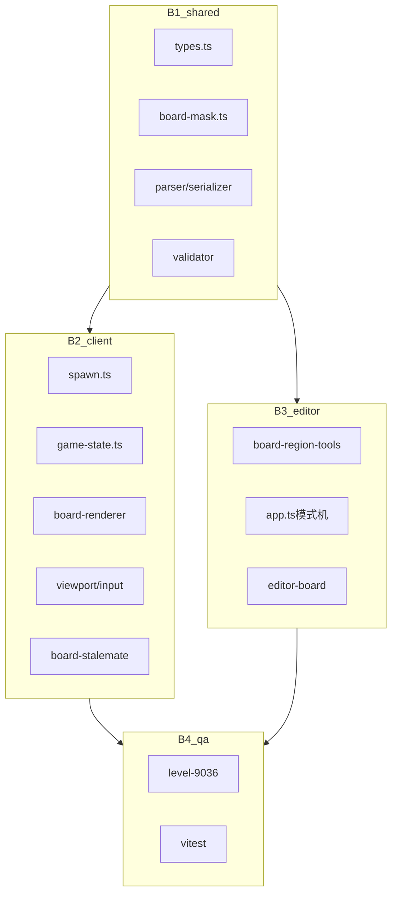

# arrow_jaw 异形棋盘与黑洞区域开发步骤拆解

> **版本**：v0.1  
> **日期**：2026-07-10  
> **关联文档**：[arrow_jaw_异形棋盘与黑洞区域开发需求文档.md](arrow_jaw_异形棋盘与黑洞区域开发需求文档.md) · [Arrow Jam 新版本规则初稿（爽快版）.md](Arrow%20Jam%20新版本规则初稿（爽快版）.md)

**总预估工时**：6–9 人天（单人全职当量）。

---

## 0. 模块依赖

---

## B1 — shared 数据层（1.5–2d）

### 目标

关卡 JSON 可表达异形棋盘与黑洞区域；解析/校验/压缩可用。

### 操作

1. **`code/shared/src/types.ts`**
   - `BoardShape`、`MaskRows`、`BoardMaskFields`
   - `LevelData` / `GameLevel` / `EditorMeta` 扩展
   - `EditorDocument.editContext.regionEditMode`
   - `EditorDocument.editorOnly.backgroundImage?`

2. **新建 `code/shared/src/board-mask.ts`**
   - `expandMaskRows`、`compressCellsToRows`
   - `buildBoardMaskFromLevel`、`buildFullBoardPlayable`
   - `isPlayableCell`、`isBlackHoleCell`
   - `isOrthogonallyConnected`、`normalizeMaskRows`

3. **`code/shared/src/parser.ts`**
   - 解析 `boardShape` / `playableMask` / `blackHoleRegions`
   - 填充 `GameLevel.playableCells` / `blackHoleCells`

4. **`code/shared/src/serializer.ts`**
   - full 棋盘省略 mask 字段
   - custom 写出压缩 rows

5. **`code/shared/src/validator.ts`**
   - V-BOARD-01 ~ V-BOARD-05

6. **`code/shared/src/index.ts`** 导出

7. **测试** `board-mask.test.ts`

### 验收

- [ ] 旧 JSON 解析 playable = 全板
- [ ] round-trip custom + 黑洞
- [ ] 连通性校验用例

---

## B2 — client 玩法与渲染（2–3d）

### 目标

游戏内正确约束生成/放置/吞噬/渲染。

### 操作

1. **`spawn.ts`** — `isSpawnableCell` 检查 playable && !blackHole
2. **`game-state.ts`**
   - 构造时缓存 mask
   - `findBlackHoleRegionEntered()`
   - `collectBoardOccupiedCellKeys` 含黑洞格
   - `buildSpawnBlockContext` 传 playable
3. **`board-stalemate.ts`** — 路径经黑洞 region 视为可出口
4. **新建 `black-hole-region-drawer.ts`** — 星空烟尘动画
5. **`board-renderer.ts`** — 无效格跳过；黑洞格绘制
6. **`viewport.ts` / `input-handler.ts`** — 非 playable 不可点
7. **`level-9036.json`（仅 test-fixtures）**

### 验收

- [ ] 箭飞入黑洞 region 消除
- [ ] 无效格无圆点
- [ ] Rush 不生成到黑洞/无效格

---

## B3 — editor 特殊区域 UI（2–3d）

### 目标

策划可在编辑器内配置异形与黑洞。

### 操作

1. **`index.html` + `style.css`** — `board-region-tools` 竖条
2. **`editor-document.ts`** — meta 字段读写
3. **`app.ts`** — 模式切换、完成编辑、背景图 file input
4. **`board-region.ts`**（新建）— 放置校验
5. **`editor-board.ts`** — overlay 绿/白/灰/背景
6. **`props-panel.ts`** — board 摘要
7. **`zone-bounds.ts`** — 整合 playable 检查

### 验收

- [ ] 三种模式互斥
- [ ] 保存重载 mask 一致
- [ ] 背景图仅编辑器可见

---

## B4 — 验收与文档（0.5–1d）

1. `code/shared` + `code/client` vitest 全绿
2. 更新 `arrow_jaw_游戏功能图谱.md` 棋盘章节
3. 手动清单：编辑 → 保存 → 试玩 → Rush

---

## 文件清单

| 文件 | 变更 |
|------|------|
| `code/shared/src/types.ts` | 扩展 |
| `code/shared/src/board-mask.ts` | 新建 |
| `code/shared/src/parser.ts` | 扩展 |
| `code/shared/src/serializer.ts` | 扩展 |
| `code/shared/src/validator.ts` | 扩展 |
| `code/shared/src/editor-document.ts` | 扩展 |
| `code/client/src/core/game/game-state.ts` | 扩展 |
| `code/client/src/core/mechanics/spawn.ts` | 扩展 |
| `code/client/src/core/mechanics/board-stalemate.ts` | 扩展 |
| `code/client/src/render/board-renderer.ts` | 扩展 |
| `code/client/src/render/black-hole-region-drawer.ts` | 新建 |
| `code/client/src/render/viewport.ts` | 扩展 |
| `code/editor/index.html` | 扩展 |
| `code/editor/src/app.ts` | 扩展 |
| `code/editor/src/canvas/editor-board.ts` | 扩展 |
| `code/editor/src/document/board-region.ts` | 新建 |
| `code/editor/src/style.css` | 扩展 |
| `code/client/test-fixtures/levels/level-9036.json` | 新建（不进 manifest） |
