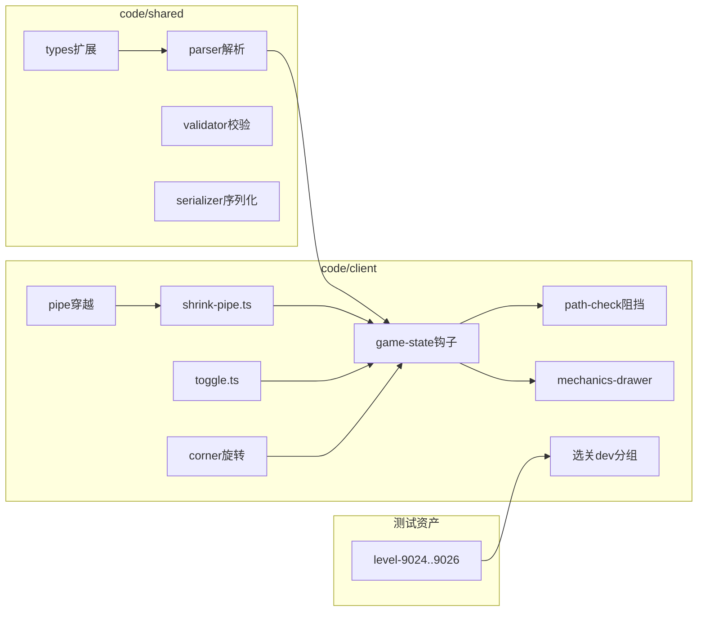

# arrow_jaw 收缩拨动机制开发步骤拆解（P8）

> **版本**：v0.1  
> **日期**：2026-06-16  
> **关联文档**：[arrow_jaw_收缩拨动机制开发需求文档.md](arrow_jaw_收缩拨动机制开发需求文档.md) · [新增两种机制.md](新增两种机制.md) · [arrow_jaw_新机制开发步骤拆解.md](arrow_jaw_新机制开发步骤拆解.md)

本文档将 kind 14/15/16 三套机制拆解为可执行工程步骤。代码根目录：**code/client**（逻辑/渲染）、**code/shared**（类型/解析/校验）。编辑器要点见**附录**。

---

## 0. 模块依赖



**前置条件**：P5 已验收（kind 2/5/7/13）；P0–P4 主线稳定。

---

## 1. P8.0 — 类型与解析骨架

### 目标

扩展共享层，使客户端可加载含 kind 14/15/16 的 JSON；kind 4 增加 spin 字段。

### 操作

1. `code/shared/src/types.ts`
   - 新增 `ShrinkPipeItem`（kind 14）、`ToggleItem`（kind 15）、`ControllerItem`（kind 16）
   - `CornerItem` 增加可选 `spin`、`spinDirection`
   - `GameLevel` 增加 `shrinkPipes`、`toggles`、`controllers`
   - `RawItem` 增加对应原始字段

2. `code/shared/src/parser.ts`
   - 解析 kind 14/15/16 → 对应数组
   - kind 12 子项递归收集 14/15/16
   - 解析期：`bindInstanceId` 校验宿主存在；kind14 `bindCoordinate` 反查管道

3. `code/shared/src/serializer.ts`
   - kind 14/15/16 及 kind4 spin 字段往返

4. `code/client/src/core/game/game-state.ts` 构造
   - 初始化 `shrinkPipes`、`toggles`、`controllers` 深拷贝
   - 构造 `ShrinkPipeManager`、`ToggleManager`（或合并在 toggle.ts）

### 产出

- `parser.test.ts` 冒烟：含三 kind 的最小 JSON
- `serializer.test.ts` 往返片段

### DoD

- [ ] `npm test`（shared + client parser）通过
- [ ] 无 TypeScript 编译错误

**预估**：0.5 天

---

## 2. P8.1 — kind 14 收缩障碍 + 管道穿越

### 目标

实现缩短逻辑、管道穿越触发、阻挡格、管毁联动移除。

### 操作

1. 新建 `code/client/src/core/mechanics/shrink-pipe.ts`
   - `ShrinkPipeManager`：维护障碍列表
   - `shortenStrip(strip, amount)`：§5.3 裁切算法
   - `canShorten(strip, pipeHealth)`：剩 1 格且管有血 → false
   - `getBlockerCells()`：活跃障碍占格
   - `onPipeTraversed(pipeId, pipesCrossed)`：找 bindCoordinate 匹配管道的 kind14 并缩短
   - `removeForPipe(pipeId)`：管毁时移除绑定障碍

2. `code/client/src/core/game/game-state.ts`
   - `applyPipeCrossingDamage` 之后调用 `shrinkPipeManager.onPipeTraversed`
   - 管道 health 归零时 `removeForPipe`
   - `getWallBlockerCells` 或新建 `getExtraBlockerCells` 合并 kind14 格

3. `code/client/src/core/mechanics/pipe.ts` / `path-check.ts`
   - `simulateCanExit`、`advanceArrowStep` 传入 kind14 阻挡格

4. `shrink-pipe.test.ts`
   - 裁切端选择、终止条件、管毁移除

### 产出

- `shrink-pipe.test.ts`
- `level-9024.json`（手写骨架）

### DoD

- [ ] 9024：穿越 2 次后障碍剩 1 格不再缩
- [ ] 管道扣血至 0 时障碍消失
- [ ] kind14 格阻挡发射路径（单测）

**预估**：1.5 天

---

## 3. P8.2 — kind 15/16 分组联动

### 目标

拨动杆穿越检测、方向切换、同组控制器广播。

### 操作

1. 新建 `code/client/src/core/mechanics/toggle.ts`
   - `ToggleManager`：维护 toggles、controllers
   - `onArrowStepped(arrow, prevPositions, nextPositions)`：检测穿过 kind15
   - `flipToggle(toggle)`：direction 1↔2
   - `fireGroup(groupID)`：收集同组非覆盖控制器
   - `isToggleCovered(toggle)` / `isControllerCovered(ctrl)`：幕布+子区域

2. `code/client/src/core/game/game-state.ts`
   - 在 `advanceExitAnimation` / `advanceBumpAnimation` 箭位更新后调用 `toggleManager.onArrowStepped`
   - 捆绑组步进：对每个 member 检测或合并路径并集

3. `toggle.test.ts`
   - 穿越触发、覆盖跳过、同组多控制器

### 产出

- `toggle.test.ts`
- `level-9025.json`

### DoD

- [ ] 9025：箭穿过拨杆 → kind7 移动 1 步
- [ ] 幕布下拨动杆不响应（单测或变体关）

**预估**：1.5 天

---

## 4. P8.3 — 控制器四宿主行为

### 目标

拨动信号驱动 kind2/4/7/14 各执行一次逻辑。

### 操作

1. `toggle.ts` — `executeController(ctrl)`
   - kind2：`flipArrow`（复用 `flip.ts`）
   - kind4：新增 `rotateCorner(corner, spin, spinDirection)` in `corner.ts`
   - kind7：`wallManager.advanceWall(bindInstanceId)`（`moving-wall.ts` 新增单墙步进）
   - kind14：`shrinkPipeManager.shortenByToggle(id)`（不扣管血）

2. `code/client/src/core/mechanics/corner.ts`
   - `rotateCorner`：向量旋转 90° 倍数；更新 direction1/direction2

3. `code/client/src/core/mechanics/moving-wall.ts`
   - `advanceWall(instanceId)`：单墙移动一步（复用既有 path 逻辑）

4. `game-state.ts`
   - 控制器执行后 `rebuildCellMap`
   - 确保与 P5 `onArrowEliminationBatch` 中墙移/翻转规则不重复（仅绑控制器的由拨动触发）

5. 集成测试 `toggle-integration.test.ts` 或扩展 `level-9026.json`

### 产出

- `corner.test.ts` 旋转用例
- `level-9026.json`

### DoD

- [ ] 9026：kind2 拨动翻转、kind4 spin90、kind14 拨动缩短均可触发
- [ ] 未绑控制器的 kind2 仍仅消除时翻转

**预估**：1 天

---

## 5. P8.4 — 渲染与收缩缓动

### 目标

三物件可视；收缩缓动；拨动/控制器闪烁反馈。

### 操作

1. `code/client/src/render/mechanics-drawer.ts`
   - `drawShrinkPipe(ctx, strip, animProgress?)`：螺旋纹 + 卡扣
   - `drawToggle(ctx, toggle)`：拨杆 + groupID
   - `drawController(ctx, ctrl, flash)`：红灯 + 编号

2. `code/client/src/render/board-renderer.ts`
   - 按需求文档 §3.2 顺序插入绘制调用
   - `BoardDrawOptions` 扩展：`shrinkPipes`、`toggles`、`controllers`、`toggleFlashGroupIds`

3. `code/client/src/app.ts` / `code/editor/src/app.ts` 试玩
   - `drawBoard` 传入新物件列表
   - 收缩缓动：`ShrinkPipeManager` 维护 `animProgress` 或由 `GameState` 暴露

4. `code/editor/src/canvas/editor-board.ts`
   - 编辑态 overlay 预览（可与试玩共用 drawer）

### DoD

- [ ] 游戏内目视：螺旋纹、拨杆、红灯符合需求
- [ ] 缩短时格点缓动可见
- [ ] 拨动时同组控制器闪一下

**预估**：1 天

---

## 6. P8.5 — dev 测试关 + manifest

### 目标

9024–9026 可玩；选关 devTests 分组可见。

### 操作

1. 完善 `level-9024.json`、`level-9025.json`、`level-9026.json`
2. `code/client/public/levels/manifest.json` — `devTests` 增加三项
3. `code/client/src/app.ts` / `screens.ts` — 确保 devTests 展示（若 P5 已做则仅追加条目）
4. 可选：`scripts/gen-mechanic-test-levels.mjs` 扩展生成 9024–9026 骨架

### manifest 示例

```json
{
  "id": 9024,
  "file": "level-9024.json",
  "name": "[测] 收缩障碍",
  "difficulty": 1,
  "width": 14,
  "height": 14,
  "durationInSec": 120,
  "kinds": [1, 3, 14]
}
```

### DoD

- [ ] 选关「机制测试」区可见 9024–9026
- [ ] 三关可进入并完成验证点

**预估**：0.5 天

---

## 7. P8.6 — 校验 + 回归

### 目标

配置校验完备；P0–P5 无回归。

### 操作

1. `code/shared/src/validator.ts` — V-P8-14/15/16/GROUP/CORNER、V06 白名单
2. `code/shared/src/items.ts` — 重叠检测作用域扩展 kind14/15/16
3. 全量 `npm test`（client + shared + editor）
4. 手动回归：9001–9004、L29、L33、L45（管道）

### DoD

- [ ] 校验器对新 kind 报错符合需求文档
- [ ] `npm test` 全绿
- [ ] P5 dev 关与主线抽样无解析错误

**预估**：0.5 天

---

## 8. 测试策略

### 8.1 单元测试

| 文件 | 重点 |
|------|------|
| `shrink-pipe.test.ts` | 裁切端、终止、管毁、阻挡格 |
| `toggle.test.ts` | 穿越、覆盖、分组广播 |
| `corner.test.ts` | spin 90/180/270 顺时针/逆时针 |
| `parser.test.ts` | kind 14/15/16 解析 |
| `serializer.test.ts` | 字段往返 |

### 8.2 集成

- 加载 9024–9026 → `GameState` 构造无抛错
- `tryLaunch` + 管道穿越 / 拨动序列断言

### 8.3 回归清单

```
P8 新增: 9024, 9025, 9026
P5: 9001, 9002, 9003, 9004
P0–P4: L29, L32, L45, L61
```

---

## 9. 里程碑

| 里程碑 | 内容 | 累计工时 |
|--------|------|----------|
| M8.0 | 类型解析序列化 | 0.5d |
| M8.1 | kind14 + 管道挂钩 | 2d |
| M8.2 | kind15/16 联动 | 3.5d |
| M8.3 | 四宿主行为 | 4.5d |
| M8.4 | 渲染缓动 | 5.5d |
| M8.5 | dev 关 | 6d |
| M8.6 | 校验回归 | 6.5d |

> 客户端 P8 单人全职粗估 **6.5 天**（±30%）。含附录编辑器约 **+2 天**。

---

## 10. 建议实施顺序

```
Day 1:  P8.0 + P8.1 前半（类型、解析、shrink 核心）
Day 2:  P8.1 后半 + 9024（管道触发、阻挡）
Day 3:  P8.2 + 9025（拨动杆、分组）
Day 4:  P8.3 + 9026（四宿主）
Day 5:  P8.4 渲染
Day 6:  P8.5 manifest + P8.6 校验回归
Day 7+: 附录编辑器（可与 P8.4 并行部分 UI）
```

---

## 附录 — 编辑器实施要点（E-P8）

> 需求细节见 [arrow_jaw_收缩拨动机制开发需求文档.md](arrow_jaw_收缩拨动机制开发需求文档.md) 附录 A。

**预估**：2 天（可在 P8.6 通过后并行）

| 步骤 | 目标 | 主要文件 |
|------|------|----------|
| E-P8-0 | 序列化/校验与客户端对齐 | `serializer.ts`, `validator.ts` |
| E-P8-1 | K14 工具：选管道→拖拽折线 | `draw-state.ts`, `app.ts`, `wall-path-preview` 类折线预览 |
| E-P8-2 | K14 管道联动移动 | `editor-ops.ts`：拖管道时平移绑定 kind14 |
| E-P8-3 | K15 单格放置 + groupID | `props-panel.ts`, `app.ts` |
| E-P8-4 | K16 绑宿主落格 + 拖限占格 | `app.ts`, `editor-ops.ts` |
| E-P8-5 | kind4 spin 属性面板 | `props-panel.ts` |
| E-P8-6 | 画布 overlay + 试玩接线 | `editor-board.ts`, `app.ts` play loop |
| E-P8-7 | 帮助文档与分组校验提示 | 帮助菜单、校验消息文案 |

### E-P8 DoD

- [ ] 工具栏 K14/K15/K16 可用，hover 文案正确
- [ ] K14 必须先选管道；贴邻校验阻塞保存
- [ ] K16 只能落在宿主占格内
- [ ] 试玩：收缩/拨动/控制与客户端一致
- [ ] 保存 → 再打开字段不丢失

---

*文档结束*
