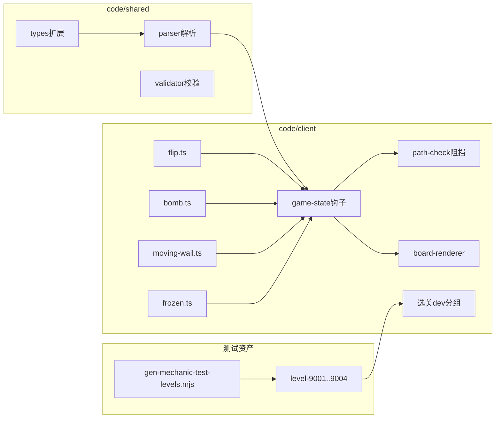

# arrow_jaw 新机制开发步骤拆解（P5）

> **版本**：v0.1  
> **日期**：2026-06-15  
> **关联文档**：[arrow_jaw_新机制开发需求文档.md](arrow_jaw_新机制开发需求文档.md) · [arrow_jaw_开发步骤拆解.md](arrow_jaw_开发步骤拆解.md)

本文档将 kind 2/5/7/13 四机制拆解为可执行工程步骤。代码根目录：**code/client**（逻辑/渲染）、**code/shared**（类型/解析/校验）。

---

## 0. 模块依赖



**前置条件**：P0–P4 已验收（kind 1/3/4/6/8/11/12）。

---

## 1. P5.0 — 类型与解析骨架

### 目标

扩展共享层，使客户端可加载含新 kind 的 JSON。

### 操作

1. `code/shared/src/types.ts`  
   - `ArrowItem.kind` 扩展为 `1 | 2`，增加可选 `direction1`/`direction2`  
   - 新增 `BombItem`、`MovingWallItem`、`FrozenOverlayItem`  
   - `GameLevel` 增加 `bombs`、`movingWalls`、`frozenOverlays`

2. `code/shared/src/parser.ts`  
   - 解析 kind 2 → arrows（`direction = direction1`）  
   - 解析 kind 5/7/13 → 对应数组  
   - kind 12 子项递归收集 2/5/13；kind 7 仅顶层  
   - 解析期绑定：炸弹/冻结按格点匹配宿主箭 `instanceId`

3. `code/client/src/core/types.ts`  
   - `LevelManifest` 增加 `devTests?: LevelManifestEntry[]`

### 产出

- `parser.test.ts` 冒烟：含四 kind 的最小 JSON

### DoD

- [ ] `npm test`（shared + client parser）通过  
- [ ] 无 TypeScript 编译错误  

**预估**：0.5 天

---

## 2. P5.1 — 消除事件钩子 + kind 2 翻转

### 目标

建立 `onArrowEliminationBatch`，实现翻转逻辑与动画占位。

### 操作

1. `code/client/src/core/mechanics/flip.ts`  
   - `flipArrow(arrow)`：反转 positions、切换 direction  
   - `flipAllUncovered(arrows, isCovered)`  

2. `code/client/src/core/game/game-state.ts`  
   - 从 `completeLaunchAnimation`、vanish 完成路径调用 `onArrowEliminationBatch(removed)`  
   - 批内多箭仍只触发一次翻转  
   - `getActiveArrows` 排除冻结覆盖宿主  

3. `code/client/src/core/mechanics/coverage.ts`（可选内联）  
   - `isArrowCovered(arrow, ctx)` 统一幕布/子区域/冻结  

### 产出

- `flip.test.ts`  
- `level-9001.json`（可先手写）

### DoD

- [ ] 9001：消除 kind1 后 kind2 翻转且可发射  
- [ ] 单测：同批 3 箭消除只翻转 1 次  

**预估**：1.5 天

---

## 3. P5.2 — kind 7 移动墙

### 目标

消除驱动墙移动；墙格阻挡路径检测。

### 操作

1. `code/client/src/core/mechanics/moving-wall.ts`  
   - `MovingWallManager`：维护 pathIndex、往复/环绕  
   - `advanceAllWalls()`、`getBlockerCells()`  

2. `code/client/src/core/mechanics/pipe.ts`  
   - `simulateCanExitWithPipes` 增加 `extraBlockerCells` 参数  

3. `game-state.ts`  
   - 消除批处理后调用 `wallManager.advanceAll()`  
   - `getLaunchableIds` / `tryLaunch` 传入墙阻挡格  

4. `board-renderer.ts` — 绘制墙身块  

### 产出

- `moving-wall.test.ts`  
- `level-9002.json`

### DoD

- [ ] 9002：墙挡路 → 消另一箭 → 墙移开 → 可发射  
- [ ] 往复模式到头反向单测  

**预估**：1.5 天

---

## 4. P5.3 — kind 13 冻结

### 目标

冻结覆盖、邻接减血、解冻后恢复可操作。

### 操作

1. `code/client/src/core/mechanics/frozen.ts`  
   - `FrozenManager`：`isFrozen(hostId)`、`onAdjacentElimination(removed)`  
   - 4 邻接判定；公共邻接多区各减 1  

2. `game-state.ts`  
   - `canVanishArrow` / `findOperableArrowAtCell` 排除冻结宿主  
   - 消除批处理中先 frost 再 flip/wall  

3. `board-renderer.ts` — 晶状 overlay  

### 产出

- `frozen.test.ts`  
- `level-9003.json`

### DoD

- [ ] 9003：health=2 需消 2 条邻接箭解冻  
- [ ] 公共邻接两冻结区各减 1（单测）  

**预估**：1.5 天

---

## 5. P5.4 — kind 5 定时炸弹

### 目标

激活倒计时、HUD、超时失败。

### 操作

1. `code/client/src/core/mechanics/bomb.ts`  
   - `BombManager`：`tick(dt)`、`getUrgentRemaining()`、宿主消除移除  

2. `game-state.ts` — `tick` 中调用 bombManager；`phase=lost` 爆炸  

3. `screens.ts` / `app.ts` — HUD 炸弹倒计时  

4. `board-renderer.ts` — 钟表图标  

### 产出

- `bomb.test.ts`  
- `level-9004.json`（含幕布 + 钥匙揭示场景）

### DoD

- [ ] 9004：揭示后倒计时；超时失败弹层  
- [ ] 宿主消除后炸弹消失  

**预估**：1 天

---

## 6. P5.5 — 渲染整合 + dev 选关

### 目标

四机制可视；测试关可选。

### 操作

1. `code/client/public/levels/manifest.json` — 增加 `devTests`  
2. `code/client/scripts/gen-mechanic-test-levels.mjs` — 生成/校验 9001–9004 骨架  
3. `screens.ts` — 「机制测试」分组标题 + 按钮列表  
4. `app.ts` — `loadManifest` 合并 devTests 展示  
5. `copy-levels.mjs` — 刷新 devTests kinds（如需要）  

### manifest 示例

```json
{
  "devTests": [
    {
      "id": 9001,
      "file": "level-9001.json",
      "name": "[测] 翻转箭",
      "difficulty": 1,
      "width": 12,
      "height": 12,
      "durationInSec": 120,
      "kinds": [1, 2]
    }
  ],
  "levels": []
}
```

### DoD

- [ ] 选关页见「机制测试」区，4 关可进入  
- [ ] 缩略图懒加载正常  

**预估**：1 天

---

## 7. P5.6 — 校验器 + 道具 + 回归

### 目标

配置校验完备；道具规则一致；主线无回归。

### 操作

1. `code/shared/src/validator.ts` — V-NEW-02/05/07/13、V06 白名单  
2. `docs/arrow_jaw_关卡道具需求文档.md` — 补充冻结/炸弹与湮灭交互  
3. 全量 `npm test`  
4. 手动回归 L25–L64 抽样 + 道具按钮  

### DoD

- [ ] 校验器对新 kind 报错/警告符合需求文档  
- [ ] `npm test` 全绿  
- [ ] 主线关卡启动无解析错误  

**预估**：1 天

---

## 8. 测试策略

### 8.1 单元测试

| 文件 | 重点 |
|------|------|
| `flip.test.ts` | 翻转、批处理、覆盖跳过 |
| `moving-wall.test.ts` | 往复/环绕、阻挡格 |
| `frozen.test.ts` | 邻接、公共邻接、解冻 |
| `bomb.test.ts` | 激活、超时、宿主移除 |
| `parser.test.ts` | 四 kind 解析 |

### 8.2 集成

- 加载 9001–9004 → `GameState` 构造无抛错  
- 关键 `tryLaunch` / 消除序列断言  

### 8.3 回归清单

```
P5 新增: 9001, 9002, 9003, 9004
P0–P4: L29, L32, L64, L25, L33, L41, L61
```

---

## 9. 里程碑

| 里程碑 | 内容 | 累计工时 |
|--------|------|----------|
| M5.0 | 文档 + 类型解析 | 0.5d |
| M5.1 | 翻转 + 消除钩子 | 2d |
| M5.2 | 移动墙 | 3.5d |
| M5.3 | 冻结 | 5d |
| M5.4 | 炸弹 | 6d |
| M5.5 | 渲染 + dev 关 | 7d |
| M5.6 | 校验回归 | 8d |

> 单人全职粗估 **8 天**（±30%）。

---

## 10. 建议实施顺序

```
Day 1:  P5.0 + P5.1（类型、解析、翻转、9001）
Day 2:  P5.1 动画收尾 + P5.2 移动墙 + 9002
Day 3:  P5.3 冻结 + 9003
Day 4:  P5.4 炸弹 + 9004
Day 5:  P5.5 渲染/选关 + P5.6 校验回归
```

---

*文档结束*
