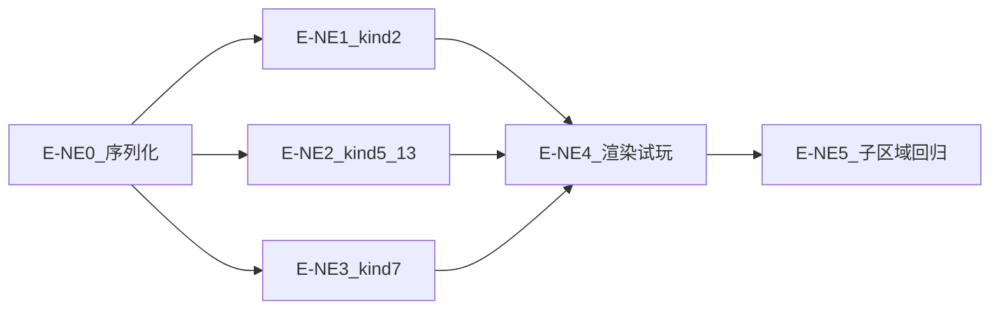

# arrow_jaw 新机制编辑器开发步骤拆解（P6）

> **版本**：v0.1  
> **日期**：2026-06-15  
> **关联文档**：[arrow_jaw_新机制编辑器开发需求文档.md](arrow_jaw_新机制编辑器开发需求文档.md) · [Arrow Jam 新增规则编辑器需求.md](Arrow%20Jam%20新增规则编辑器需求.md) · [arrow_jaw_关卡编辑器开发步骤拆解.md](arrow_jaw_关卡编辑器开发步骤拆解.md) · [arrow_jaw_收缩拨动机制开发步骤拆解.md](arrow_jaw_收缩拨动机制开发步骤拆解.md)（附录 E-P8）

本文档将 P6 新机制编辑器开发拆解为 **E-NE0 → E-NE5**。代码根目录 `code/editor`，共享层 `code/shared`。

---

## 0. 模块依赖



---

## E-NE0 — 数据完整性

**目标**：保存不丢失新机制字段  
**预估**：0.5 天

### 改动

| 文件 | 内容 |
|------|------|
| `code/shared/src/serializer.ts` | kind 2/5/7/13 字段序列化 |
| `code/shared/src/serializer.test.ts` | 9001–9004 往返测试 |

### DoD

- [ ] serialize 含 direction1/2、time、movingPath、health 等
- [ ] Vitest 往返通过
- [ ] 手工：打开 9003 → 保存 → 再打开 health 仍在

---

## E-NE1 — kind2 翻转箭

**目标**：完整编辑与可视化 kind2  
**预估**：1 天

### 改动

| 文件 | 内容 |
|------|------|
| `code/editor/src/tools/draw-state.ts` | `flipArrow` 工具、`buildFlipArrowItem` |
| `code/editor/src/app.ts` | 工具栏 K2、折线提交分支 |
| `code/editor/src/ui/props-panel.ts` | direction1/2、colorId |
| `code/editor/src/canvas/flip-preview.ts` | 双方向 overlay |
| `code/editor/src/canvas/editor-board.ts` | 调用 flip overlay |

### DoD

- [ ] 可绘制 kind2 折线并提交
- [ ] 属性面板可改双方向
- [ ] 画布显示双箭头标记
- [ ] 9001 加载正确

---

## E-NE2 — kind5/13 绑定类

**目标**：选箭绑定 + 同步移动 + 互斥校验  
**预估**：1.5 天

### 改动

| 文件 | 内容 |
|------|------|
| `code/editor/src/app.ts` | `startBomb()`、`startFrozen()` |
| `code/editor/src/document/editor-ops.ts` | 移动/删除宿主时同步绑定物件 |
| `code/shared/src/validator.ts` | V-EDIT-01 互斥 |
| `code/editor/src/ui/props-panel.ts` | kind5 time、kind13 health |

### DoD

- [ ] 未选箭时提示，选中 kind1/2 后可添加
- [ ] 拖拽宿主箭，炸弹/冻结坐标跟随
- [ ] 删除宿主箭，绑定物件删除
- [ ] 同箭重复绑定报阻塞错误
- [ ] 9003/9004 加载编辑正常

---

## E-NE3 — kind7 移动墙

**目标**：墙身矩形 + 路径编辑 + 预览  
**预估**：1.5 天

### 改动

| 文件 | 内容 |
|------|------|
| `code/editor/src/tools/draw-state.ts` | `movingWall` 工具、`buildMovingWallItem` |
| `code/editor/src/app.ts` | 矩形放置 + 路径模式 |
| `code/editor/src/canvas/wall-path-preview.ts` | 路径线/色/方向 |
| `code/editor/src/ui/props-panel.ts` | movingDistance、movingType、编辑路径 |

### DoD

- [ ] 矩形放置墙身
- [ ] 可编辑 movingPath（正交连续）
- [ ] 往复橙/环绕绿路径预览
- [ ] 9002/9005 加载正确

---

## E-NE4 — 渲染与试玩接线

**目标**：编辑器画布与试玩展示 P5 机制  
**预估**：0.5 天

### 改动

| 文件 | 内容 |
|------|------|
| `code/editor/src/canvas/editor-board.ts` | drawBoard mechanics 参数 |
| `code/editor/src/app.ts` | startPlayLoop 对齐 client |

### DoD

- [ ] 编辑态可见墙/冰/炸弹
- [ ] 试玩炸弹倒计时、爆炸、冻结、墙移动正常
- [ ] 与 client 选关行为一致

---

## E-NE5 — 子区域与回归

**目标**：zone 工具扩展 + bundle kind2 + 全量验收  
**预估**：0.5 天

### 改动

| 文件 | 内容 |
|------|------|
| `code/editor/src/app.ts` | ZONE_EDIT_TOOLS、startBundle kind2 |
| 工具栏 | tooltip title |

### DoD

- [ ] 子区域可编辑 kind2/5/13
- [ ] 捆绑可选 kind2 源箭
- [ ] AC-NE01~NE08 全部通过
- [ ] shared + editor Vitest 全绿

---

## 测试清单

| 关卡 | 验证点 |
|------|--------|
| 9001 | kind2 双方向、翻转试玩 |
| 9002 | 往复墙、阻挡 |
| 9003 | 冻结 health、解冻 |
| 9004 | 炸弹绑定、爆炸失败 |
| 9005 | 环绕多格墙、无渲染黑洞 |

---

## 命令

```bash
cd code/shared && npm test
cd code/editor && npm test
cd code/client && npm test
```

---

*文档结束*
