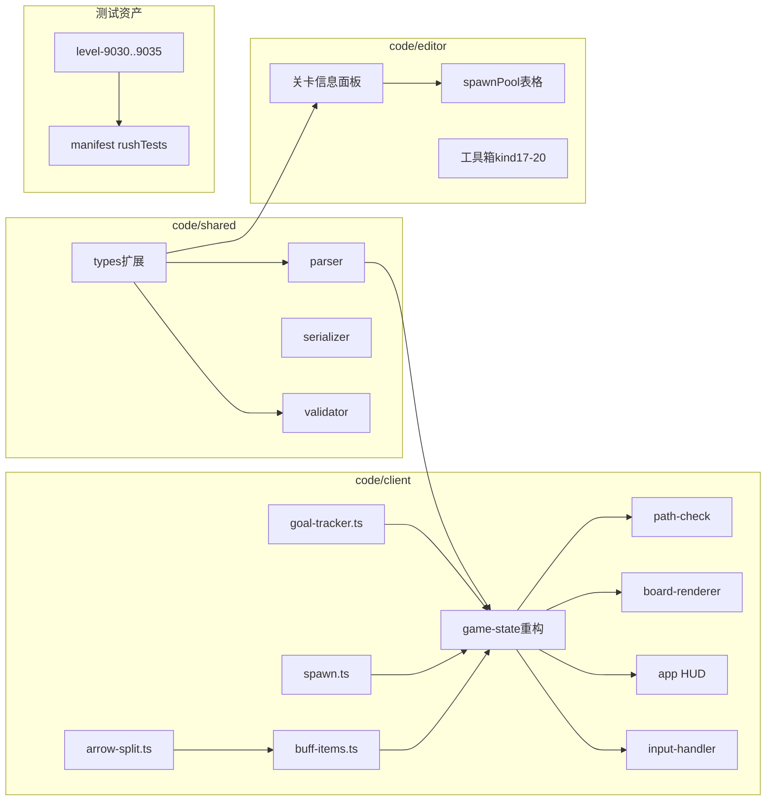

# arrow_jaw 爽快版开发步骤拆解（V2）

> **版本**：v0.1  
> **日期**：2026-06-16  
> **关联文档**：[arrow_jaw_爽快版开发需求文档.md](arrow_jaw_爽快版开发需求文档.md) · [Arrow Jam 新版本规则初稿（爽快版）.md](Arrow%20Jam%20新版本规则初稿（爽快版）.md) · [arrow_jaw_开发步骤拆解.md](arrow_jaw_开发步骤拆解.md) · [arrow_jaw_关卡编辑器开发步骤拆解.md](arrow_jaw_关卡编辑器开发步骤拆解.md)

本文档将 V2 爽快版拆解为可执行工程步骤，按 **V2.0 → V2.10** 分期推进。代码根目录：**code/client**（逻辑/渲染）、**code/shared**（类型/解析/校验）、**code/editor**（编辑器）。

**总预估工时**：15–22 人天（单人全职当量）。

---

## 0. 模块依赖总览

**前置条件**：P0–P8 已验收（当前 `main` 已具备 kind 1–16）。

**经典模式兼容**：各阶段实现须保证 `gameMode !== "rush"` 时行为与现网一致（见附录 B）。

---

## 1. V2.0 — 类型与解析骨架

### 目标

扩展共享层，使客户端与编辑器可加载含 rush 字段与 kind 17–20 的 JSON。

### 操作

1. **`code/shared/src/types.ts`**
   - 新增 `SpawnPoolEntry`、`LevelGoal`、`BuffItem`（kind 17–20 联合类型）
   - `LevelData` / `GameLevel` 增加：`gameMode?`、`spawnIntervalSec?`、`spawnPool?`、`levelGoals?`、`buffs`
   - `RawItem` 增加 `bombRadius?`、`crossArm?`
   - `EditorMeta` 同步 rush 字段

2. **`code/shared/src/parser.ts`**
   - 解析顶层 rush 字段
   - 解析 kind 17–20 → `buffs[]`
   - kind 12 子项递归收集 17–20
   - `gameMode` 缺省为 `classic`

3. **`code/shared/src/serializer.ts`**
   - rush 字段与 kind 17–20 往返
   - `spawnPool` 保持数组顺序

4. **`code/shared/src/validator.ts`**
   - 实现 V-V2-001 ~ V-V2-007（见需求文档 §7.3）

5. **`code/client/src/core/types.ts`**
   - re-export 新类型
   - `LevelManifest` 增加 `rushTests?: LevelManifestEntry[]`
   - `LevelManifestEntry` 增加 `gameMode?`、`spawnIntervalSec?`

### 产出

- `parser.test.ts`：含 rush 字段 + kind 17–20 的最小 JSON
- `validator.test.ts`：权重和、重复条目、缺 variant

### DoD

- [ ] `npm test`（shared）通过
- [ ] 经典关卡 JSON 解析结果与改版前一致
- [ ] rush 示例 JSON 可解析出 `buffs` 与 `levelGoals`

**预估**：1 天

---

## 2. V2.1 — GoalTracker 与胜负逻辑

### 目标

实现目标驱动胜负，替换清盘即胜；经典模式保持原逻辑。

### 操作

1. **新建 `code/client/src/core/game/goal-tracker.ts`**
   - `GoalTracker(levelGoals, gameMode)`
   - `onEliminationBatch(removed: ArrowItem[])`：按 §6.2 计次
   - `onBuffClear(arrows: ArrowItem[])`：气球等批量清除
   - `isMet(): boolean`
   - `getProgress(): GoalProgress[]`（供 HUD）

2. **`code/client/src/core/game/game-state.ts`**
   - 构造时初始化 `GoalTracker`
   - `completeLaunchAnimation` / `syncPhaseAfterAnimations`：`gameMode === "rush"` 时用 `goalTracker.isMet()` 判胜
   - `onArrowEliminationBatch` 末尾调用 `goalTracker.onEliminationBatch`
   - 经典模式分支保留 `arrows.length === 0`

3. **`code/client/src/app.ts`**
   - `checkEndState()`：rush 结算文案显示目标完成情况
   - 选关加载 `rushTests` 分组（可先空数组）

### 产出

- `goal-tracker.test.ts`：两类目标、分割计次、气球多色

### DoD

- [ ] rush 关达成 `clearArrowCount` 后胜利（棋盘可非空）
- [ ] 经典关清空棋盘仍胜利
- [ ] 超时未达成 rush 目标 → `lost`

**预估**：1.5 天

---

## 3. V2.2 — SpawnManager 基础生成

### 目标

实现生成周期、填充比例、加权抽取、箭头/角/道具放置与结束条件（**不含**动态概率）。

### 操作

1. **新建 `code/client/src/core/mechanics/spawn.ts`**
   - `SpawnManager(level, cellMap, rng?)`
   - `tickCountdown(deltaSec)`：非 SpawnPhase 递减
   - `shouldRunWave(): boolean`
   - `runSpawnWave(): SpawnResult`：实现需求文档 §4.5 算法（权重用原池）
   - `pickRandomEmptyRun` / `buildArrow` / `buildCorner` / `buildBuff`
   - `DIFFICULTY_FILL_RANGES` 映射

2. **`code/client/src/core/game/game-state.ts`**
   - 集成 `SpawnManager`（仅 `gameMode === "rush"`）
   - `tick()` 中：倒计时归零 → `runSpawnWave()` → 写入新物件 → `rebuildCellMap`
   - 消除链仅累加 `cycleElimCells`（本阶段可先不接动态调整）

3. **`code/client/src/core/board/cell-map.ts`**
   - 暴露 `getEmptyCells()` / `isCellBlockedForSpawn(x,y)` 辅助

### 产出

- `spawn.test.ts`：空棋盘填充、2–6 格箭、连续格不足、100 次上限、结束条件

### DoD

- [ ] 周期到后空格生成物件
- [ ] 生成物不覆盖管道/墙/幕布
- [ ] `spawnPool` 权重抽取分布合理（固定 seed 测试）
- [ ] `npm test` 通过

**预估**：2.5 天

---

## 4. V2.3 — 动态概率调整

### 目标

实现 `cycleElimCells` 驱动的三类权重调整与边界归一化。

### 操作

1. **`spawn.ts`**
   - `adjustSpawnWeights(pool, cycleElimCells)`：需求文档 §4.4 完整实现
   - `runSpawnWave` 开头调用；结束后 `cycleElimCells = 0`

2. **`game-state.ts`**
   - `onArrowEliminationBatch`：`cycleElimCells += removed 格数`

### 产出

- `spawn.test.ts` 扩展：0–20 / 21–50 / >50 三档；边界「减到 0」「buff 100%」

### DoD

- [ ] 高消除周期内 buff 生成率可测上升
- [ ] 权重总和始终为 100
- [ ] Wave 结束后 `cycleElimCells` 归零

**预估**：1 天

---

## 5. V2.4 — ArrowSplit 与目标计次挂钩

### 目标

统一箭头分割模块；区域/十字炸弹依赖此模块。

### 操作

1. **新建 `code/client/src/core/mechanics/arrow-split.ts`**
   - `splitArrow(arrow, destroyedCells, ctx): SplitResult[]`
   - 三种分支：1 格湮灭 / 含头裁尾 / 无头补方向
   - 新 `instanceId` 分配策略
   - 宿主重匹配：炸弹、冰冻、捆绑解除

2. **`goal-tracker.ts`**
   - 分割时：被毁部分 +1 credit；存活段为新实例

3. **单元测试**覆盖 §5.5 全部用例

### DoD

- [ ] 1 格剩余 → 湮灭
- [ ] 含头 → 标准尾
- [ ] 无头 → 新方向新头
- [ ] 分割计次与需求 §6.2 一致

**预估**：1.5 天

---

## 6. V2.5 — 区域炸弹与十字炸弹

### 目标

实现 kind 17/18 点击触发、爆炸几何、分割与渲染。

### 操作

1. **新建 `code/client/src/core/mechanics/buff-items.ts`**
   - `tryTriggerBuff(buffId, state)` 入口
   - `triggerAreaBomb`：3×3 / 5×5 格收集 → `arrow-split`
   - `triggerCrossBomb`：十字逐格 → 分割
   - 仅遍历箭头占格；跳过非箭物件

2. **`game-state.ts`**
   - `tryTriggerBuffAt(cell)`：SpawnPhase / 非 playing 拒绝
   - 点击命中 kind 17/18 时调用

3. **`mechanics-drawer.ts`**
   - `drawAreaBomb`：红色捆绑式 + 引信
   - `drawCrossBomb`：绿色菠萝手榴弹
   - 爆炸动画占位（范围高亮 300ms）

4. **`board-renderer.ts`** 绘制 `buffs` 数组

### DoD

- [ ] 点击区域炸弹正确摧毁范围内箭格并分割
- [ ] 十字炸弹 5×5 / 10×10 几何正确
- [ ] 管道/角不受影响
- [ ] 触发后道具移除

**预估**：2 天

---

## 7. V2.6 — 燃烧弹与定向气球

### 目标

实现 kind 19/20；气球箭撞击检测。

### 操作

1. **`buff-items.ts`**
   - `triggerFireBomb`：3×3 引燃 → 逐格蔓延 → 整箭移除
   - `triggerBalloon(hitArrow)`：变色 → 全屏同色箭清除
   - 燃烧动画队列（150ms/格）

2. **`game-state.ts`**
   - 发射步进中检测路径经过 kind 20 → 触发气球（exit/bump 均可）
   - 气球 batch 清除调用 `goalTracker.onBuffClear`

3. **`mechanics-drawer.ts`**
   - `drawFireBomb`、`drawBalloon`
   - 膨胀破裂动画（气球与同色箭）

4. **`input-handler.ts`**
   - kind 19 点击触发

### DoD

- [ ] 燃烧弹整箭燃尽移除，计 1 次
- [ ] 箭撞气球后同色箭全清
- [ ] 颜色目标正确累加
- [ ] bump 路径经过气球仍触发

**预估**：2 天

---

## 8. V2.7 — SpawnPhase 表现与 HUD

### 目标

生成淡入、禁点、rush HUD（目标/周期倒计时）。

### 操作

1. **`game-state.ts`**
   - `SpawnPhase` 状态与 `pendingSpawnInstanceIds`
   - 淡入进度 `spawnFadeProgress` 0→1（400ms）
   - SpawnPhase 内 `tryLaunch` / `tryTriggerBuff` 返回 false

2. **`board-renderer.ts`**
   - 新物件按 `spawnFadeProgress` 设置 globalAlpha
   - 生成倒计时、目标进度 HUD 数据接口

3. **`app.ts`**
   - rush HUD：剩余时间、目标进度、`spawnCountdownSec`
   - 隐藏 HUD 测试道具（`gameMode === "rush"`）
   - dev 开关可恢复测试道具

4. **`input-handler.ts`**
   - SpawnPhase 早退

### DoD

- [ ] 生成结束后统一淡入，过程中无逐格动画
- [ ] SpawnPhase 无法点击箭或道具
- [ ] HUD 显示目标与生成周期
- [ ] 经典关 HUD 无 rush 元素

**预估**：1.5 天

---

## 9. V2.8 — dev 测试关与 manifest

### 目标

提供 9030–9035 测试关与选关入口。

### 测试关定义

| ID | 名称 | 验证点 |
|----|------|--------|
| 9030 | Rush: Spawn Basic | 周期生成 + 淡入 + 禁点 |
| 9031 | Rush: Dynamic Weights | 高消除后 buff 增多（池含 17/19） |
| 9032 | Rush: Area Bomb | 预置 + 生成 kind17，分割 |
| 9033 | Rush: Balloon | 撞击气球 + 颜色目标 |
| 9034 | Rush: Color Goal | `clearColorArrows` 复合目标 |
| 9035 | Rush: Classic Mechanisms | 管道+幕布+预置角与生成共存 |

### 操作

1. **`code/client/test-fixtures/levels/level-9030.json` … `9035.json`**
2. **`public/levels/manifest.json`** 增加 `rushTests` 分组（9030–9035 **不**放入 `public/levels/`，仅 test-fixtures + dev manifest 或本地 manifest 片段）
3. **`app.ts`** 选关 UI 增加「爽快版测试」分组
4. **`scripts/gen-mechanic-test-levels.mjs`** 扩展（可选）

### DoD

- [ ] 六关可加载、可玩、可通关或可按设计失败
- [ ] `parser.test.ts` 引用 9030 冒烟
- [ ] `p8-integration.test.ts` 模式新增 `v2-integration.test.ts`

**预估**：1.5 天

---

## 10. V2.9 — 编辑器

### 目标

编辑器支持 rush 配置、spawnPool、levelGoals、kind 17–20 放置。

> 详细 UI 步骤见**附录 A**。

### 操作摘要

1. **`editor/src/ui/props-panel.ts`**：`gameMode`、`spawnIntervalSec`、`spawnPool` 表格、`levelGoals` 列表
2. **`editor/src/tools/draw-state.ts`**：kind 17–20 工具与 variant 选择
3. **`editor/src/document/editor-ops.ts`**：放置/删除 buff；spawnPool 增删行
4. **`editor/src/app.ts`**：权重合计 100 实时校验；rush 字段保存
5. **`shared/validator.ts`**：编辑器保存前调用 V-V2-*

### DoD

- [ ] 可配置 rush 关并保存 JSON
- [ ] 工具箱可放置四种增益道具
- [ ] spawnPool 权重非 100 时保存阻塞
- [ ] 试玩模式可加载 rush 关

**预估**：2.5 天

---

## 11. V2.10 — 回归测试与文档回写

### 目标

全量回归；更新关联文档状态。

### 操作

1. **测试**
   - `spawn.test.ts`、`goal-tracker.test.ts`、`arrow-split.test.ts`、`buff-items.test.ts`
   - `v2-integration.test.ts`：9030–9035 关键断言
   - 经典关 `game-state-trace.test.ts` 无回归

2. **文档**
   - 更新本文档各阶段 DoD 勾选
   - [arrow_jaw_游戏功能图谱.md](arrow_jaw_游戏功能图谱.md) 增加 V2 节点（若有）
   - [Arrow 关卡结构说明.md](Arrow%20关卡结构说明.md) 增加 rush 字段说明（可选）

3. **CI**
   - `npm test` client + shared 全绿

### DoD

- [ ] client 全测试绿
- [ ] shared 全测试绿
- [ ] 经典 L25 手动冒烟通过
- [ ] rush 9030–9035 手动冒烟通过

**预估**：1.5 天

---

## 12. 分期总览

| 阶段 | 主题 | 预估 | 依赖 |
|------|------|------|------|
| V2.0 | Schema + 解析校验 | 1d | P0–P8 |
| V2.1 | GoalTracker 胜负 | 1.5d | V2.0 |
| V2.2 | Spawn 基础 | 2.5d | V2.0 |
| V2.3 | 动态概率 | 1d | V2.2 |
| V2.4 | ArrowSplit | 1.5d | V2.1 |
| V2.5 | 区域/十字炸弹 | 2d | V2.4 |
| V2.6 | 燃烧弹/气球 | 2d | V2.4, V2.1 |
| V2.7 | SpawnPhase + HUD | 1.5d | V2.2, V2.5, V2.6 |
| V2.8 | 测试关 9030–9035 | 1.5d | V2.7 |
| V2.9 | 编辑器 | 2.5d | V2.0 |
| V2.10 | 回归 + 文档 | 1.5d | V2.8, V2.9 |
| **合计** | | **18.5d** | |

V2.9 可与 V2.5–V2.8 **并行**（不同目录），压缩日历时间。

---

## 附录 A — 编辑器分步

对齐 [arrow_jaw_关卡编辑器开发步骤拆解.md](arrow_jaw_关卡编辑器开发步骤拆解.md) 格式。

### E-V2.1 — 关卡 meta 扩展

**文件**：`props-panel.ts`、`editor/src/document/types.ts`

- `gameMode` 下拉
- rush 时显示 `spawnIntervalSec`
- DoD：切换 classic 隐藏 rush 字段

### E-V2.2 — spawnPool 表格

**文件**：`props-panel.ts`、`editor-ops.ts`

- 行：kind 下拉 → 动态列（colorId / bombRadius / crossArm）+ weight
- 底部显示权重合计，≠100 时红色
- 添加/删除行；重复条目 error
- DoD：保存后 JSON `spawnPool` 正确

### E-V2.3 — levelGoals 配置

**文件**：`props-panel.ts`

- 添加目标：类型下拉
- `clearArrowCount`：count 数字
- `clearColorArrows`：多行 colorId + count
- DoD：至少 1 目标才可保存 rush 关

### E-V2.4 — 增益道具工具箱

**文件**：`draw-state.ts`、`editor-board.ts`、`mechanics-drawer`（editor 复用或本地 draw）

| 工具 | 放置 | 属性 |
|------|------|------|
| 区域炸弹 | 单格点击 | bombRadius 1/2 |
| 十字炸弹 | 单格点击 | crossArm 2/5 |
| 燃烧弹 | 单格点击 | — |
| 定向气球 | 单格点击 | — |

- DoD：放置后 `itemModels` 含正确 kind 与 variant

### E-V2.5 — 校验与试玩

**文件**：`app.ts`、shared `validator.ts`

- 保存前跑 V-V2-*
- 试玩跳转 client 时带上 rush 字段
- DoD：编辑器试玩 rush 关与 client 直接加载一致

---

## 附录 B — 经典模式共存检查清单

实现各阶段时须验证：

| 检查项 | 经典关预期 |
|--------|------------|
| 无 `spawnIntervalSec` 倒计时 | ✓ 不启动 |
| 消除后无生成 | ✓ |
| `arrows.length === 0` 胜利 | ✓ |
| 无目标 HUD | ✓ |
| kind 5 炸弹爆炸失败 | ✓ |
| HUD 测试道具 | ✓ 仍显示（非 rush） |
| P0–P8 机制 | ✓ 行为不变 |

---

## 附录 C — 建议新建文件清单

| 路径 | 职责 |
|------|------|
| `code/client/src/core/game/goal-tracker.ts` | 目标进度与胜负 |
| `code/client/src/core/mechanics/spawn.ts` | 周期生成 |
| `code/client/src/core/mechanics/arrow-split.ts` | 箭头分割 |
| `code/client/src/core/mechanics/buff-items.ts` | kind 17–20 逻辑 |
| `code/client/src/core/mechanics/v2-integration.test.ts` | 集成测试 |
| `code/client/test-fixtures/levels/level-9030.json` … `9035.json` | 测试关 |

---

## 附录 D — 初稿与需求文档对照

| 初稿章节 | 步骤阶段 |
|----------|----------|
| §一 物件自动生成 | V2.2, V2.3, V2.7 |
| §二 增益道具 | V2.4, V2.5, V2.6 |
| §三 结算规则 | V2.1 |
| §四 编辑器 | V2.9, 附录 A |

---

*创建时间: 2026-06-16*
