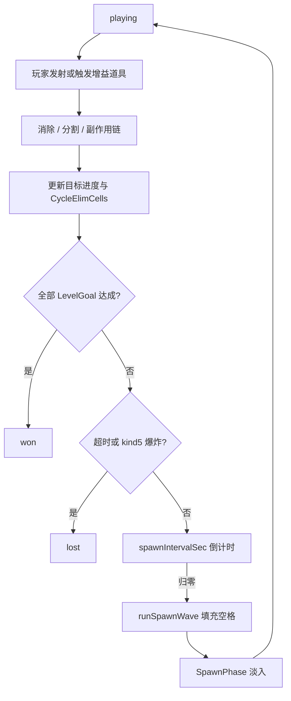

# arrow_jaw 爽快版开发需求文档（V2）

> **版本**：v0.1  
> **日期**：2026-06-16  
> **状态**：待开发  
> **关联文档**：[Arrow Jam 新版本规则初稿（爽快版）.md](Arrow%20Jam%20新版本规则初稿（爽快版）.md) · [arrow_jaw_爽快版开发步骤拆解.md](arrow_jaw_爽快版开发步骤拆解.md) · [arrow_jaw_开发需求文档.md](arrow_jaw_开发需求文档.md) · [arrow_jaw_新机制开发需求文档.md](arrow_jaw_新机制开发需求文档.md) · [arrow_jaw_收缩拨动机制开发需求文档.md](arrow_jaw_收缩拨动机制开发需求文档.md) · [arrow_jaw_关卡编辑器开发需求文档.md](arrow_jaw_关卡编辑器开发需求文档.md) · [arrow_jaw_关卡道具需求文档.md](arrow_jaw_关卡道具需求文档.md)

---

## 0. 源文档勘误与已确认决策

### 0.1 源文档勘误

| 位置 | 原文 | 修正 |
|------|------|------|
| [Arrow Jam 新版本规则初稿（爽快版）.md](Arrow%20Jam%20新版本规则初稿（爽快版）.md) §一 首句 | 箭头被消除后，空闲空格**会自动生成**新物件 | **消除只产生空格**；物件生成**仅在生成周期倒计时归零时**触发一轮 `SpawnWave`（与 §1.5 一致） |
| 初稿 §三 | 失败仅「时间完结未达成目标」 | 爽快版**保留** kind 5 定时炸弹爆炸判负；**任一失败条件成立即判负** |
| 初稿 §二 增益道具 | 未定义 kind 编号 | 本文档分配 kind **17–20**（见 §5） |
| 初稿 §一 通用色 | 未定义 JSON 字段 | 使用 `colorId: 0` 表示**通用色**（生成时从关卡可用色表随机） |

### 0.2 已确认决策

| 议题 | 决策 |
|------|------|
| 生成触发时机 | **仅按生成周期**触发；消除后不立即填充 |
| 与 P0–P8 旧机制关系 | **全部保留**；关卡通过 `spawnPool` 配置可生成子集；预置物件与旧机制逻辑不变 |
| 经典模式共存 | 无 `gameMode: "rush"` 或未配置 `spawnPool`/`levelGoals` 的关卡，行为与现网经典模式一致 |
| HUD 测试道具 | [arrow_jaw_关卡道具需求文档.md](arrow_jaw_关卡道具需求文档.md) 的自动/随机/指定消除在爽快版关卡中**默认隐藏**（dev 开关可启用） |

### 0.3 推荐默认（实现以本文档为准）

| 议题 | 推荐默认 |
|------|----------|
| 生成周期倒计时 | `playing` 且非 `SpawnPhase` 时正常递减；`SpawnPhase` 与发射/道具动画进行中**暂停** |
| 难度与填充比例 | `difficulty: 1` → Normal 70–80%；`2` → Hard 80–90%；`3` → SuperHard 90–100% |
| 分割后宿主绑定 | 炸弹/冰冻/捆绑绑定随**宿主箭 `instanceId`**；分割后按格点重新匹配宿主，无法匹配则**解除绑定** |
| 气球撞击 | 发射路径经过气球格即触发（`exit` 与 `bump` 均触发） |
| 目标胜利时机 | 全部 `levelGoals` 达成后可转 `won`，允许当前批动画收尾（≤500ms） |

---

## 1. 概述

### 1.1 代号与定位

**V2 爽快版** — 对 Arrow Jam **核心循环**的改版，区别于 P5/P8 等增量机制包：

| 维度 | 经典模式（现网） | 爽快版（V2） |
|------|-----------------|--------------|
| 核心循环 | 消除 → 路径解锁 → 连锁消除 | 消除 → 周期填充新物件 → 持续消除 |
| 关卡目标 | 清空棋盘所有箭头 | 限时内达成 `levelGoals` |
| 棋盘状态 | 静态（只减不增） | 动态（周期生成） |
| 道具 | 无棋盘增益道具 | kind 17–20 增益道具 |
| 策略维度 | 发射顺序 | 发射顺序 + 道具时机 + 目标管理 |

### 1.2 项目目标

在 `code/client`、`code/shared`、`code/editor` 中实现：

1. **物件自动生成**：按关卡周期与配置，向空格填充箭头/反射角/增益道具
2. **增益道具**：区域炸弹、十字炸弹、燃烧弹、定向气球及统一箭头分割规则
3. **目标驱动结算**：替换「清盘即胜」为 `levelGoals` + 限时胜负
4. **编辑器支持**：生成池、关卡目标、增益道具放置与校验
5. **与经典模式共存**：`gameMode` 开关，旧关卡零改动可继续游玩

### 1.3 范围

| 在范围 | 不在范围 |
|--------|----------|
| `code/shared` 类型、解析、序列化、校验 | 正式主线 L25–L64 批量改造 |
| `code/client` 逻辑、渲染、HUD | 账号、排行榜、内购 |
| `code/editor` 配置 UI 与工具箱 | AI 生成 prompt 大改（附录后续） |
| dev 测试关 9030–9035 + manifest `rushTests` | 音效、复杂粒子大片 |

### 1.4 前置条件

P0–P8 已验收（kind 1–16 及消除批处理、覆盖状态、管道穿越等）。机制细节见 [arrow_jaw_开发需求文档.md](arrow_jaw_开发需求文档.md)、[arrow_jaw_新机制开发需求文档.md](arrow_jaw_新机制开发需求文档.md)、[arrow_jaw_收缩拨动机制开发需求文档.md](arrow_jaw_收缩拨动机制开发需求文档.md)。

---

## 2. 术语

### 2.1 V2 新增术语

| 术语 | 说明 |
|------|------|
| `EmptyCell` | 棋盘范围内、未被任何物件占用的格点 |
| `SpawnWave` | 一次生成周期归零后执行的**一整轮**空格填充 |
| `SpawnPoolEntry` | 关卡 `spawnPool` 中的单条可生成物件配置（含权重与 variant） |
| `CycleElimCells` | 当前生成周期内，因消除事件移除的箭头占用格总数（用于动态概率） |
| `BuffItem` | kind 17–20 棋盘增益道具（区别于 HUD 测试辅助道具） |
| `ArrowSplit` | 道具摧毁箭身部分格后，对剩余段的统一分割处理 |
| `LevelGoal` | 关卡胜利条件条目（`levelGoals` 数组元素） |
| `SpawnPhase` | 生成轮次逻辑写入完成后的表现阶段：淡入显现 + **禁止点击** |
| `EliminationCredit` | 计入关卡目标的一次「消除计次」；与箭实例生命周期解耦 |
| `RushMode` | `gameMode === "rush"` 或关卡含 `spawnPool` + `levelGoals` 的爽快版模式 |

### 2.2 沿用 P5 术语

| 术语 | 引用 |
|------|------|
| `EliminationEvent` | 一批箭从棋盘移除（飞出或湮灭），计 1 次事件 |
| `Covered` | 未揭示子区域 / 幕布遮盖 / 冰冻覆盖 |
| `Operable Arrow` | kind 1/2、非覆盖、可见 |

定义见 [arrow_jaw_新机制开发需求文档.md](arrow_jaw_新机制开发需求文档.md) §2。

---

## 3. 核心循环与状态机

> 对应初稿 §五 核心变化总结

### 3.1 主循环流程



### 3.2 与经典模式的代码替换点

| 位置 | 经典行为 | 爽快版行为 |
|------|----------|------------|
| `game-state.ts` `completeLaunchAnimation` | `arrows.length === 0 → won` | `goalTracker.isMet() → won` |
| `game-state.ts` `syncPhaseAfterAnimations` | 同上 | 同上 |
| `game-state.ts` `tick()` | 仅 `remainingSeconds` 超时判负 | 超时 **或** kind 5 爆炸判负 |
| `app.ts` `checkEndState()` | 「清空棋盘」下一关文案 | 显示目标进度与 rush 专用结算文案 |

**重要**：爽快版中「棋盘已空但未达成目标」**不**触发胜利。

### 3.3 kind 映射扩展（V2）

在 P0–P8 kind 表基础上增加：

| 玩法术语 | kind | layer | 预置 / 生成 | 触发方式 |
|----------|------|-------|-------------|----------|
| 区域炸弹 | 17 | 2 | 均可 | 点击 |
| 十字炸弹 | 18 | 2 | 均可 | 点击 |
| 燃烧弹 | 19 | 2 | 均可 | 点击 |
| 定向气球 | 20 | 2 | 均可 | 箭撞击 |

**spawnPool 可生成物件**（v1）：

| 类型 | kind | 备注 |
|------|------|------|
| 普通箭 | 1 | 须配置 `colorId`（0=通用色） |
| 翻转箭 | 2 | 须配置 `colorId`；生成时随机初始朝向 |
| 反射角 | 4 | 反射面随机 |
| 区域炸弹 | 17 | 须配置 `bombRadius` |
| 十字炸弹 | 18 | 须配置 `crossArm` |
| 燃烧弹 | 19 | — |
| 定向气球 | 20 | — |

v1 **不**通过 `spawnPool` 自动生成 kind 3/5/6/7/8/11/12/13/14/15/16；这些仅允许关卡**预置**。

### 3.4 colorId 与通用色

沿用 [arrow_jaw_开发需求文档.md](arrow_jaw_开发需求文档.md) §2.2 色表，扩展：

| colorId | 含义 |
|---------|------|
| 0 | **通用色**：生成时从本关 `spawnPool` 中出现的非零 `colorId` 集合中均匀随机；若仅有 0 则回退 `{3,4,6,7}` |
| 3,4,6,7 | 固定颜色 |

---

## 4. 物件自动生成

> 对应初稿 §一

### 4.1 触发与周期（§1.5）

| 规则 | 说明 |
|------|------|
| 字段 | `spawnIntervalSec: number`（秒，> 0） |
| 开局 | 进入 `playing` 后启动倒计时 `spawnCountdownSec = spawnIntervalSec` |
| 归零 | 执行 `runSpawnWave()` → 重置 `spawnCountdownSec` |
| 暂停 | `SpawnPhase === true` 或存在未完结发射/增益道具动画时，倒计时不递减 |
| 消除 | 消除**不**触发即时生成，仅产生 `EmptyCell` 并累加 `cycleElimCells` |

### 4.2 填充比例（§1.1）

由 `difficulty` 映射填充比例区间，在 `SpawnWave` 开始时计算目标填充格数：

```
fillMin, fillMax = DIFFICULTY_FILL_RANGES[difficulty]
ratio = randomUniform(fillMin, fillMax)
targetFillCells = floor(emptyCells.length * ratio)
```

| difficulty | 档位 | fillMin | fillMax |
|------------|------|---------|---------|
| 1 | Normal | 0.70 | 0.80 |
| 2 | Hard | 0.80 | 0.90 |
| 3 | SuperHard | 0.90 | 1.00 |
| 其它 | 回退 Normal | 0.70 | 0.80 |

`targetFillCells` 为**软目标**；实际生成数以 §4.5 结束条件为准，可能低于该值。

### 4.3 生成池与权重（§1.2）

关卡字段 `spawnPool: SpawnPoolEntry[]`。

```typescript
interface SpawnPoolEntry {
  kind: 1 | 2 | 4 | 17 | 18 | 19 | 20;
  weight: number;           // 整数或小数，总和须为 100
  colorId?: number;         // kind 1/2 必填；0=通用色
  bombRadius?: 1 | 2;       // kind 17：1→3×3，2→5×5
  crossArm?: 2 | 5;         // kind 18：2→5×5 十字，5→10×10 十字
}
```

**校验（V-V2-SPAWN）**：

- `spawnPool` 非空（rush 模式）
- 所有 `weight` 之和 === 100（允许 ±0.01 浮点误差）
- 不允许两条目 `kind + colorId + bombRadius + crossArm` 完全相同
- kind 1/2 必须提供 `colorId`；kind 17/18 必须提供对应 variant

### 4.4 动态概率调整（§1.6）

`SpawnWave` **开始时**，根据当前 `cycleElimCells` 调整三类权重后归一化：

**分类**：

- `arrowWeight`：kind 1 + kind 2 权重之和
- `mechanicWeight`：kind 4 权重之和
- `buffWeight`：kind 17–20 权重之和

**调整表**（基于原配置合计 100）：

| cycleElimCells | buff 增量 | arrow 减量 | mechanic 减量 |
|----------------|-----------|------------|---------------|
| 0–20 | 0 | 0 | 0 |
| 21–50 | +10（多 buff 条目均分） | −5（多 arrow 条目均分） | −5（多 mechanic 条目均分） |
| >50 | +20 | −10 | −10 |

**边界归一化算法**：

```
function adjustSpawnWeights(pool, cycleElimCells):
  (dBuff, dArrow, dMech) = table(cycleElimCells)
  arrowEntries = pool where kind in (1,2)
  mechEntries = pool where kind == 4
  buffEntries = pool where kind in (17..20)

  applyDelta(arrowEntries, -dArrow)   // 每条按原 weight 比例分摊减量
  applyDelta(mechEntries, -dMech)
  applyDelta(buffEntries, +dBuff)

  // 单类条目：若减量后 weight < 5，置 0，将差额补给另一类（arrow↔mech 优先互补）
  // 若 arrow+mech 合计减量后仍不足 10%，则 arrow=0, mech=0, buff=100（均分到 buff 条目）

  normalize(pool)  // 总和归一为 100
  return pool
```

`SpawnWave` 结束后：`cycleElimCells = 0`。

### 4.5 单轮生成算法（§1.3、§1.7）

```
function runSpawnWave(state):
  if emptyCells.isEmpty(): return

  pool = adjustSpawnWeights(state.spawnPool, state.cycleElimCells)
  filledCells = 0
  failStreak = 0
  attempts = 0
  newItems = []

  while attempts < 100:
    attempts++

    if no emptyCells: break
    if emptyCells.size < 5 and failStreak >= 3: break
    if all remaining empty runs have length 1 and failStreak >= 3: break
    if filledCells >= targetFillCells and failStreak >= 1: break  // 软目标达成后可结束

    entry = weightedRandom(pool)
    placed = false

    if entry.kind in (1, 2):
      run = pickRandomEmptyRun(minLen=2)  // 连续空格，随机起点与走向
      if run == null: failStreak++; continue
      len = run.length >= 6 ? randomInt(2, 6) : run.length
      if len < 2: failStreak++; continue
      arrow = buildArrow(entry, run, len)  // 方向与末段趋势一致
      if overlapsBlocked(arrow): failStreak++; continue
      newItems.push(arrow)
      placed = true

    else if entry.kind == 4:
      cell = pickRandomEmptyCell()
      corner = buildCorner(cell, randomReflectFace())
      if overlapsBlocked(corner): failStreak++; continue
      newItems.push(corner)
      placed = true

    else:  // buff 17-20
      cell = pickRandomEmptyCell()
      buff = buildBuff(entry, cell)
      if overlapsBlocked(buff): failStreak++; continue
      newItems.push(buff)
      placed = true

    if placed:
      commitOccupancy(newItems.last)
      filledCells += footprint(newItems.last)
      failStreak = 0
    else:
      failStreak++

  state.pendingSpawnItems = newItems
  enterSpawnPhase()
```

**箭头生成约束（§1.3）**：

- 占格 2–6，格点曼哈顿相邻成链
- `direction` 与 `occupiedPositions` 末段走向一致（与 `snakeStepArrow` 语义一致）
- kind 2 额外随机 `direction1`/`direction2` 初始状态

**反射角（§1.4）**：

- 单格放置；`direction` 随机（1–4），表示反射面朝向

**空格选取范围**：

- 仅**顶层**或**已揭示**子区域内
- 排除幕布遮盖格
- 不与管道、墙、幕布、已有占格冲突

### 4.6 生成表现与输入（§1.8）

| 阶段 | 行为 |
|------|------|
| 逻辑写入 | `runSpawnWave` 结束时批量写入 `arrows`/`corners`/`buffs`，重建 `CellMap` |
| `SpawnPhase` | `tryLaunch`、增益道具点击、HUD 测试道具**全部拒绝** |
| 渲染 | 本轮 `pendingSpawnItems` 对应物件 `opacity: 0 → 1`，时长 **400ms**（`SPAWN_FADE_MS`） |
| 结束 | 淡入完成 → `SpawnPhase = false`，恢复点击 |

生成过程中**无**逐格动画；仅结束后统一淡入。

### 4.7 与消除链的挂钩

```
onArrowEliminationBatch(removed):
  // 既有 P5/P8 副作用链不变
  cycleElimCells += sum(removed.map(a => a.occupiedPositions.length))
  goalTracker.onEliminationBatch(removed)
  // 不调用 runSpawnWave
```

周期倒计时在 `GameState.tick(deltaSec)` 中递减，与 `remainingSeconds` 共用「非 SpawnPhase 才递减」规则。

---

## 5. 增益道具

> 对应初稿 §二

所有增益道具：**仅影响箭头占用格**；不伤害管道、反射角、墙、幕布、炸弹、拨动杆等非箭物件。

### 5.1 kind 17 — 区域炸弹（§2.1）

| 项 | 说明 |
|----|------|
| 外观 | 红色捆绑式炸弹，带引信，无定时器；单格 |
| 触发 | 玩家点击（须非 `SpawnPhase`、`playing` 阶段） |
| variant | `bombRadius: 1` → 3×3；`2` → 5×5（以道具格为中心） |
| 效果 | 爆炸动画 → 区域内所有箭头占用格摧毁 → 对每个受影响箭调用 `ArrowSplit` |
| 移除 | 触发后道具格移除 |

### 5.2 kind 18 — 十字炸弹（§2.2）

| 项 | 说明 |
|----|------|
| 外观 | 绿色菠萝手榴弹；单格 |
| 触发 | 点击 |
| variant | `crossArm: 2` → 臂长 2（总跨 5×5 十字）；`5` → 臂长 5（总跨 10×10 十字） |
| 效果 | 中心 + 上/下/左/右同时逐格爆炸（可并行动画 200ms/格）→ 摧毁路径上箭头格 → `ArrowSplit` |
| 移除 | 触发后移除 |

### 5.3 kind 19 — 燃烧弹（§2.3）

| 项 | 说明 |
|----|------|
| 外观 | 浅绿色燃烧瓶；单格 |
| 触发 | 点击 |
| 效果 | 3×3 区域引燃 → 每条受影响箭从被引燃格开始，沿箭身**逐格**蔓延燃烧（150ms/格）→ 全箭格燃尽后移除 |
| 与分割 | 燃烧为**整箭移除**，不走部分分割；计 1 次 `EliminationCredit` |
| 移除 | 触发后移除 |

### 5.4 kind 20 — 定向气球（§2.4）

| 项 | 说明 |
|----|------|
| 外观 | 白色气球；单格 |
| 触发 | **箭撞击**（发射动画路径经过该格；不要求箭可消除） |
| 效果 | ① 气球变色为撞击箭的 `colorId` → ② 膨胀破裂动画 → ③ 棋盘上所有同 `colorId` 箭膨胀破裂消失 |
| 计数 | 每条被清除的箭各计 1 次 `EliminationCredit`；颜色目标按各箭 `colorId` 累加 |
| 移除 | 触发后移除 |

### 5.5 箭头分割处理规则（§2.5）

统一模块：`code/client/src/core/mechanics/arrow-split.ts`。

输入：箭 `arrow`、被摧毁格集合 `destroyedCells`。

| 剩余情况 | 处理 |
|----------|------|
| 剩余 1 格 | 播放湮灭动画（`vanish`）后移除；计 1 次 `EliminationCredit`（若尚未计入） |
| 剩余 ≥2 格且仍含原箭头格（`occupiedPositions` 末格） | 裁掉被毁格；尾部标准化为半格箭尾；更新 `instanceId` 不变 |
| 剩余 ≥2 格且不含箭头格 | 在**最靠近原箭头格**的剩余格，按原延伸方向生成新 `direction` 与新箭头头；分配**新 `instanceId`** |

**宿主绑定**：

- kind 5 炸弹 / kind 13 冰冻：按格点重新匹配宿主；失败则移除绑定物
- kind 8 捆绑：若组内箭被分割，解除捆绑或按共享组规则拆分（v1：**解除捆绑**）
- 分割产生的新箭实例，后续消除单独计次

### 5.6 增益道具配置字段

| kind | 字段 | 类型 | 说明 |
|------|------|------|------|
| 17 | bombRadius | 1 \| 2 | 必填 |
| 18 | crossArm | 2 \| 5 | 必填 |
| 19 | — | — | 无额外字段 |
| 20 | — | — | 无额外字段 |
| 共用 | occupiedPositions | Vec2[] | 长度 1 |
| 共用 | layer | 2 | 固定 |
| 共用 | instanceId | number | 全关唯一 |

### 5.7 与旧机制交互

| 机制 | 交互 |
|------|------|
| kind 3 管道 | 不受增益伤害；爆炸格落在管道上时**跳过**该格 |
| kind 4 反射角 | 不摧毁 |
| kind 5 炸弹 | 道具不引爆倒计时炸弹（除非炸弹所在格即箭头格且被摧毁） |
| kind 6 幕布 | 幕布下箭头不可见但仍可被燃烧/气球清除（若占格暴露于效果几何） |
| kind 8 捆绑 | 组内任一格被毁 → 整组走分割/移除规则 |
| kind 12 子区域 | 仅已揭示区内道具可点击；气球仅影响同区域内可见箭 |
| kind 13 冰冻 | 冰冻宿主被分割后按 §5.5 重匹配；overlay 随宿主更新 |
| SpawnPhase | 所有增益道具不可触发 |

---

## 6. 结算与关卡目标

> 对应初稿 §三

### 6.1 目标类型

关卡字段 `levelGoals: LevelGoal[]`。**全部达成**即胜利。

```typescript
type LevelGoal =
  | { type: "clearArrowCount"; count: number }
  | {
      type: "clearColorArrows";
      targets: { colorId: number; count: number }[];
    };
```

| type | 说明 |
|------|------|
| `clearArrowCount` | 累计消除箭头条数 ≥ `count` |
| `clearColorArrows` | 每个 `targets` 条目独立达成；`colorId` 须为具体色（非 0） |

### 6.2 计数规则（§3.1）

| 事件 | clearArrowCount | clearColorArrows |
|------|-----------------|------------------|
| 飞出消除 1 箭 | +1 | 若 `arrow.colorId` 匹配则 +1 |
| 区域/十字炸弹部分摧毁 | 被毁部分整体 +1；存活分割段为新实例 | 按被毁箭 `colorId` +1 |
| 燃烧弹整箭移除 | +1 | 按箭色 +1 |
| 定向气球全屏清除 | 每条箭 +1 | 按各箭色分别 +1 |
| bump 弹回 | 不计 | 不计 |
| 道具分割剩余段后续消除 | 新实例单独计次 | 按新实例颜色计次 |

**EliminationCredit** 与 `EliminationEvent` 对齐：同一批动画内多条箭移除，各计各的。

### 6.3 胜负判定

| 结果 | 条件 |
|------|------|
| **胜利** | `levelGoals` 全部满足；`phase → won`（允许收尾动画） |
| **失败（超时）** | `remainingSeconds <= 0` 且目标未达成；`lostReason: "timeout"` |
| **失败（炸弹）** | kind 5 倒计时归零爆炸；`lostReason: "bomb"` |
| **非胜利** | 棋盘空但目标未达成 → 继续等待周期生成或超时 |

**失败优先级**：超时与炸弹**无先后顺序**，先触发先判负。

### 6.4 HUD（§6.4）

爽快版关卡须显示：

| 元素 | 说明 |
|------|------|
| 剩余时间 | 沿用 `durationInSec` 倒计时 |
| 目标进度 | 如「消除箭头 28/40」「蓝箭 5/10」 |
| 生成周期倒计时 | `spawnCountdownSec` 秒数或环形进度 |
| 可选 debug | 当前 `cycleElimCells`（dev 模式） |

结算弹窗文案改为目标驱动，不再使用「清空棋盘」表述。

---

## 7. 关卡数据 Schema 扩展

### 7.1 LevelData / GameLevel 新字段

```json
{
  "width": 20,
  "height": 32,
  "name": "Rush Demo 9030",
  "durationInSec": 120,
  "difficulty": 2,
  "gameMode": "rush",
  "spawnIntervalSec": 25,
  "spawnPool": [
    { "kind": 1, "weight": 35, "colorId": 7 },
    { "kind": 1, "weight": 25, "colorId": 0 },
    { "kind": 4, "weight": 15 },
    { "kind": 17, "weight": 10, "bombRadius": 1 },
    { "kind": 20, "weight": 15 }
  ],
  "levelGoals": [
    { "type": "clearArrowCount", "count": 40 }
  ],
  "itemModels": [
    { "kind": 1, "occupiedPositions": [[3, 5], [3, 6]], "instanceId": 1, "layer": 2, "direction": 1, "colorId": 7 },
    { "kind": 17, "occupiedPositions": [[10, 10]], "instanceId": 100, "layer": 2, "bombRadius": 1 }
  ]
}
```

| 字段 | 类型 | 必填 | 说明 |
|------|------|------|------|
| `gameMode` | `"classic"` \| `"rush"` | rush 关必填 | 缺省或 `classic` 时走经典逻辑 |
| `spawnIntervalSec` | number | rush 必填 | > 0 |
| `spawnPool` | SpawnPoolEntry[] | rush 必填 | 见 §4.3 |
| `levelGoals` | LevelGoal[] | rush 必填 | 至少 1 条；`count` > 0 |

**GameLevel 运行时扩展**：

```typescript
interface GameLevel {
  // ...既有字段
  gameMode?: "classic" | "rush";
  spawnIntervalSec?: number;
  spawnPool?: SpawnPoolEntry[];
  levelGoals?: LevelGoal[];
  buffs: BuffItem[];  // kind 17-20 解析结果
}
```

### 7.2 manifest.json 扩展

```json
{
  "rushTests": [
    {
      "id": 9030,
      "file": "level-9030.json",
      "name": "Rush: Spawn Basic",
      "gameMode": "rush",
      "difficulty": 1,
      "width": 12,
      "height": 16,
      "durationInSec": 90,
      "spawnIntervalSec": 20,
      "kinds": [1, 4, 17, 20]
    }
  ],
  "levels": [ "...经典关卡不变..." ]
}
```

选关 UI：`rushTests` 独立分组；经典 `levels` / `devTests` 行为不变。

### 7.3 校验规则摘要（validator.ts）

| ID | 级别 | 规则 |
|----|------|------|
| V-V2-001 | error | `gameMode: rush` 时 `spawnIntervalSec`、`spawnPool`、`levelGoals` 必填 |
| V-V2-002 | error | `spawnPool` 权重和 === 100 |
| V-V2-003 | error | `spawnPool` 无重复条目（kind+colorId+variant） |
| V-V2-004 | error | kind 17/18 条目缺 variant |
| V-V2-005 | error | `levelGoals` 为空或 `count <= 0` |
| V-V2-006 | warning | 目标 `count` 远大于初始箭数 + 理论生成数（可达性提示） |
| V-V2-007 | error | 预置 kind 17–20 的 variant 与 `spawnPool` 不一致时 warning |

---

## 8. 编辑器需求（摘要）

> 对应初稿 §四；详细步骤见 [arrow_jaw_爽快版开发步骤拆解.md](arrow_jaw_爽快版开发步骤拆解.md) 附录 A

### 8.1 关卡基础配置

在关卡信息面板（`props-panel` / meta 区）增加：

| 配置项 | UI | 校验 |
|--------|-----|------|
| `gameMode` | 下拉：classic / rush | rush 时展开下方字段 |
| `spawnIntervalSec` | 数字输入 | > 0 |
| `spawnPool` | 表格：下拉添加 + 权重 + 颜色/variant | 实时显示权重合计，须 100 |
| `levelGoals` | 列表：类型下拉 + count / 多色目标表 | 至少 1 条 |

**生成池添加下拉**（rush）：

- 箭头（kind1/2）→ 选颜色（含通用色 0）
- 反射角（kind4）
- 区域炸弹（kind17）→ 选 3×3 / 5×5
- 十字炸弹（kind18）→ 选 5×5 / 10×10 十字
- 燃烧弹（kind19）
- 定向气球（kind20）

### 8.2 关卡编辑工具箱

| 工具 | 操作 |
|------|------|
| 区域炸弹 | 选 variant → 点击棋盘放置 |
| 十字炸弹 | 选 variant → 点击放置 |
| 燃烧弹 | 点击放置 |
| 定向气球 | 点击放置 |

### 8.3 编辑器校验

- 保存时执行 V-V2-* 规则
- 同 kind 同色箭头不可在 `spawnPool` 重复
- 目标可达性 warning 不阻塞保存

---

## 9. 与既有机制共存规则

> 用户确认：P0–P8 **全部保留**

### 9.1 生成（SpawnWave）与旧物件

| 物件 | 共存规则 |
|------|----------|
| kind 3 管道 | 占格不可被生成覆盖 |
| kind 4 反射角 | 可被生成池生成；与预置角共存 |
| kind 5 炸弹 | 不自动生成；预置炸弹逻辑不变 |
| kind 6 幕布 | 遮盖格不可生成 |
| kind 7 移动墙 | 占格阻挡生成 |
| kind 8 捆绑 | 不自动生成 |
| kind 11 钥匙 | 不自动生成 |
| kind 12 子区域 | 未揭示区内不可生成 |
| kind 13 冰冻 | 不自动生成 |
| kind 14–16 | 不自动生成；预置逻辑不变 |

### 9.2 事件时序（rush 模式）

```
发射步进 / 增益触发
  → 消除或分割
  → onArrowEliminationBatch（冻结→翻转→墙→炸弹→管道→P8…）
  → goalTracker / cycleElimCells 更新
  → 胜负判定
  → tick：spawnCountdownSec 递减
  → 归零：runSpawnWave → SpawnPhase 淡入
```

### 9.3 经典模式兼容

当 `gameMode !== "rush"` 或未配置 `levelGoals`：

- 不启动 `spawnIntervalSec` 倒计时
- 不执行 `runSpawnWave`
- 胜负逻辑保持 `arrows.length === 0 → won`
- HUD 不显示目标与生成周期

---

## 10. 验收标准

### 10.1 功能验收

| ID | 场景 | 预期 |
|----|------|------|
| AC-V2-01 | rush 关消除箭后等待周期 | 周期到时空格填充，淡入显现 |
| AC-V2-02 | SpawnPhase 中点击箭 | 无响应 |
| AC-V2-03 | cycleElimCells > 50 后生成 | buff 权重上升 |
| AC-V2-04 | 点击区域炸弹 | 3×3/5×5 内箭分割正确 |
| AC-V2-05 | 箭撞气球 | 同色箭全清，计入颜色目标 |
| AC-V2-06 | 达成 clearArrowCount | 胜利，即使棋盘非空 |
| AC-V2-07 | 超时未达成 | 失败 |
| AC-V2-08 | kind5 爆炸 | 失败（与超时并列） |
| AC-V2-09 | classic 关 25 | 行为与改版前一致 |
| AC-V2-10 | 编辑器保存 rush 关 | JSON 往返无字段丢失 |

### 10.2 测试资产

dev 测试关 **9030–9035**（定义见 [arrow_jaw_爽快版开发步骤拆解.md](arrow_jaw_爽快版开发步骤拆解.md) §V2.8）。

### 10.3 单元测试

| 模块 | 覆盖点 |
|------|--------|
| `spawn.ts` | 权重归一化、填充比例、结束条件、100 次上限 |
| `arrow-split.ts` | 三种分割分支、新 instanceId |
| `goal-tracker.ts` | 两类目标计数、分割计次 |
| `buff-items.ts` | 四类道具几何与触发 |
| `parser/validator` | rush 字段往返与 V-V2 规则 |

---

## 附录 A：与 HUD 测试道具的关系

[arrow_jaw_关卡道具需求文档.md](arrow_jaw_关卡道具需求文档.md) 描述的是 **HUD 辅助按钮**（自动/随机/指定消除），与 kind 17–20 **棋盘增益道具**不同：

| 维度 | HUD 测试道具 | 棋盘增益道具 |
|------|-------------|-------------|
| 数据 | 不写入关卡 JSON | `itemModels` + 可 `spawnPool` 生成 |
| 爽快版默认 | 隐藏 / dev-only | 正常显示与触发 |
| 计次 | 随机/指定消除计 `EliminationEvent` | 按 §6.2 规则计次 |

---

## 附录 B：初稿章节对照

| 初稿章节 | 本文档章节 |
|----------|------------|
| §一 物件自动生成 | §4 |
| §二 增益道具 | §5 |
| §三 结算规则 | §6 |
| §四 编辑器 | §8 |
| §五 核心变化总结 | §1.1、§3 |

---

*创建时间: 2026-06-16*
